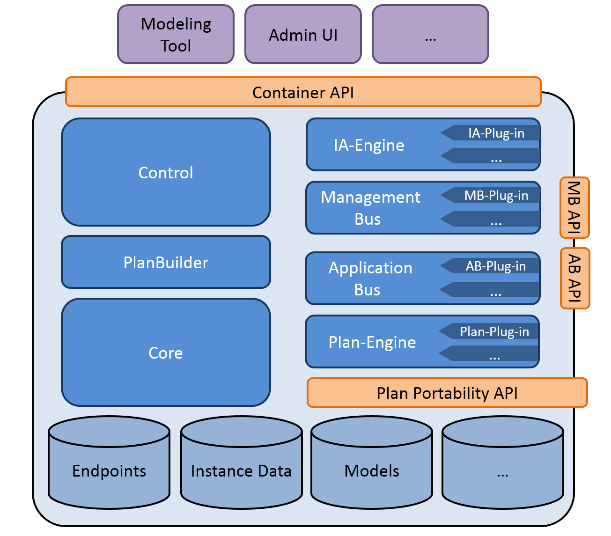
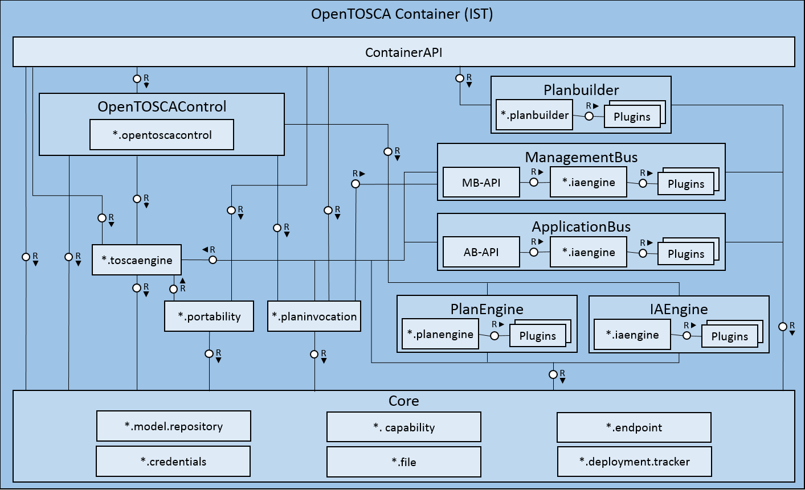
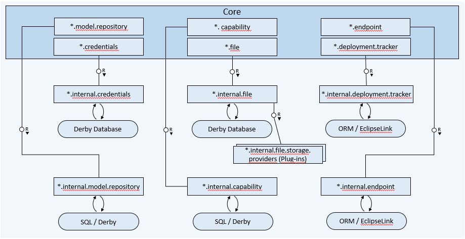
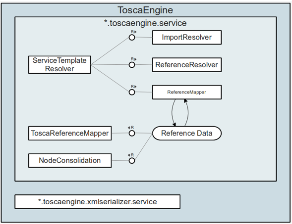

# OpenTOSCA Container

This is the OpenTOSCA runtime environment.

First, we present the architecture.
Furture things will come. Stay tuned

---

# OpenTOSCA Architecture

Scroll down for the architecture

+++

+++

+++

+++

+++

---

# More things to come

** stay tuned **
