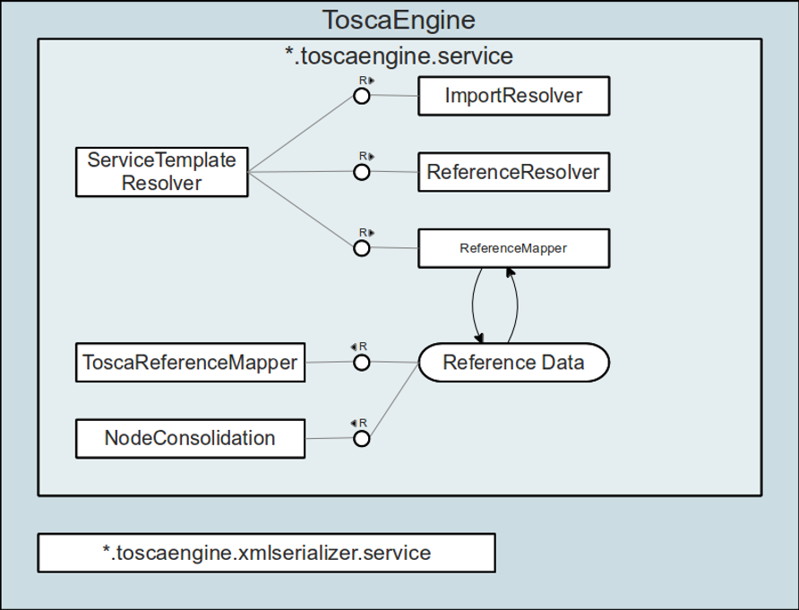
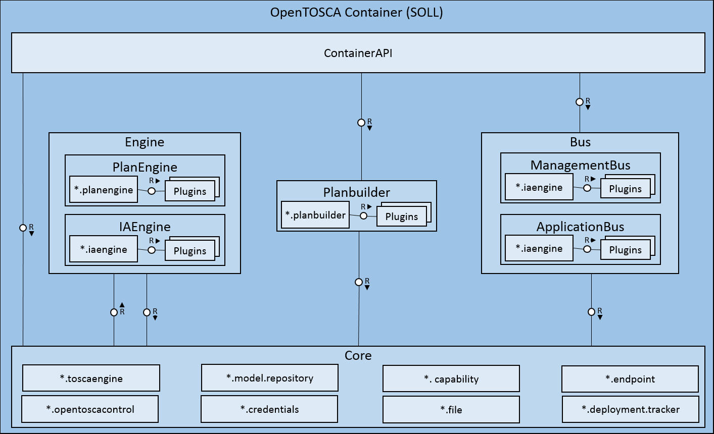

# OpenTOSCA Container

This is the OpenTOSCA runtime environment.

First, we present the architecture.
Furture things will come. Stay tuned.

---

# OpenTOSCA Architecture

Scroll down for the architecture

+++

## Components

+++

## Current Architecture

+++

## Core Architecture

+++

## TOSCA Engine

+++

## Planned Architecture

---

# More things to come

** stay tuned **
