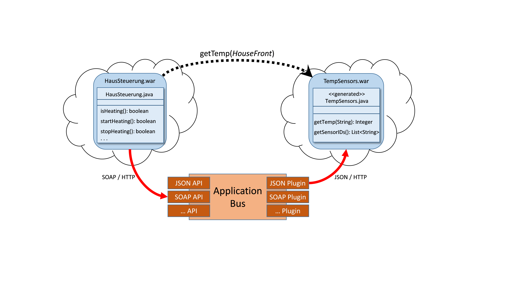
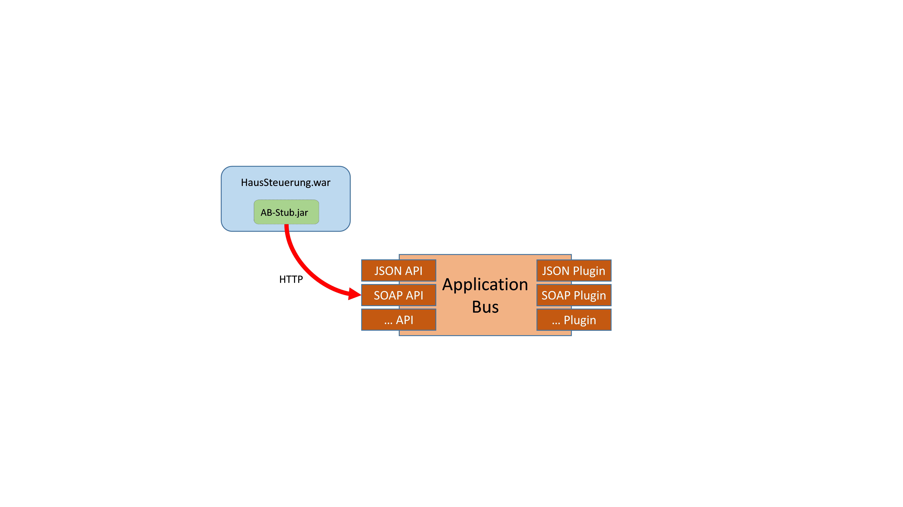
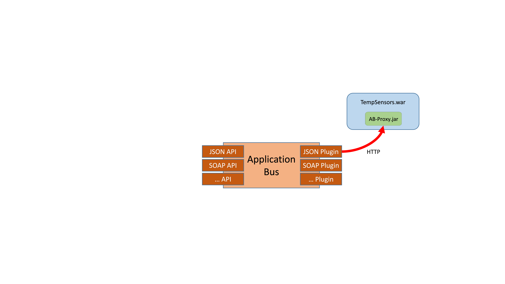

---
---

#Konzept und Implementierung einer Komponente zur Kommunikation TOSCA-basierter Anwendungen (Kapitel 7-9)
**Masterthesis Michael Zimmermann**

Architektur
===========

In diesem Kapitel wird die Architektur des im Rahmen dieser Arbeit entwickelten Application Bus vorgestellt. 
Dabei wird zum einen auf die Architektur des Application Bus selbst als auch auf die resultierende Architektur von OpenTOSCA eingegangen.

In Abbildung 12 wird die Architektur des Application Bus dargestellt.
Links in der Abbildung sind beispielhafte APIs zur Nutzung des Application Bus aufgeführt (siehe Abschnitt 9.2, 9.3 und 9.4). 
Durch diese APIs wird die Funktionalität des Application Bus anderen Komponenten und Anwendungen zur Verfügung gestellt.
Die Abbildung zeigt beispielsweise eine SOAP sowie eine REST API. 
Weiterhin können beliebige weitere APIs, auch während der Laufzeit, hinzugefügt werden und damit die Anzahl an unterstützten Protokollen und Standards erhöht werden.

Die zentrale Komponente innerhalb des Application Bus ist die *Application Bus Engine* (siehe Abschnitt 9.5). 
Hier werden zum Aufruf einer gewünschten Operation benötigte Informationen gesammelt beziehungsweise ermittelt. 
Beispielsweise wird in der Application Bus Engine der Endpoint der aufzurufenden Anwendung bestimmt. 
Weiterhin wird ermittelt welches Application Bus Plugin zur Verfügung steht, also im Container installiert und gestartet ist. 
Außerdem wird anhand der im TOSCA-Modell vorhandenen Informationen (siehe dazu Kapitel 8) ein Plugin bestimmt, dass den Aufruf bewerkstelligen kann. 
Hierzu ist die Application Bus Engine mit anderen benötigten Komponente des OpenTOSCA Containers wie der TOSCA Engine sowie dem Instance Data Service verbunden. 
Per Instance Data Service können Instanzdaten gespeichert und abgefragt werden. So können zum Beispiel IP-Adressen deployter Anwendungskomponenten dort von Plänen abgelegt werden und diese dadurch anderen OpenTOSCA-Komponenten wie beispielweise dem Application Bus zugänglich gemacht werden.

<center>


**Abbildung 12: Application Bus Architektur**
</center>
Im rechten Bereich der Abbildung sind die Application Bus Plugins dargestellt (siehe Abschnitt 9.6). 
Die Plugins sind für den Aufruf der spezifizierten Operation einer Anwendung zuständig und stellen ebenfalls Unterstützung für verschiedene Standards und Protokolle --*Invocation-Type* genannt -- zur Verfügung. 
Wiederum sind hier beispielhaft ein SOAP sowie ein REST Plugin aufgeführt.
Jedoch können auch hier, analog zu den APIs, beliebige neue Plugins noch zur Laufzeit hinzugefügt werden. 
Die Verwaltung der Plugins übernimmt die Application Bus Engine durch ein dafür ausgelegtes und auf OSGi (siehe Abschnitt 2.4) basierendes Plugin-System.

Abbildung 12 zeigt weiterhin die Verbindung der einzelnen Komponenten innerhalb der Application Bus Engine durch Camel (siehe Abschnitt 2.7).
Die schwarzen Punkte stellen dabei die von der jeweiligen Komponente definierten Endpunkte dar. 
Die gestrichelten Linien stellen weiterhin die Camel Routen zur Verbindung dieser Endpunkte dar.

In dem hier aufgezeigten Beispiel sind jeweils die gleichen Typen (SOAP und REST) an APIs und Plugins vorhanden. 
Dies ist jedoch nicht obligatorisch. Die zur Verwendung des Application Bus genutzte API muss nicht identisch mit dem für den Aufruf einer Operation einer Anwendung genutztem Plugin sein. 
Eine Anwendung kann somit beispielsweise den Application Bus per REST API ansprechen, wohingegen der effektive Aufruf der Operation einer anderen Anwendung per SOAP Plugin erfolgt.

<center>


**Abbildung 13:Kommunikationsdiagramm des Application Bus**
</center>

Abbildung 13 stellt den Aufbau des Application Bus als Kommunikationsdiagramm dar. 
Das Diagramm zeigt den zentralen Charakter der Application Bus Engine, die einerseits sowohl mit benötigten Komponenten des OpenTOSCA Containers kommuniziert sowie andererseits als Bindeglied zwischen den verschiedenen APIs und Plugins fungiert.
Abbildung 13 zeigt weiterhin die beispielhafte Nutzung des Application Bus durch eine Anwendung (A) sowie den Aufruf einer Anwendung (B) durch ein Application Bus Plugin.

<center>


**Abbildung 14: OpenTOSCA Architektur mit Application Bus**
</center>

Abbildung 14 stellt die erweiterte Gesamtarchitektur von OpenTOSCA, im Vergleich zu Abbildung 2, mit integriertem Application Bus dar. 
Zu erkennen ist, dass die Komponenten auf der rechten Seite der Abbildung (IA-Engine, Management Bus, Application Bus sowie Plan-Engine) jeweils mit einem eigenen Plugin-System ausgestattet sind. 
Dadurch kann die Funktionalität jeder einzelner Komponente sowie von OpenTOSCA insgesamt einfach erweitert werden. 
Darüber hinaus bringt die Verwendung eines einheitlichen Plugin-Systems eine besser Wartbarkeit des Containers mit sich.

Erweiterung von TOSCA, Code-Generierung und Umsetzung durch den Application Bus
===============================================================================

In Kapitel 6 wurde bereits ein grober Überblick über die Funktionsweise des Application Bus gegeben. 
In diesem Kapitel wird daher anhand eines Beispielszenarios die Nutzung und Funktionsweise des Application Bus detailliert vorgestellt. 
Dabei werden von der Entwicklung einer Anwendung, über das Deployment dieser durch OpenTOSCA bis hin zum Aufruf der Anwendung mittels des Application Bus wichtige Teilschritte näher betrachtet. 
Hierzu wird im folgenden Beispielszenario die Application Bus SOAP/HTTP API (siehe Abschnitt 9.2) sowie das Application Bus JSON/HTTP Plugin (siehe Abschnitt 9.6) als Beispiele für eine API sowie für ein Plugin genutzt. 
Der konzeptionelle Ablauf bei der Nutzung einer anderen API beziehungsweise eines anderen Plugins ist mit dem hier gezeigten vergleichbar.

<center>


**Abbildung 15: Beispielszenario**
</center>

Abbildung 15 veranschaulicht das zur Erläuterung der Nutzung und Funktionsweise des Application Bus verwendete Szenario. 
Die Abbildung zeigt, dass eine Anwendung *HausSteuerung* die Operation *getTemp* der Anwendung *TempSensors* aufrufen soll. 
Da die Anwendung HausSteuerung jedoch weder den Endpunkt der Anwendung TempSensors kennt, noch weiß, wie sie aufgerufen werden kann, wird der Application Bus hierfür benötigt. 
In diesem Beispiel sind die beiden Anwendungen als Web Application Archives (WAR) implementiert. 
Es sind jedoch konzeptionell auch beliebige andere Implementierungen möglich.

Dem Ablauf des Beispielszenarios folgend ist dieses Kapitel wie folgt gegliedert: 
In Abschnitt 8.1 wird erläutert, was bei der Entwicklung einer durch den Application Bus aufzurufenden Anwendung (hier: TempSensors) beachtet werden muss. 
Anschließend wird analog dazu in Abschnitt 8.2 gezeigt, was bei der Entwicklung einer den Application Bus nutzenden Anwendung (hier: HausSteuerung) beachtet werden muss. 
In beiden Fällen wird dabei auch auf die mögliche Unterstützung durch Code-Generierung eingegangen. 
In Abschnitt 8.3 wird anschließend das nach dem Deployment erforderliche Einrichten der Application Bus nutzenden Anwendung (hier: HausSteuerung) erklärt. 
Im darauf folgenden Abschnitt 8.4 wird die Kommunikation einer Anwendung (hier: HausSteuerung) mit dem Application Bus erläutert. 
In Abschnitt 8.5 wird schließlich die Kommunikation des Application Bus mit der aufzurufenden Anwendung (hier: TempSensors) vorgestellt.

Entwicklung einer durch den Application Bus aufzurufenden Anwendung
-------------------------------------------------------------------

In diesem Abschnitt wird erklärt, wie eine Anwendung für den Application Bus aufrufbar gemacht wird. 
Dabei wird erläutert welche Voraussetzungen die Anwendung dafür erfüllen muss, wie Code-Generierung zur Unterstützung genutzt werden kann und welche Erweiterungen in TOSCA dafür notwendig sind. 
Als Beispielanwendung wird hierzu die im zuvor geschilderten Beispielszenario vorgestellte TempSensors Anwendung verwendet.

Bevor eine Anwendung mittels des OpenTOSCA Containers deployt werden kann, muss sie zuerst implementiert werden. 
Wie bereits in der in Kapitel 6 definierten Methode zur Entwicklung TOSCA-basierter Cloud-Anwendungen gezeigt, wird der Entwickler dabei schon unterstützt.
Mit dem Application Bus Stub Generator (siehe Abschnitt 9.8) können aus einer mittels TOSCA modellierten Anwendung die Code-Skelette der dazugehörigen Methoden generiert werden (siehe Abbildung 16). 
Noch nicht implementiert, aber konzeptionell vorgesehen, ist auch das generieren der TOSCA Elemente aus einer bereits bestehenden Anwendung.

<center>


**Abbildung 16: Generierung eines Code-Skelettes aus TOSCA**
</center>

Listing 2 zeigt eine beispielhafte Modellierung der *TempSensors* Anwendung mittels TOSCA. 
In dem dargestellten Beispiel bietet die Anwendung eine Operation *getTemp* (Zeile 6) an. 
Weiterhin definiert die Operation einen Eingabeparameter *sensorID* (Zeile 10) sowie einen Rückgabeparameter *temperature* (Zeile 13). 
Um Anwendungsoperationen von Managementoperationen -- welche von Implementation Artifacts implementiert werden -- unterscheiden zu können, wurde der TOSCA Standard mit einem speziell für OpenTOSCA vorgesehenen Element erweitert. 
Zusätzlich zu dem bereits standardmäßig vorhandenen *Interfaces* Element, welches für die Managementoperationen genutzt wird, wurde das *ApplicationInterfaces* Element (Zeile 3) eingeführt um darin Anwendungsoperationen zusammenzufassen.

```xml
<NodeType name="TempSnesorsApplication">
    ...
    <opentosca:ApplicationInterfaces
        xmlns:opentosca="http://www.uni-stuttgart.de/opentosca">
        <Interface name="TempSensors">
            <Operation name="getTemp">
                <documentation>Returns the temperature of the
                    specified sensor</documentation>
                <InputParameters>
                    <InputParameter name="sensorID" tzpe="xs:string"/>
                </InputParameters>
                <OutputParameters>
                    <OutputParameter name="temperature" type="xs:int"/>
                </OutputParameters>
            </Operation>
        </Interface>
    </opentosca:ApplicationInterfaces>
</NodeType>
```
<center>

**Listing 2: Beispielhafte Modellierung von Anwendungsoperationen in erweitertem TOSCA**

</center>

Listing 3 zeigt das mittels Application Bus Stub Generator generierte Code-Skelett der modellierten Anwendungsoperation. 
Der Entwickler der Anwendung kann dieses Code-Skelett nutzen und die generierte Methode mit der gewünschten Anwendungslogik füllen. 
Man sieht anhand des Beispiels wie die TOSCA-Elemente in Java Code überführt werden. 
Der Name des Interfaces innerhalb TOSCA (Zeile 5) wird zu dem Klassenname in Java (Zeile 1). 
Die in TOSCA modellierte Operation (Zeile 6) wird zur Methode (Zeile 6) und Input- und OutputParameter (Zeilen 10 und 13) werden zu Eingabe- und Rückgabewerten (Zeilen 6 und 8). 
Optionale Dokumentationen werden ebenfalls von TOSCA (Zeilen 7 und 8) in Java (Zeilen 3-5) überführt.

```java
public class TempSensors{
    /**
    * Returns the temperature of the specified sensor
    */
    
    public static Integer getTemp(String sensorID){
        //TODO generated method stub
        return temperature;
    }
}
```
<center>

**Listing 3: Aus TOSCA generiertes Code-Skelett einer Anwendungsoperation**
</center>

Damit die angebotenen Operationen einer Anwendung durch den Application Bus aufgerufen werden können, muss die Anwendung eine Web Service Schnittstelle anbieten. 
Diese Schnittstelle wird dann von einem passenden Application Bus Plugin zur Kommunikation verwendet. 
Im Rahmen dieser Arbeit wurde eine generische Web Service Schnittstelle, *Application Bus Proxy* genannt (siehe Abschnitt 9.7), für als WAR implementierte Anwendungen entwickelt. 
Der Proxy ist in Abbildung 16 als AB-Proxy.jar zu erkennen. 
Der ansonsten fertig implementierten Anwendung muss abschließend dieser Proxy hinzugefügt werden und ist dann bereit deployt zu werden (siehe Kapitel 6).

Um später das zur Web Service Schnittstelle passende Application Bus Plugin sowie den Endpunkt der Schnittstelle bestimmen zu können, müssen in der dazugehörigen TOSCA Definition noch bestimmte Informationen angegeben werden. 
Diese Informationen werden in den Properties (siehe Listing 4) eines *ArtifactTemplates*, welches von einem *DeploymentArtifact* referenziert wird, definiert. 
Das *DeploymentArtifact* wiederum gehört zur *NodeTypeImplementation* des eigentlichen *NodeTypes*.


```xml
<opentosca:ApplicationInterfacesproperties>
    <opentosca:Endpoint> /TempSensorsApp</opentosca:Endpoint>
    <opentosa:InvocationType>JSON/HTTP</opentosa:InvocationType>
    <opentosca:ApplicationInterfaceInformations>
        <opentosca:ApllicationInterfaceInformation
            name="TempSensors" class="org.sensor.TempSensors"/>
    </opentosca:ApplicationInterfaceInformations>
</opentosca:ApplicationInterfacesproperties>
```
<center>

**Listing 4: ArtifactTemplate Properties**
</center>

Listing 4 zeigt die benötigten Daten. Aktuell müssen diese Informationen noch per Hand in die jeweilige TOSCA-Definition eingetragen werden. 
Zukünftig sollen diese Informationen -- zumindest teilweise -- jedoch auch generiert werden können. 
Per *Endpoint* (Zeile 2) wird der standardmäßige relative Endpunkt der Anwendung angegeben. 
Dieser wird zur Bestimmung des absoluten Endpunkts der Web Service Schnittstelle benötigt. 
In Zeile 3 wird der *InvocationType* festgelegt. 
Dieser legt fest, auf welche Art die Schnittstelle genutzt werden kann und wird zur Bestimmung des richtigen Application Bus Plugins benötigt. 
In diesem Fall müsste beispielsweise das Application Bus JSON/HTTP Plugin (siehe Abschnitt 9.6) genutzt werden.

In diesem Beispielszenario muss weiterhin in Zeile 6 der voll qualifizierte Name der Klasse (hier *org.sensor.TempSensors*), welche die Operationen des jeweiligen Interfaces (hier *TempSensors*) implementiert, angegeben werden. 
Dies ist nötig, da der Application Bus Proxy -- im Falle von als WAR implementierten Anwendungen -- die gewünschte Methode per Reflection aufruft und dafür der qualifizierte Klassenname benötigt wird. 
Der in diesem Beispielszenario verwendete Proxy sowie dessen Implementierung werden detaillierter in Abschnitt 9.7 vorgestellt.

Entwicklung einer den Application Bus nutzenden Anwendung
---------------------------------------------------------

In diesem Abschnitt wird erläutert, wie eine Anwendung (HausSteuerung im Beispielszenario) den Application Bus nutzen kann, welche Bedingungen hierzu erfüllt sein müssen und wie Code-Generierung zur Unterstützung verwendet werden kann.

Damit eine Anwendung mit dem Application Bus kommunizieren kann, muss sie gegen eine verfügbare Application Bus API (siehe Abschnitt 9.2, 9.3 und 9.4) programmiert werden. 
Neben der Möglichkeit dies per Hand zu tun, kann auch wieder der Application Bus Stub Generator zur Hilfe genommen werden. 
Im in diesem Kapitel genutzten Beispielszenario (siehe Abbildung 15) soll die Anwendung HausSteuerung die Operation getTemp der Anwendung TempSensors aufrufen. 
Wie Abbildung 17 zeigt, lässt sich zur einfacheren Verwendung der Operation getTemp, aus der TOSCA Definition der Anwendung TempSensors (siehe Listing 2) ein betriebsbereiter Stub der Operation generieren. 
Dieser Stub ist bereits gegen eine Application Bus API programmiert. 
Dadurch kann die Operation getTemp innerhalb der Anwendung HausSteuerung verwendet werden als wäre sie lokal verfügbar und die Kommunikation mit dem Application Bus wird hinter einer separaten Kommunikationsschicht verborgen.

<center>


**Abbildung 17: Verwendung eines generierten Stubs zur Kommunikation mit dem Application Bus**
</center>

Listing 5 zeigt einen solchen generierten Stub. 
Die im Stub enthaltene Methode getTemp kann innerhalb der Anwendung HausSteuerung als normale lokale Java Methode verwendet werden. 
Innerhalb der generierten getTemp Methode wird die *invoke* Methode der abstrakten Klasse *ApplicationBusClient* (ABClient in Abbildung 17) aufgerufen (Zeile 9).
Dabei werden die zum Aufruf benötigten Informationen wie Name des *NodeTemplates*, Namen des *ApplicationInterfaces* und der *Operation* sowie Eingabeparameter übergeben (Zeilen 9 und 10). 
Die Kommunikation mit dem Application Bus (siehe Abschnitt 8.4) erfolgt schließlich durch die generische ApplicationBusClient Klasse.

```java
public class TempSensors extends Application Bus Client{
    /**
    * Returns temperatur of the specified sensor
    */
    public static Integer getTemp(String sensorID){
        HashMap<String, Object> params = new HashMap<>();
        params.put("sensorID", sensorID);
        Integer temperature = invoke("TempSnesorsAppTemplate",
            "TempSensors", "getTemp", params);
        return temperature;
    }
}
```
<center>

**Listing 5: Aus TOSCA generierter Stub**
</center>

Setup einer den Application Bus nutzenden Anwendung
---------------------------------------------------

In diesem Abschnitt wird erläutert, wie eine Anwendung (HausSteuerung im Beispielszenario) nach ihrem Deplyoment eingerichtet werden muss, um mit dem Application Bus kommunizieren zu können.

Damit eine Anwendung mit dem Application Bus kommunizieren kann, benötigt sie den Endpunkt des OpenTOSCA Containers. 
Da dieser nicht zwingend bereits zur Entwicklungszeit verfügbar ist, muss er der Anwendung nach ihrem Deployment mitgeteilt werden. 
Hierzu wird von dem in der Anwendung verwendeten Application Bus Stub (siehe vorherigen Abschnitt) eine Web Service Schnittstelle angeboten, worüber nach dem Deployment durch OpenTOSCA der Endpunkt des Containers durch einen Plan (siehe Abschnitt 2.3) mitgeteilt werden kann. 
Dieses sogenannte *Setup* der Anwendung wird in Abbildung 18 gezeigt.

Da es mehrere Instanzen einer aufzurufenden Anwendung geben kann, muss beim Setup der Anwendung -- neben dem OpenTOSCA Endpunkt -- ebenfalls eine Instanz-ID der aufzurufenden Anwendung mitgeteilt werden. 
Dies kann entweder in Form der *NodeInstanceID* oder der *ServiceInstanceID* erfolgen. 
Dadurch kann eine Instanz der Anwendung später vom Application Bus eindeutig identifiziert werden. 
Wie genau der Application Bus diese Instanz-IDs verwendet, wird in Abschnitt 9.5 näher erläutert.

<center>


**Abbildung 18: Setup einer den Application Bus nutzenden Anwendung**

</center>

Kommunikation einer aufrufenden Anwendung mit dem Application Bus
-----------------------------------------------------------------

In diesem Abschnitt wird die Kommunikation einer Anwendung (HausSteuerung im Beispielszenario) mit dem Application Bus vorgestellt (siehe Abbildung 19). 
Beispielhaft wird hierfür die Application Bus SOAP/HTTP API (siehe Abschnitt 9.2) verwendet. 
Da ein einheitliches Protokoll zur Kommunikation (siehe Abbildung 6) verwendet wird, ist der grundsätzliche Ablauf mit der Verwendung einer anderen Application Bus API vergleichbar.

<center>


**Abbildung 19: Kommunikation einer Anwendung mit dem Application Bus**
</center>

Nachdem eine Anwendung von OpenTOSCA deployt und anschließend per Setup eingerichtet wurde, kann sie mit dem Application Bus kommunizieren.
Listing 6 zeigt die beispielhafte Nutzung des Application Bus per Application Bus SOAP API. 
Zeile 7 zeigt die *ServiceInstanceID*, welche zuvor, wie bereits erläutert, der Anwendung nach dem Deployment per Plan mitgeteilt wurde. 
In Zeile 8 sieht man die Angabe des *NodeTemplates*.
Durch die Angabe von *ServiceInstanceID* und *NodeTemplateID* kann eine Instanz der aufzurufenden Anwendung eindeutig identifiziert werden. 
Es ist auch möglich, anstelle von *ServiceInstanceID* und *NodeTemplateID*, nur die *NodeInstanceID* der aufzurufenden Anwendung zu übergeben.
Listing 6 zeigt weiterhin wie die aufzurufende Operation (Zeile 10), das zur Operation gehörende Interface (Zeile 9) sowie die Übergabeparameter (Zeilen 12 -- 18) angegeben werden.

```xml
<soapenv:Envelope
    xmlns:soapenv="http://schemas.xmlsoap.org/soap/envelope/"
    xmlns:app="http://opentosca.org/appinvoker/">
    <soapenv:Header/>
    <soapenv:Body>
        <app:invokeMethod>
            <serviceInstanceID>5</serviceInstanceID>
            <nodeTemplateID>TempSensorsAppTemplate</nodeTemplateID>
            <interface>TempsSensors</interface>
            <operation>getTemp</operation>
            <!--Optional:-->
            <Params>
                <!-- 1 or more repetitions: -->
                <Param>
                    <key>sensorID</key>
                    <value>HouseFront</value>
                </Param>
            </Params>
        </app:invokeMethod>
    </soapenv:Body>
</soapenv:Envelope>
```
<center>

**Listing 6: Request an die Application Bus SOAP API zum Aufruf einer Operation**
</center>

Anschließend wird der Request von der Application Bus Engine überprüft, ob alle benötigten Informationen übergeben wurden. 
Falls dies nicht der Fall ist wird eine Fehlermeldung an den Aufrufer zurückgegeben.
Andernfalls wird dem Aufrufer, da die asynchrone Kommunikation per Polling realisiert wird, eine *RequestID* zurückgegeben. Listing 7 zeigt eine positive Antwort zurück an den Aufrufer. 
In Zeile 5 ist die RequestID festgelegt, welche für das Polling sowie der Abfrage des Ergebnisses benötigt wird.

```xml
<soap:Envelope xmlns:soap="...">
    <soap:Body>
        <ns2:invokeMethodResponse
            xmlns:ns2="http://opentosca.org/appinvoker/">
            <requestID>5</requestID>
        </ns2:invokeMethodResponse>
    </soap:Body>
</soap:Envelope>
```

<center>

**Listing 7: Reply von der Application Bus SOAP API**
</center>

Parallel zur Rückgabe der RequestID wird im Application Bus mit der Bearbeitung der Anfrage begonnen. 
Beispielsweise bestimmt der Application Bus anhand der übergebenen Daten und mit Hilfe der TOSCA Engine sowie dem Instance Data Service, den Endpunkt der aufzurufenden Anwendung beziehungsweise des Application Bus Proxys. 
Details zur konkreten Implementierung werden in Kapitel 9 näher betrachtet. 
Die Kommunikation mit der aufzurufenden Anwendung durch ein zuvor bestimmtes Application Bus Plugin wird in Abschnitt 8.5 vorgestellt.

Während der Application Bus noch mit der Bearbeitung des in Listing 6 definierten Aufrufs beschäftigt ist, kann der Aufrufer per Polling bereits den Status der Bearbeitung abfragen. 
Listing 8 stellt einen solchen Polling-Request dar. 
In Zeile 7 sieht man die von dem Application Bus in Listing 7 zurückgegebene RequestID zur Identifikation des Aufrufes.

```xml
<soapenv:Envelope
    xmlns:soapenv="..."
    xmlns:app="http://opentosca.org/appinvoker/">
    <soapenv:Header/>
    <soapenv:Body>
        <app:isFinished>
            <requestID>5</requestID>
        </app:isFinished>
    </soapenv:Body>
</soapenv:Envelope>
```

<center>

**Listing 8: Polling-Request an den Application Bus zur Abfrage des Bearbeitungsstatus**
</center>

Listing 9 zeigt die Antwort der Application Bus SOAP/HTTP API eines solchen Polling-Requests. 
In diesem Fall wird in Zeile 5 *true* zurückgegeben, was bedeutet, dass die Bearbeitung abgeschlossen ist und das Ergebnis abgefragt werden kann. 
Falls die Bearbeitung noch nicht abgeschlossen ist, wird dementsprechend *false* zurückgegeben und der Client muss weiter pollen. 
Falls die RequestID innerhalb des Application Bus unbekannt ist wird eine entsprechende Fehlermeldung an den Aufrufer zurückgegeben.

```xml
<soap:Envelope xmlns:soap="...">
    <soap:Body>
        <ns2:isFinishedResponse
            xmlns:ns2="http://opentosca.org/appinvoker/">
            <isFinished>true</isFinished>    
        </ns2:isFinishedResponse>
    </soap:Body>
</soap:Envelope>
```
<center>

**Listing 9: Polling-Response des Application Bus zurück an den Aufrufer**
</center>

Nachdem der Bearbeitungsstatus abgefragt und mit true beantwortet wurde, kann vom Client das Ergebnis des ursprünglichen Operationsaufrufs abgefragt werden. 
Listing 10 zeigt einen solchen Request zur Ergebnis-Abfrage. 
In Zeile 7 ist wiederum die zur Identifikation benötigte RequestID zu sehen.

```xml
<soapenv:Envelope
    xmlns:soapenv="http://schemas.xmlsoap.org/soap/envelope/"
    xmlns:app="http://opentosca.org/appinvoker/">
    <soapenv:Header/>
    <soapenv:Body>
        <app:getResult>
            <requestID>5</requestID>    
        </app:getResult>    
    </soapenv:Body>
</soapenv:Envelope>
```
<center>

**Listing 10: Request an den Application Bus zur Abfrage des Ergebnisses eines Operationsaufrufs**
</center>

Listing 11 zeigt die Antwort der Application Bus SOAP/HTTP API. 
In Zeile 5 ist das Ergebnis des Operationsaufrufs zu sehen. 
Falls die bei der Anfrage übergebene RequestID unbekannt ist, wird dem Aufrufer eine entsprechende Fehlermeldung zurückgegeben. 
Weiterhin wird im Falle eines Fehlers innerhalb des Application Bus, beim Aufruf der Methode durch ein Application Bus Plugin oder innerhalb der aufgerufenen Operation selbst, dem Aufrufer ebenfalls eine Fehlermeldung zurückgegeben.

```xml
<soap:Envelope xmlns:soap="...">
    <soap:Body>
        <ns2:getResultResponse
            xmlns:ns2="http://opentosca.org/appinvoker/">
            <result>-11</result>    
        </ns2:getResultResponse>
    </soap:Body>
</soap:Envelope>

```
<center>

**Listing 11: Responsedes Application Bus mit dem Ergebnis des Methodenaufrufs**
</center>

Kommunikation des Application Bus mit einer aufzurufenden Anwendung
-------------------------------------------------------------------

In diesem Abschnitt wird die Kommunikation des Application Bus mit einer aufzurufenden Anwendung (TempSensors im Beispielszenario) vorgestellt.
Beispielhaft wird hierfür das zum Application Bus Proxy passende Application Bus JSON/HTTP Plugin verwendet (siehe Abbildung 20).

<center>


**Abbildung 20: Kommunikation des Application Bus mit einer aufzurufenden Anwendung**
</center>

Nachdem in der Application Bus Engine (siehe Abschnitt 9.5) alle benötigten Informationen gesammelt wurden, übernimmt das passende Application Bus Plugin die Kommunikation mit der aufzurufenden Anwendung. 
Listing 12 zeigt die Nachricht des Application Bus JSON/HTTP Plugins an den Application Bus Proxy der aufzurufenden Anwendung. 
In Zeile 3 ist die aufzurufende Methode *getTemp*, sowie in Zeile 4 die implementierende Klasse *org.sensor.SensorApp* (aus Listing 4) angegeben. 
Weiterhin ist in Zeile 7 der Eingabeparameter *sensorID* mit dem Wert *HouseFront* angegeben.

```json
{
  "invocation-information":{
    "operation": "getTemp",
    "class": "org.sensor.TempSensors"
  },
  "params":{
    "sensorID": "HouseFront" 
  }
}
```

<center>

**Listing 12: Request des Application Bus JSON/HTTP Plugins an eine aufzurufende Anwendung**
</center>

Die Kommunikation zwischen Application Bus JSON/HTTP Plugin und dem dazugehörigen Application Bus Proxy erfolgt ebenfalls per Polling. 
Das Application Bus Plugin bekommt dafür nach dem Aufruf von dem Proxy ebenfalls eine RequestID zurückgegeben. 
Mittels der RequestID kann das Plugin in regelmäßigen Abständen abfragen, ob die Bearbeitung beendet wurde und gegebenenfalls das Ergebnis abrufen. 
Nachdem das Ergebnis abgefragt wurde, wird dieses im Application Bus zusammen mit der RequestID des ursprünglichen Aufrufers (5, siehe Listing 7) abgelegt.
Anschließend kann das Ergebnis von der aufrufenden Anwendung (HausSteuerung im Beispielszenario) wie im vorherigen Abschnitt gezeigt, abgefragt werden.

Das im Rahmen dieser Arbeit implementierte Application Bus JSON/HTTP Plugin sowie der dazugehörige generische Application Bus Proxy verwenden ebenfalls das in Kapitel 4 vorgestellte Kommunikationsprotokoll. 
Die detaillierte Implementierung wird jeweils in Abschnitt 9.6 sowie Abschnitt 9.7 vorgestellt. 
Die Kommunikation mit der aufzurufenden Anwendung kann jedoch auch beliebig anders als hier gezeigt erfolgen und ist ausschließlich von der konkreten Implementierung des jeweiligen Application Bus Plugins sowie des dazugehörigen Proxys abhängig.
Beispielsweise kann auch ein Plugin implementiert werden, dass Callbacks wie es zum Beispiel SOAP ermöglicht unterstützt.

Implementierung
===============

In diesem Kapitel werden die Implementierungen des Application Bus und dessen Komponenten, sowie des Application Bus Stub Generators und Application Bus Proxys näher betrachtet.

Application Bus Konstanten und Exceptions
-----------------------------------------

In diesem Abschnitt werden die im Application Bus definierten und verwendeten Konstanten sowie Exceptions vorgestellt. 
Zur besseren Verwaltung der Abhängigkeiten der einzelnen Application Bus Komponenten sind die Konstanten und Exceptions in einem separaten Bundle organisiert.

Da die einzelnen Komponenten des Application Bus per Camel Endpoints und Routen (siehe Kapitel 7) miteinander verbunden sind und über Camel Exchange Messages kommunizieren, werden Konstanten zur Definition der Message Header benötigt. 
Dadurch können alle Komponenten des Application Bus benötigte Parameter auf eine einheitliche Weise ablegen beziehungsweise auslesen. 
Tabelle 1 zeigt und erklärt die durch ein Enum definierten Konstanten des Application Bus. 
In der ersten Spalte der Tabelle sind die einzelnen Konstanten gelistet. 
Die zweite Spalte gibt an, ob die Konstante als Key oder als Value des Message Headers verwendet wird. 
In der dritten Spalte der Tabelle wird die jeweilige Konstante näher beschrieben.

  
| **Konstante**                      | **Verwendung** |  **Beschreibung**
|------------------------------------|----------------|-------------------------------------------------------------------------------------------------------|
| NODE_INSTANCE_ID_INT               | Key            |  Zur Angabe der NodeInstanceID                                                                        |
| SERVICE_INSTANCE_ID_INT            | Key            |  Zur Angabe der ServiceInstanceID                                                                     |
| NODE_TEMPLATE_ID                   | Key            |  Zur Angabe der NodeTemplateID                                                                        |
| INTERFACE_NAME                     | Key            |  Zur Angabe des Interfaces                                                                            |
| OPERATION_NAME                     | Key            |  Zur Angabe der Operation                                                                             |
| APPLICATION_BUS_METHOD             | Key            |  Zur Angabe der Application Bus Methode (in Kombination mit einem der drei folgenden Werte als Value) |
| APPLICATION_BUS_METHOD_INVOKE      | Value          |  Aufruf einer Operation                                                                               |
| APPLICATION_BUS_METHOD_IS_FINISHED | Value          |  Status der Bearbeitung abfragen                                                                      |
| APPLICATION_BUS_METHOD_GET_RESULT  | Value          |  Ergebnis eines Operationsaufrufes abfragen                                                           |
| INVOCATION_ENDPOINT_URL            | Key            |  Zur Angabe des Endpoints                                                                             |
| CLASS_NAME                         | Key            |  Zur Angabe der implementierenden Klasse                                                              |
 

<center>

**Tabelle 1: Definierte Konstanten, deren Beschreibung und Verwendung innerhalb des Application Bus**
</center>

Neben den gezeigten Konstanten sind noch zwei verschiedene Exceptions definiert. 
Zum einen die *ApplicationBusInternalException* für auftretende Fehler innerhalb des Application Bus sowie zum anderen die *ApplicationBusExternalException* für Fehler die extern auftreten.
Beispielsweise in einer aufgerufenen Anwendung oder während der Kommunikation. 
Die Unterscheidung von internen und externen Fehlern wird für die Rückgabe einer passenden Fehlermeldung durch die jeweilige Application Bus API benötigt.

Application Bus SOAP/HTTP API {#application-bus-soaphttp-api .heading2}
-----------------------------

In diesem Abschnitt wird die Implementierung der Application Bus SOAP/HTTP API vorgestellt. 
Da in Kapitel 8 bereits ein Überblick über die Schnittstelle an sich gegeben wurde, wird hier vor allem auf die Verwendung von Camel bei der Umsetzung der API eingegangen.

Listing 13 zeigt konzeptionell die mit Camel definierte Route und Endpoints der Application Bus SOAP/HTTP API. 
In Zeile 1 wird der Endpunkt zur Nutzung der API definiert. 
Man sieht, dass die Camel *CXF* Komponente hierzu genutzt wird und der SOAP Web Service auf *http://0.0.0.0:8084/appBus* gestartet wird. 
Weitere, hier zur Vereinfachung verborgene, benötigte Informationen sind zum Beispiel die verwendete WSDL-Datei sowie der Service und Port Name des Web Services.

```java
String SOAP_Endpoint = "cxf:http://0.0.0.0:8084/appBus?wsdlURL=...";
from(SOAP_Endpoint).unmarshall(jaxb).process(requestProcessor)
     .choice().when(APP_BUS_ENDPOINT_EXISTS)
    .recipientList(APP_BUS_ENDPOINT)
    .to("direct:handleResponse")
    .endChoice().otherwise().to("direct:handleException");

from("direct:handleException").throwException(
        new ApplicationBusInternalException("The Application Bus is not running.")).to("direct:handleResponse");

from("direct:handleResponse").process(responseProcessor).marshall(jaxb);
```

<center>

**Listing 13: Routes der Application Bus SOAP/HTTP API**
</center>

Von Zeile 2 bis 10 ist die Route der API definiert, die sich zur Vereinfach nochmals in drei Unterrouten unterteilt. 
In Zeile 2 sieht man den vorherig definierten *SOAP\_ENDPOINT* als Einstiegspunkt der Route.
Anschließend wird die erhaltene SOAP Message unmarshallt und danach in dem *RequestProcessor* bearbeitet. 
Dabei werden die übergebenen Parameter gemäß der in Abschnitt 9.1 gezeigten Konstanten als Header der Exchange Message abgelegt, beziehungsweise die für die aufzurufende Operation vorgesehenen Eingabeparameter in den Body der Exchange Message gelegt. 
Falls der Status der Bearbeitung oder das Ergebnis eines Operationsaufrufes abgefragt werden soll, wird die übermittelte *RequestID* in den Body der Exchange Message gelegt.

In Zeile 3 wird überprüft, ob die Application Bus Engine läuft, beziehungsweise von der API als Service gebunden wurde (siehe Abschnitt 2.4) und ihr Endpunkt verfügbar ist. 
Der Endpunkt der Application Bus Engine kann von der API in der Bind-Methode über eine durch das Engine-Interface festgelegt Methode abgefragt werden. 
Dadurch sind API und Engine lose voneinander gekoppelt und es können verschiedene Endpoints und dadurch verschiedene Camel Komponenten einfach genutzt werden. 
Ist die Application Bus Engine verfügbar wird die Exchange Message zur weiteren Bearbeitung an ihren Endpunkt (*APP\_BUS\_ENDPOINT*) weitergeleitet (Zeile 4). 
Falls nicht, wird eine *ApplicationBusInternalException* geworfen (Zeilen 7-9).

Unabhängig davon ob irgendwo innerhalb der Route ein Fehler aufgetreten ist, muss die Antwort zurück an den Aufrufer generiert werden. 
Dies erfolgt in Zeile 10. Dabei wird zuerst im *ResponseProcessor* die Exchange Message in ein marschall-fähiges Objekt umgewandelt, anschließend gemarshallt und als SOAP Message zurück an den Aufrufer gesendet.

Wie in Kapitel 8 bereits gezeigt wurde, bietet die Application Bus SOAP/HTTP API drei Operationen an. 
1. Eine Operation zum Aufruf einer Methode einer anderen durch OpenTOSCA deployten Anwendung. 
2. Da Polling eingesetzt wird, eine Operation zum Abfragen des Status der Bearbeitung eines zuvor getätigten Methodenaufrufes. 
3. Eine Operation zum Abfragen des Ergebnisses eines zuvor getätigten und abgeschlossenen Methodenaufrufes. 

Im Falle von 1. wird als Antwort eine *RequestID* zur Identifikation des Aufrufes zurückgegeben. 
Im Falle von 2. wird abhängig des Status der Bearbeitung *true* oder *false* zurückgegeben. 
Und im Falle von 3. wird das entsprechende Ergebnis des Methodenaufrufes zurückgegeben.

Application Bus JSON/HTTP API {#application-bus-jsonhttp-api .heading2}
-----------------------------

In diesem Abschnitt wird die Implementierung der Application Bus JSON/HTTP API näher betrachtet. 
Dabei wird sowohl auf die Nutzung von Camel zur Umsetzung der API als auch auf das von der API erwartete Nachrichtenformat eingegangen.

Die Application Bus JSON/HTTP API bietet eine Lo-RESTful-Web Service Schnittstelle (siehe Abschnitt 2.2) zur Nutzung des Application Bus an.
Als Datenformat wird JSON unterstützt. 
Listing 14 zeigt konzeptionell die per Camel definierten Routes und Endpoints der Application Bus JSON/HTTP API. 
In Zeile 1 ist der initiale Endpunkt definiert. 
Wie man sieht, wird zur Realisierung der API die Camel *Restlet* Komponente genutzt und die API wird auf Port 8083 betrieben. 
Zum Aufruf einer Operation einer anderen Anwendung müssen die benötigten Parameter als Content-Type application/json formatiert und per HTTP-POST Methode (definiert in Zeile 2) an */OTABService/v1/appInvoker* geschickt werden.

```java
1   String ENDPOINT = "restlet:http://0.0.0.0:8083/OTABService/v1/appInvoker";

2   from(ENDPOINT + "?restletMethods=post")
3     .process(invocationRequestProcessor)
4     .to(TO_APP_BUS_ENDPOINT)
5     .process(exceptionProcessor);

6   from(ENDPOINT + "/activeRequests/{id}?restletMethods=get")
7     .process(isFinishedRequestProcessor)
8     .to(TO_APP_BUS_ENDPOINT)
9     .process(isFinishedResponseProcessor);

10  from(ENDPOINT + "/activeRequests/{id}/response?restletMethods=get")
11    .process(getResultRequestProcessor)
12    .to(TO_APP_BUS_ENDPOINT)
13    .process(getResultResponseProcessor);

14  from(TO_APP_BUS_ENDPOINT)
15    .choice().when(APP_BUS_ENDPOINT_EXISTS)
16    .recipientList(APP_BUS_ENDPOINT)
17    .endChoice().otherwise().to("direct:handleException");

18  from("direct:handleException").throwException(
19   new ApplicationBusInternalException("The Application Bus is not running."));

```

<center>

**Listing 14: Routes der Application Bus JSON/HTTP API**
</center>

Listing 15 zeigt den zum in Kapitel 8 vorgestellten Beispielszenario passenden Request. 
Falls kein Fehler auftritt, antwortet die Application Bus JSON/HTTP API mit HTTP-Statuscode 202 (Accepted) und der Polling-Adresse im Location-Header.

Listing 14 zeigt weiterhin in Zeile 6, dass zum Abfragen des Bearbeitungsstatus ein HTTP-GET an */OTABService/v1/appInvoker/activeRequests/{id}* geschickt werden muss.
Wobei *{id}* hier als Platzhalter für die *RequestID* steht. 
Die Adresse wird auch über den Location-Header von der API als Antwort auf ein Invoke-Request zurückgegeben. Falls die Bearbeitung abgeschlossen ist, wird eine Antwort mit HTTP-Statuscode 303 (See Other) und der Adresse zum Abrufen des Ergebnisses im Location-Header zurückgegeben. 
Falls nicht, wird eine Antwort mit HTTP-Statuscode 200 (OK) und Inhalt *{\"status\": \"PENDING\"}* zurückgegeben.

```json
1   {
2       "invocation-information": {
3          "serviceInstanceID": 12, 
4           "nodeTemplateID": "TempSensorsAppTemplate", 
5           "interface": "TempSensors", 
6           "operation": "getTemp"
7       }, 
8       "params": {
9           "sensorID": "HouseFront"
10      }
11   }

```
<center>

**Listing 15: Request an die Application Bus JSON/HTTP API zum Aufruf einer Operation**
</center>

In Listing 14 ist in Zeile 10 weiterhin zu sehen, dass zum Abfragen des Ergebnisses eines zuvor getätigten Operationsaufrufes ein HTTP-GET an */OTABService/v1/appInvoker/activeRequests/{id}/response* geschickt werden muss (*{id}* wieder Platzhalter für die *RequestID)*. 
Wie bereits erwähnt, wird diese Adresse auch beim Abfragen des Bearbeitungsstatus per Location-Header an den Aufrufer zurückgegeben. 
Als Antwort wird eine Nachricht mit HTTP-Statuscode 200 (OK) und des Ergebnisses wiederum als Content-Type application/json an den Aufrufer zurückgegeben.

Bei auftretenden Fehlern, wie beispielsweise einem Invoke-Request mit nicht korrekt formatiertem JOSN Inhalt oder einer unbekannten RequestID beim Abfragen des Bearbeitungsstatus wird dem Aufrufer eine Antwort mit entsprechendem HTTP-Statuscode und einer passenden Fehlermeldung zurückgegeben. 
Weiterhin ist in Zeile 15 von Listing 14 auch der bereits von der Application Bus SOAP/HTTP API (siehe Abschnitt 9.2) bekannte Check zur Überprüfung, ob die Application Bus Engine läuft und gebunden wurde, zu sehen. 
Falls nicht wird ebenfalls eine entsprechende Fehlermeldung (Zeile 19) an den Aufrufer zurückgegeben.

Application Bus REST/HTTP API {#application-bus-resthttp-api .heading2}
-----------------------------

In diesem Abschnitt wird die Implementierung der Application Bus REST/HTTP API vorgestellt. 
Dabei wird vor allem auf das Design der Schnittstelle und die Unterschiede zur Application Bus JSON/HTTP API eingegangen.

Die Application Bus REST/HTTP API bietet wie die Application Bus JSON/HTTP API (siehe Abschnitt 9.3) eine Lo-RESTful-Web Service Schnittstelle zur Nutzung des Application Bus an. 
Als Datenformat wird ebenfalls JSON sowie zusätzlich XML unterstützt. 
Anders als bei der JSON/HTTP API werden hier jedoch nur die Eingabeparameter der aufzurufenden Operation im Body der Nachricht übergeben. 
Die anderen, zur Bestimmung der aufzurufenden Anwendung beziehungsweise Operation benötigten Daten, können aus der URI ausgelesen werden.

Listing 16 zeigt einen Beispielaufruf mit den aus Kapitel 8 bekannten Werten. Der Aufruf wird per HTTP-POST an die API gesendet. 
In der URI sind die aus dem Beispielszenario bereits bekannten Informationen wie *ServiceInstanceID* (*12*), *NodeTemplate* (*TempSensorsAppTemplate*), *Interface* (*TempSensors*) sowie die aufzurufende *Operation* (*getTemp*) zu sehen. 
Weiterhin ist der für die *Operation* getTemp vorgesehene Eingabeparameter *sensorID* im Body der Nachricht zu sehen.

```
POST 
/ServiceInstances/12/Nodes/TempSensorsAppTemplate/ApplicationInterfaces
/TempSensors/Operations/getTemp
{  
     "sensorID" : "HouseFront"
 }

```

<center>

**Listing : Request an die Application Bus REST/HTTP API zum Aufruf einer Operation mit Angabe der ServiceInstanceID**

</center>

Anstelle die aufzurufende Anwendung per ServiceInstanceID sowie NodeTemplate zu spezifizieren, kann dies auch per *NodeInstanceID* erfolgen. 
Listing 17 zeigt ein Beispiel hierfür.
```
POST 
/NodeInstances/42/ApplicationInterfaces/TempSensors/Operations/getTemp
{  
     "sensorID" : "HouseFront"
 }

```
<center>

**Listing 17: Request an die Application Bus REST/HTTP API zum Aufruf einer Operation mit Angabe der NodeInstanceID**
</center>

Das Überprüfen des Bearbeitungsstatus sowie das Abfragen des Ergebnisses des Operationsaufrufs verläuft identisch wie es bereits für die Application Bus JSON/HTTP API vorgestellt wurde. 
So muss zum Abfragen des Bearbeitungsstatus eine HTTP-GET Anfrage an die per Location-Header zurückgegebene Adresse gesendet werden. 
Falls die Bearbeitung noch nicht beendet wurde, muss dies bis zur Beendigung der Bearbeitung wiederholt werden. 
Wenn die Bearbeitung schließlich beendet ist, wird hier ebenfalls der HTTP-Statuscode 303 (See Other) und die Adresse zum Abrufen des Ergebnisses im Location-Header zurückgegeben. 
Zum Abrufen des Ergebnisses muss weiterhin per Accept-Header der gewünschte MIME-Type (XML oder JSON) angegeben werden.

Application Bus Engine {#application-bus-engine .heading2}
----------------------

In diesem Abschnitt wird die Implementierung der Application Bus Engine vorgestellt. 
Dabei wird unter anderem die Nutzung von Camel sowie die Verwaltung der Application Bus Plugins näher betrachtet. 
Weiterhin wird der Bearbeitungsablauf innerhalb der Engine vorgestellt.

Eine der Aufgaben der Application Bus Engine ist es, die für den Aufruf einer Methode einer durch OpenTOSCA deployten Anwendung benötigte Informationen zu besorgen. 
Weiterhin verwaltet die Engine sowohl die Polling-Queue als auch die von den Plugins zurückgegebenen Ergebnisse der aufgerufenen Anwendungen.

Abbildung 21 gibt einen grafischen Überblick über die mit Camel implementierte Route der Application Bus Engine. 
Zuerst wird überprüft, ob eine Methode aufgerufen werden soll, der Bearbeitungsstatus eines Aufrufes abgefragt werden soll oder das Ergebnis eines vorherigen Aufrufs abgefragt werden soll. 
Die Exchange Message wird dann dementsprechend geroutet und bearbeitet. 
So wird beispielsweise, falls der Bearbeitungsstatus abgefragt werden soll, die Exchange Message an den *isFinishedProcessor* weitergeleitet. 
Dort wird anschließend überprüft, ob die Bearbeitung für die übermittelte *RequestID* abgeschlossen ist und davon abhängig *true* oder *false* zurückgegeben.
Falls das Ergebnis eines Aufrufes abgefragt werden soll, wird die Exchange Message an den *getResultProcessor* weitergeleitet. 
Dort wird das, für die angegebene RequestID abgelegte Ergebnis, beziehungsweise -- im Falle eines aufgetretenen Fehlers -- eine Exception zurückgegeben.

<center>


**Abbildung 21: Grafisch veranschaulichtes Routing innerhalb der Application Bus Engine**

</center>

Soll dagegen eine Methode einer anderen Anwendung aufgerufen werden, ist die Bearbeitung innerhalb der Application Bus Engine deutlich komplexer.
Die Engine überprüft in diesem Fall zuerst, ob alle benötigten Parameter (siehe Abschnitt 9.1) spezifiziert wurden. 
Dies wird gemacht, um dem Aufrufer in diesem Fall sofort eine entsprechende Fehlermeldung zurückgeben zu können. 
Falls alle benötigten Parameter angegeben sind, wird die zur Identifikation des Aufrufes genutzte RequestID generiert. 
Anschließend spaltet sich die Route in zwei Unterrouten auf und die Bearbeitung wird parallel fortgesetzt.

In der einen Unterroute wird die RequestID in der Polling-Queue (*isFinishedQueue* in der Abbildung) abgelegt und als *false* -- also noch nicht fertig bearbeitet -- markiert. 
Daraufhin wird die zuvor generierte und nun auch in der Engine bekannte RequestID an den Aufrufer zurückgegeben.

In der anderen Unterroute wird die Exchange Message zuerst an den *InvokeProcessor* weitergeleitet. 
Dort wird mit Hilfe der Tosca Engine und dem Instance Data Service unter anderem der Endpunkt der aufzurufenden Anwendung sowie das dafür benötigte Application Bus Plugin bestimmt. 
Die Implementierung des InvokeProcessor wird in Abbildung 22 dargestellt und später in diesem Kapitel näher betrachtet.

Nachdem die weiteren für den Aufruf benötigten Informationen gesammelt wurden, wird anschließend der Endpunkt des für den Aufruf benötigten Plugins aus der Plugin-Registry abgefragt und die Exchange Message dorthin weitergeleitet. 
Die Bearbeitung innerhalb eines Application Bus Plugins wird in Abschnitt 9.6 vorgestellt. 
Nachdem das Plugin den Methodenaufruf abgeschlossen und ein Ergebnis zurückgegeben hat, wird dieses wiederum zusammen mit der entsprechenden RequestID abgespeichert und anschließend in der Polling-Queue der Bearbeitungsstatus auf *true* gesetzt.

<center>


**Abbildung 22: Bearbeitungsablauf innerhalb des Invoke-Processors**
</center>

In Abbildung 22 wird dargestellt, wie die zum Aufruf einer Anwendung benötigten Informationen, durch den InvokeProcessor bestimmt werden.
Nachdem die vorhanden Informationen aus den Headern der Exchange Message ausgelesen wurden, wird zuerst mit Hilfe des Instance Data Services die dadurch spezifizierte *NodeInstance* und damit der dazugehörige *NodeType* bestimmt. 
Anschließend werden die benötigten Application Bus Properties gesucht. 
Diese Properties definieren den relativen Endpunkt der Anwendung, den *InvocationType* -- also welches Application Bus Plugin zum Aufruf benötigt wird -- sowie weitere Informationen wie beispielsweise die Klasse, welche die aufzurufende Operation implementiert. 
Ein Beispiel für solche Application Bus Properties wurde bereits in Listing 4 gezeigt. 
Da diese Properties in einem beliebigen *ArtifactTemplate* eines *DeploymentArtifacts* einer zum *NodeType* gehörigen *NodeTypeImplementation* definiert sein kann, müssen diese zunächst, bis die Properties gefunden wurden, durchsucht werden. 
Werden die Properties gefunden, werden die benötigten Informationen bestimmt.
Anschließend muss noch die Adresse der aufzurufenden Anwendung herausgefunden werden. 
Dafür werden in der Topologie von dem ursprünglichen *NodeTemplate* ausgehend solange *HostedOn*-Abhängigkeiten verfolgt bis ein NodeTemplate die fest definierten Properties zur Angabe der Adresse definiert hat. 
Per Instance Data Service werden dann die aktuellen Properties mit der aktuellen Adresse der aufzurufenden Anwendung abgefragt und anschließend der Endpunkt der Anwendung bestimmt. 
Außerdem wird mit Hilfe des InvocationTypes das für den Aufruf benötigte Plugin bestimmt (siehe 8.1).

Wie in Kapitel 3 beschrieben, ist das Hinzufügen von Plugins zum Erweitern der durch den Application Bus unterstützten Standards und Protokolle eine wichtige Anforderung. 
Diese wird durch das dafür genutzte Plugin-System realisiert, welches nun folgend erläutert wird.

```java
1    public interface IApplicationBusPluginService {
2
3	    /**
4	     * @return supported InvocationTypes of this plugin.
5	     */
6	    public List<String> getSupportedInvocationTypes();
7
8	    /**
9	     * @return the routing endpoint of this plugin.
10	     */
11	    public String getRoutingEndpoint();
12
13   }

```

<center>

**Listing 18: Application Bus Plugin Interface**
</center>

Das verwendete Plugin-System wird durch die Nutzung von Declarative Services (siehe Abschnitt 2.4) ermöglicht. 
Hierfür müssen die Application Bus Plugins das in Listing 18 dargestellte Interface implementieren und es als Service anbieten. 
Das Interface definiert zwei Methoden. 
Die erste Methode *getSupportedInvocationTypes* (Zeile 6) wird verwendet um die vom Plugin unterstützten InvocationTypes zu übergeben.
Die zweite Methode *getRoutingEndpoint* (Zeile 11) wird zur Übergabe des Camel Endpoints des jeweiligen Plugins genutzt. 
Dieser Endpunkt gibt den Einstiegspunkt zur Route des Plugins an. 
Beim Binden des Services durch die Application Bus Engine werden die beiden Methoden aufgerufen und die InvocationTypes zusammen mit dem dazugehörigen Endpunkt abgespeichert.
Die Engine kann dann bei Bedarf den zu einem InvocationType gehörigen Endpunkt abfragen und die Exchange Message dorthin weiterleiten. 
Dieses Verfahren ermöglicht zum einen das dynamische Verwalten von startenden und stoppenden Plugins sowie zum anderen die Verwendung unterschiedlicher Camel Komponenten zur Kommunikation zwischen der Application Bus Engine und den verschiedenen Application Bus Plugins.

Application Bus JSON/HTTP Plugin {#application-bus-jsonhttp-plugin .heading2}
--------------------------------

In diesem Abschnitt wird das Application Bus JSON/HTTP Plugin genauer vorgestellt. 
Aufgabe des Plugins ist es, eine Operation einer durch OpenTOSCA deployten Anwendung aufzurufen.

Damit das Plugin mit der aufzurufenden Anwendung kommunizieren kann, wird wie in Kapitel 8 bereits erläutert, das zum Plugin passende Gegenstück in Form des Application Bus Proxys (siehe nächsten Abschnitt) benötigt. 
Der Proxy bietet eine Schnittstelle an, gegen die das Plugin programmiert ist. 
Das hier verwendete Kommunikationsprotokoll entspricht dem in Abbildung 6 vorgestellten Protokoll. 
Tabelle 2 stellt die angebotene Schnittstelle schematisch dar.

  
  | **Methode** | **URL**                                    | **Inhalt**                                    | **Rückgabe**                                                                                                                                        |
  |             | (/OTABProxy/v1/...)                        |                                               |                                                                                                                                                     |        
  |-------------| -------------------------------------------| --------------------------------------------- | --------------------------------------------------------------------------------------------------------------------------------------------------- |
  | POST        | /appInvoker                                | Klassenname, Operationsname, Eingabeparameter | Statuscode 202 (Accepted) & Verweis im Location-Header auf /activeRequests/{id}                                                                     |
  | GET         | /appInvoker /activeRequests/{id}           |                                               | *Falls fertig:* Statuscode 303 (See Other) & Verweis im Location-Header auf /response   *Falls nicht fertig: Statuscode 200 (OK) & Pending im Body* |
  | GET         | /appInvoker /activeRequests/{id} /response |                                               | Ergebnis des Methodenaufrufs                                                                                                                        |

<center>

**Tabelle 2: Schnittstelle des Application Bus Proxys**

</center>

Listing 19 zeigt den konzeptionellen Aufbau der im Plugin implementierten Route. 
Der Einstiegspunkt der Route (*ENDPOINT*) ist in Zeile 1 zu sehen. 
Über diesen Endpunkt sendet die Application Bus Engine die Exchange Messages an das Plugin. 
Woher die Engine die Endpunkte der Plugins kennt wurde in  Abschnitt 9.5 erläutert. 
Im *RequestProcessor* (Zeile 2) wird aus den übergebenen Informationen die entsprechende JSON Nachricht (siehe Listing 12 für eine solche Beispielnachricht) erstellt. 
Anschließend werden benötigte Header wie die verwendete HTTP-Methode (Zeile 3), der Content-Type (Zeile 4) sowie die aufzurufende URL (Zeile 5) gesetzt und die Nachricht verschickt. 
*to(“<http://dummyhost>“)* wird hier nur verwendet, um Camel mitzuteilen, die HTTP-Komponente zum Verschicken der Nachricht zu nutzen. 
Der richtige Endpunkt wird aus dem zuvor gesetzten Header ausgelesen. 
Falls die dann erhaltende Antwort den vorgesehen Statuscode (202) aufweist (Zeile 7), wird die per Location-Header übergebene Polling-Adresse als neuer Endpunkt gesetzt (Zeile 8) und an die Polling-Unterroute weitergeleitet (Zeile 9). 
Andernfalls tritt das, hier zur Vereinfachung weggelassene, Exception-Handling in Kraft (Zeile 11).

```json
1   from(ENDPOINT)
2     .process(requestProcessor)
3     .setHeader(Exchange.HTTP_METHOD, constant("POST"))
4     .setHeader(Exchange.CONTENT_TYPE, constant("application/json"))
5     .setHeader(Exchange.HTTP_URI, INVOKE_ENDPOINT).to("http://dummyhost")
6     .choice()
7     .when(header(Exchange.HTTP_RESPONSE_CODE).isEqualTo(202))
8     .setHeader(Exchange.HTTP_URI, simple("${header.Location}"))
9     .to("direct:polling")
10    .endChoice()
11    .otherwise().to("direct:handleException");

12  from("direct:polling")
13    .setHeader(Exchange.HTTP_METHOD, constant("GET")).to("http://dummyhost")
14    .choice()
15    .when(PENDING).delay(5000).to("direct:polling")
16    .endChoice()
17    .when(RESULT_RECEIVED).process(responseProcessor)
18    .endChoice()
19    .otherwise().to("direct:handleException");

```
Listing 19: Route des Application Bus JSON/HTTP Plugins

Für das Polling wird ein HTTP-GET an die zuvor gesetzte Adresse geschickt (Zeile 13). 
Anschließend wird anhand der erhaltenen Antwort überprüft, ob die Bearbeitung abgeschlossen ist (Zeile 17) oder nicht (Zeile 15).
Falls die Bearbeitung nicht abgeschlossen ist -- die Antwort hat den Statuscode 200 und enthält *{“status“ : “PENDING“}* im Body -- wird fünf Sekunden gewartet (Zeile 15) und dann erneut gepollt. 
Falls dagegen die Bearbeitung abgeschlossen ist wird im *ResponseProcessor* (Zeile 17) aus der erhaltenen JSON Nachricht das Ergebnis des Methodenaufrufs ausgelesen und an die Engine zurückgegeben.

Zu beachten ist, dass wenn die Bearbeitung fertig ist, der per Statuscode 303 initiierte Redirect automatisch an die im Location-Header angegebene Adresse durchgeführt wird und daher in der Route nicht gesondert zu sehen ist. 
Weiterhin wird im Falle einer nicht vorhergesehenen Antwort oder eines Fehlers wiederum das Exception-Handling aktiviert (Zeile 19).

Application Bus Proxy {#application-bus-proxy .heading2}
---------------------

In diesem Abschnitt wird der Application Bus Proxy vorgestellt. 
Der Proxy kann einer Anwendung vor dem Deployment durch den OpenTOSCA Container hinzugefügt werden, um damit ihre Methoden für andere Anwendungen nutzbar zu machen. 
Der hier vorgestellte Proxy ist für die Verwendung in einer als WAR implementierten Anwendung vorgesehen und kann als eine Referenzimplementierung angesehen werden.

Im vorherigen Abschnitt wurde bereits in Tabelle 2 die vom Proxy angebotene Schnittstelle dargestellt und die Nutzung dieser beschrieben.
Der Proxy erhält von dem -- zum Proxy kompatiblen -- Application Bus JSON/HTTP Plugin den Name der aufzurufenden Methode, den qualifizierten Name der implementierenden Klasse sowie die Eingabeparameter übermittelt. 
Als Antwort wird eine zur Identifikation des Aufrufs genutzte *RequestID* zurückgegeben. 
Parallel dazu wird per Reflection die geforderte Methode mit den übergebenen Parametern aufgerufen und anschließend das Ergebnis zwischengespeichert. 
Mit der entsprechenden RequestID kann das Ergebnis dann abgefragt werden. 
Abbildung 23 zeigt die Funktionsweise des Application Bus Proxys als Kommunikationspartner des Application Bus sowie die Verwendung der übergebenen Informationen zur Bestimmung der per Reflection aufzurufenden Methode. 
Das durch die Schnittstelle vorgesehene Polling und Abfragen des Ergebnisses erfolgt wie bereits im vorherigen Abschnitt beschrieben.

<center>


**Abbildung 23: Funktionsweise des Application Bus Proxys**
</center>

Application Bus Stub Generator {#application-bus-stub-generator .heading2}
------------------------------

In diesem Abschnitt wird der Application Bus Stub Generator vorgestellt.
In Kapitel 8 wurde bereits ein Überblick über den Funktionsumfang des Generators gegeben. 
Daher wird in diesem Abschnitt vor allem die Implementierung des Generators näher betrachtet.

In der aktuellen Implementierung kann der Application Bus Stub Generator nur Stubs und Code-Skelette für Java generieren. 
Das Generieren für andere Programmiersprachen ist jedoch konzeptionell ebenso möglich.
Abbildung 24 zeigt den Workflow innerhalb des Application Bus Stub Generators. 
Als Eingabe bekommt der Generator eine oder mehrere TOSCA-Dateien sowie einen Speicherort zum Ablegen der generierten .jar(s) übergeben. 
Im ersten Schritt werden die übergebenen Tosca-Dateien geparst. Anschließend wird nach *NodeTypes* mit definierten Anwendungsoperationen (siehe Listing 2) gesucht. 
Weiterhin werden alle *NodeTemplates* von jedem dieser NodeTypes bestimmt und zusammen mit den jeweils definierten Interfaces an die Generator-Komponente weitergegeben. 
Dort wird für jedes definierte Interface eine .java-Klasse mit den im Interface enthaltenen Operationen generiert. 
Der Name des jeweiligen Interfaces wird dabei auch als Name der dazugehörigen Klasse verwendet. 
Abhängig davon ob ein reines Code-Skelett oder ein bereits gegen die Application Bus JSON/HTTP API programmierter Stub generiert werden soll, dienen Listing 3 beziehungsweise Listing 5 hierfür als Beispiel. 
In der Compiler-Komponente werden die zuvor generierten .java-Klassen kompiliert. 
Im letzten Schritt werden die zum jeweiligen NodeTemplate dazugehörigen Klassen zusammengefasst und als .jar an dem anfangs festgelegten Ort abgespeichert.
Als Name der .jar wird dabei der Name des jeweiligen NodeTemplates verwendet.

<center>


**Abbildung 24: Workflow des Application Bus Stub Generators**
</center>
