## How to upload an application

- Go to [opentosca2](localhost:8088/#/applications)
- Click on **Upload New Application**

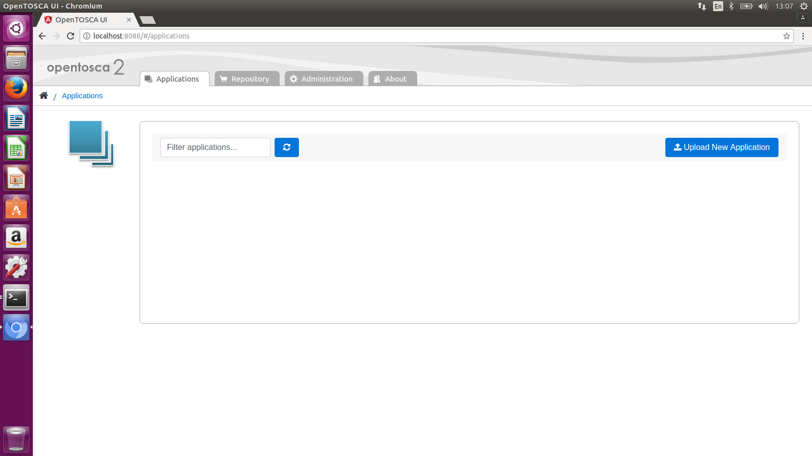

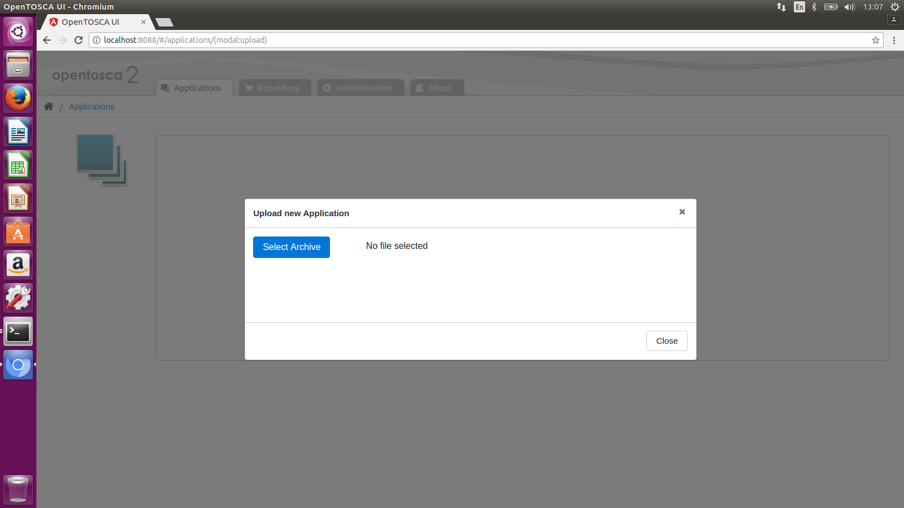

- Select **MyTinyToDo** Application

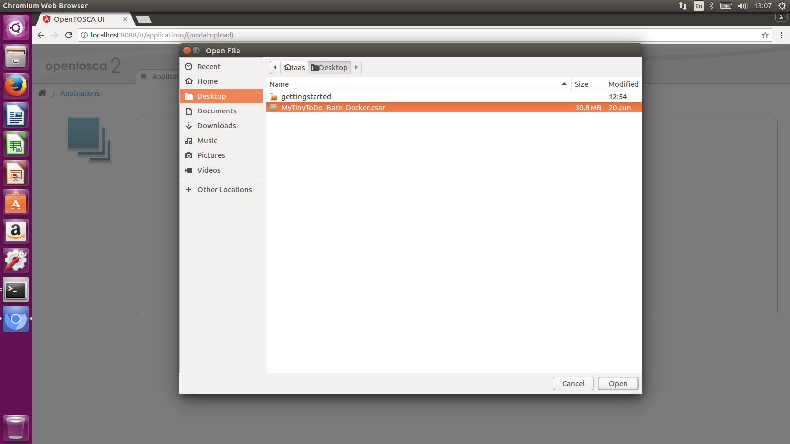

- Confirm the upload

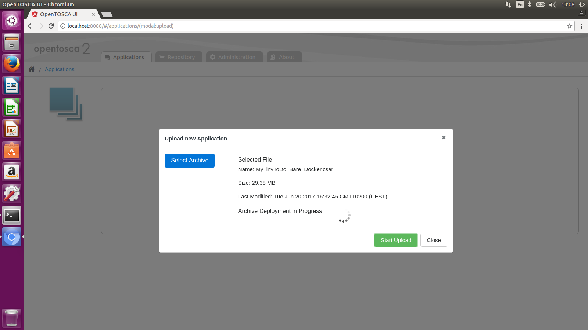

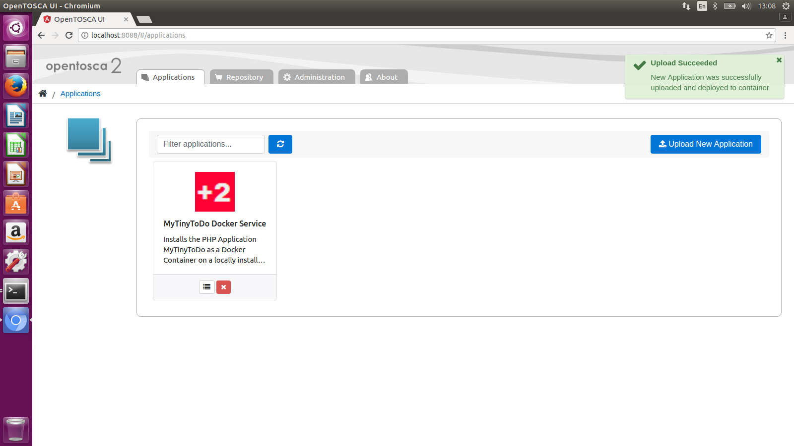

- **Details** can be shown with the icon on the left

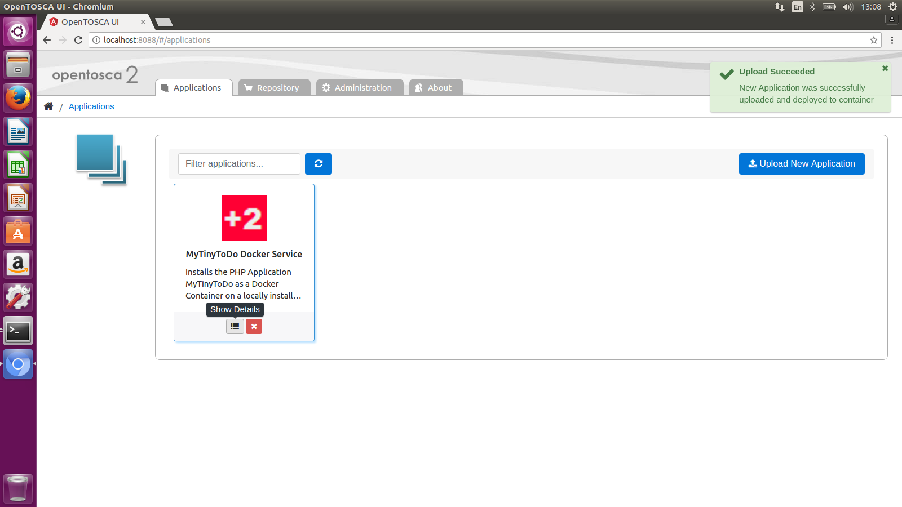

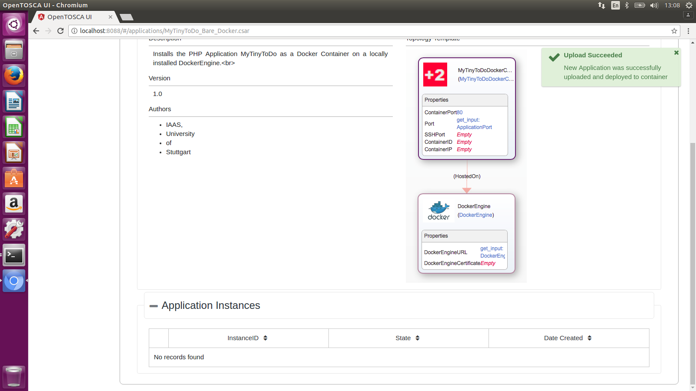

- Enter **9990** as the Application Port and
- **tcp://localhost: 375** as the DockerEngineURL

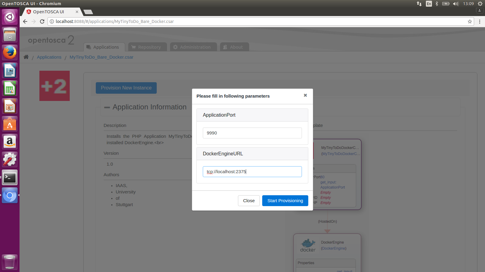

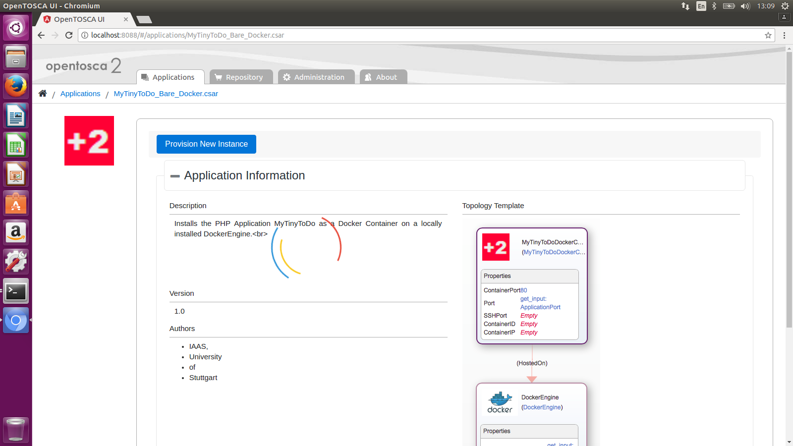

- Click on **Open Application**

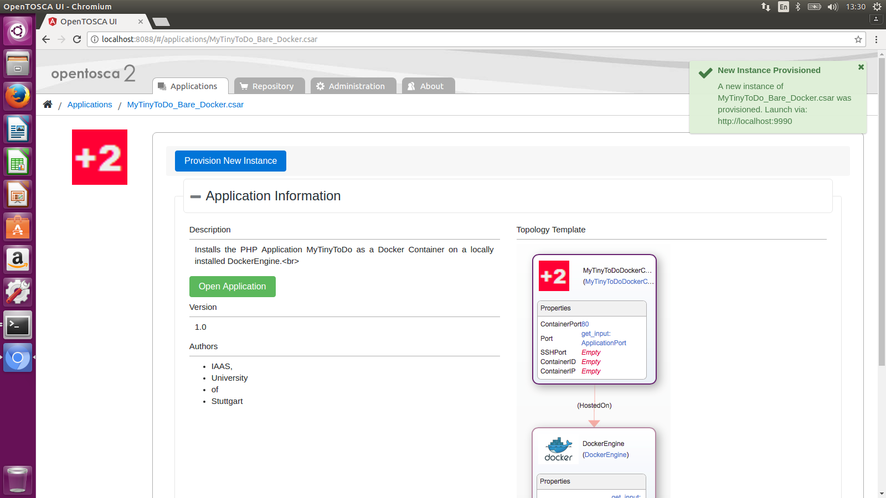

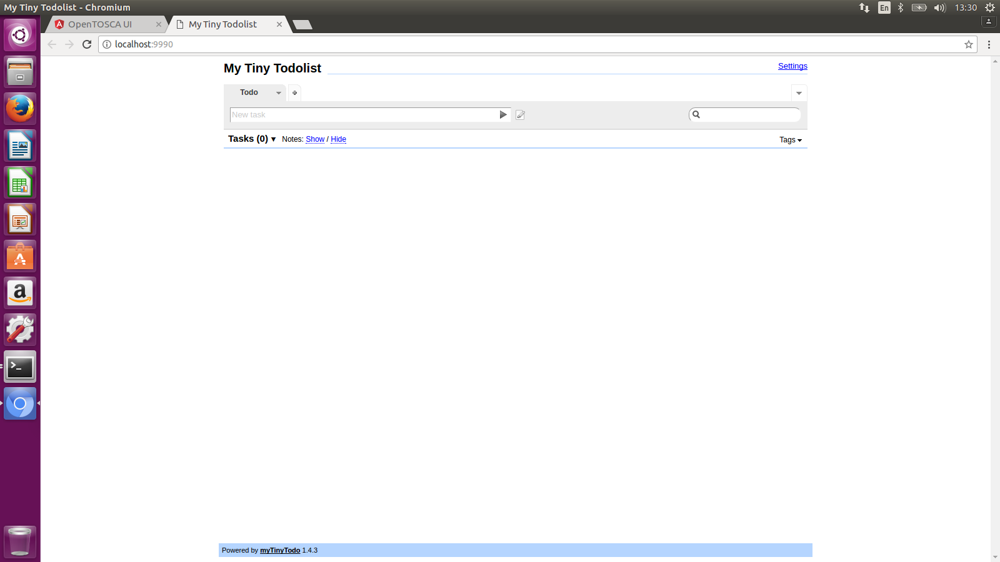

- Create a **Task**

- An instance is created in the **Application Instances** 

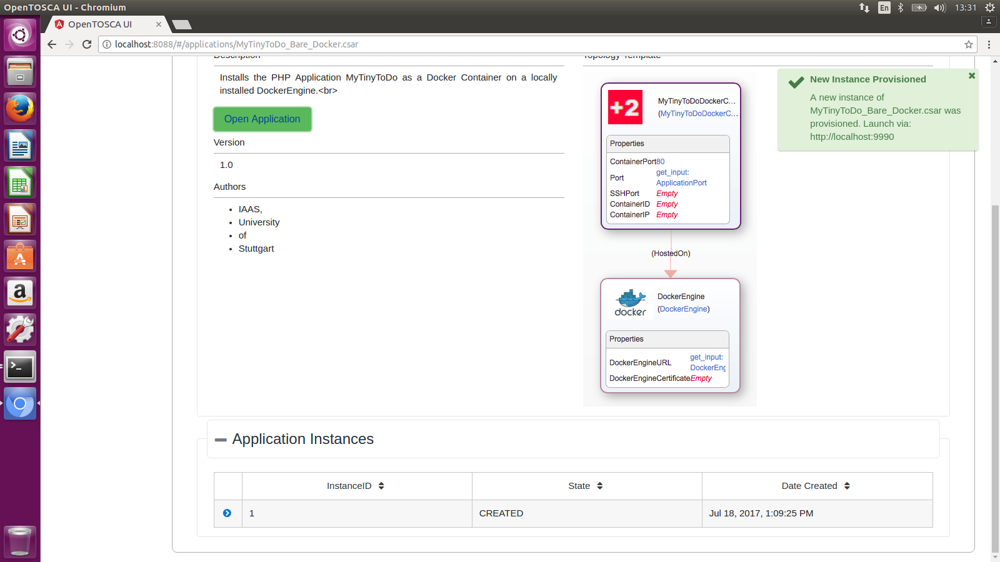
