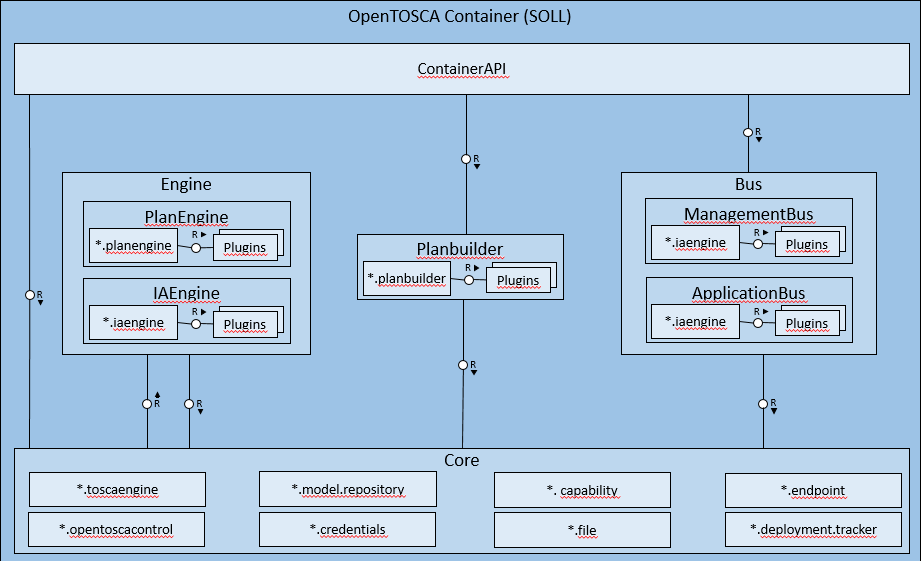
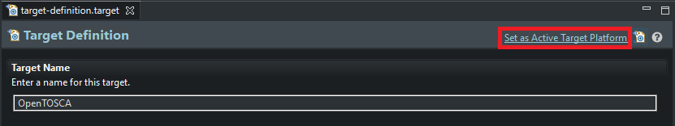
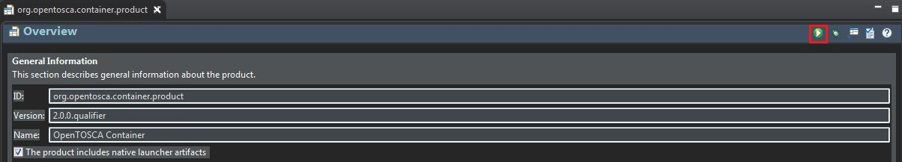

---
---


# Developer Guide OpenTOSCA Container

## Table of Contents


- [Introduction](#introduction)
- [Eclipse Installation](#eclipse-installation)
  * [Java SE Development Kit (JDK)](#java-se-development-kit-jdk)
  * [Eclipse](#eclipse)
- [Set up Eclipse](#set-up-eclipse)
  * [Import Code](#import-code)
  * [Set Container Target Platform](#set-container-target-platform)
- [How to](#how-to)
  * [Create an Eclipse Plug-in project](#create-an-eclipse-plug-in-project)
  * [Create / provide a declarative service](#create--provide-a-declarative-service)
  * [Consume / use a declarative service](#consume--use-a-declarative-service)
  * [OpenTOSCA Target Platforms](#opentosca-target-platforms)
    + [Get and add libraries](#get-and-add-libraries)
  * [Start container within Eclipse](#start-container-within-eclipse)

## Introduction

This document helps to setup Eclipse to develop the OpenTosca Container and its user interfaces (UIs).
Thereby, [Section 2](#eclipse-installation) explains the installation of Eclipse, [Section 3](#set-up-eclipse) the setup of eclipse and
[Section 4](#how-to) lists various guides regarding selected topics, e.g. how to create a declarative service.
Some subsections are optional and can be skipped.

This introduction provides an architectural overview of the OpenTosca container including their
package names, which should help to understand the code better. Figure 1 shows an architectural
overview of the OpenTosca container including the relations of the different components.
Further details can be found in the respective architecture documentation of OpenTOSCA.


**Fig.1: OpenTOSCA Container Architecture Overview**

Figure 2 shows the architecture of the OpenTosca Container core which provides different shared
capabilities to the other components of the container.


**Fig.2: OpenTOSCA Container Architecture or Core**
___

## Eclipse Installation

We use Eclipse as IDE for OpenTosca development.

### Java SE Development Kit (JDK)

If not installed already, download and install the most recent Java JDK from:
http://www.oracle.com/technetwork/java/javase/downloads/index.html

### Eclipse

If not installed already, download and install the most recent "Eclipse IDE for Java EE Developers"
from http://www.eclipse.org/downloads .
Install Eclipse by unpacking the downloaded archive to a location of your choice.

***

## Set up Eclipse

Start Eclipse and create a new workspace at a location of your choice.

### Import Code

IMPORTANT: We recommend opening useful Git views in Eclipse. If not done already, click **Window** -> **Show view** -> **Other...**. In the **Show View** window, type **Git** in the filter box and select **Git Repositories** and **Git Staging**. (Optionally you can add more views).

 1. Copy the clone link of the Github repository.
 2. In Eclipse click **File** -> **Import...**
 3. Type **Git** in the filter box and select **Projets from Git**
 4. In the following window select **Clone URI**
 5. The copied repository link should be pasted automatically into the corresponding box. If not, paste it into the **URI** text box.
 6. Add your authentication credentials (Optional)
 7. Click **Next**
 8. Select at least the **master** branch and optionally other branches you want to develop.
 9. Click **Next**
 10. Now choose the directory you want to store the project files locally.
 11. Click **Next** and the cloning process starts. This should take a few seconds.
 12. After the download is completed, select **Import as general project** to finish the import process.
 
 Hint: To add additional projects from the repository, right click on the imported **container** repository in the **Git Repositories** view and select **Import projects...**

### Set Container Target Platform

An Eclipse Target Platform contains libraries (OSGI bundles) that can be used / are available in Eclipse
plug-in projects. The OpenTOSCA Target Platform is contained in the project
"**target-definition**".

1.Open the file "target-definition.target" in the project
  "**target-definition**".
2.In the appearing Target Platform Editor click on "**Set as Target Platform**" in the top right corner
  (FIG. 3)
3.After building the workspace there should be no errors left.


Fig.3: Eclipse Target Platform Editor

___

## How to

### Create an Eclipse Plug-in project

New Projects that should belong to the Container or the RAP UI must be created as Eclipse Plug-in Project (OSGI Bundle)

1. In Eclipse go to "**New**" then "**Other...**" in the File menu.
2. Select in the list "**Plug-in Project**" and click on "**Next**".
3. Define as "project name" a name that begins with "**org.opentosca**" (it's our project namespace),
   e.g. "**org.opentosca.core.file.service.impl**" (Fig. 4). At "**Target Platform**" select the radio button
   "**an OSGi framework**" and in the associated drop down list "**standard**" (Fig. 4). Click on "**Next**".


**Fig.4: Define details of new Eclipse plug-in project.**

4. Define at "**Name**" a human readable name of this project/bundle, e.g. "**Core File Service Implementation**"
5. An Activator is a class that contains the methods "**start**" and "**stop**" that will be executed when the
   bundle will be started/stopped in the OSGi framework. Usually an Activator is not necessary.
   Thus, deselect the checkbox "**Generate an activator...**"
6. Click on "**Finish**" to create the plug in project.

### Create / provide a declarative service

An OSGi service consists of an interface class and one or more implementation classes (e.g. the Core File Service
implementation for a database or Amazon S3) Interface and implementations should be in separate projects/bundles.

_Interface project:_

1. Create a project that contains the interface as plug-in project like it's described in 4.1.
   The project name should be "**org.opentosca.<Component>.<Function>.service**", e.g.
   "**org.opentosca.core.file.service**"
2. In a project "**org.opentosca.core.file.service**" every class should be in a package "**org.opentosca.core.file.service**"
   Thus, create a first package with the name of the project.
3. Create in this package the interface class "**I<Component><Function>Service**", e.g."ICoreFileService".
   In this interface you can define the methods the service should provide.
4. Open the bundle manifest "**META-INF/MANIFEST.MF**" (relative to project root).
5. In the appearing Eclipse bundle manifest editor go to the tab "Runtime".
6. At "**Exported Packages**" click on "**Add...**", select the package that includes the interface class and click on "OK". Save the manifest.

Define the packages as exported makes the included interface class available for implementation classes/projects.

_Implementation project:_

1. Create a project that contains the implementation as plug in project like it's described in 4.1.
   The project name should be "**org.openttosca.core.file.service.impl**" (Fig.4)
2. Open the bundle manifest "**META.INF/MANIFEST.MF**" (relative to project root)
3. In the appearing Eclipse bundle manifest editor go to the tab "**Dependencies**"
4. At "**Imported Packages**" click on "**Add...**", select the package in the interface project that includes
   the interface class and click on "OK". Save the manifest.
5. In the project “org.opentosca.core.file.servie.impl” every class should be in the package “org.opentosca.core.file.service.impl” Thus, create a package with the name of the project.
6. In this package, create the implementation class “**ServiceImpl**.java", e.g. "CoreFileServiceImpl.java"
7. Right click on the project root and choose in the appearing context menu "**New**" then "**Folder**".
8. Define as name of the new folder "**OSGI-INF**".
9. Right click on the "**OSGI-INF**" folder and choose in the appearing context menu "**New**" then "**Other...**"
10. Open "**Plug-in development**" and select "**Component Definition**". Click on "**Next**"
11. Define as "File name" the name of the implementation class with the ending "**_component**", e.g. "**CoreFileServiceImpl_component.xml**" (Fig. 5)


**Fig.5: Create a new Component Definition.**

12. Define in "**Class**" the fully qualified name of the implementation class, e.g. "**org.opentosca.core.file.service.impl.CoreFileServiceImpl**"
    and in "**Name**" the same as in "**Class**" (Fig. 5). Finally click on "**Finish**" to create the component XML.
13. The created component XML should be automatically opened in the Eclipse component editor.
    If not, manually click on the file.
14. In the component editor go to the tab "**Services**" and click at "**Provided Services**" on "**Add...**"
15. In the appearing window type in the class name of the interface project, e.g. "**ICoreFileService**" and click on "**OK**"
    to publish the service interface. Save the manifest.

Fig. 6 shows the correct project structure of the Core File Service used as example in this chapter.


**Fig. 6: Service interface and implementation project structure. The Core File Services provides the methods “getCSAR” and “storeCSAR”. Its component XML resides in the folder “OSGI-INF” in the implementation project.**

### Consume / use a declarative service

A service can be only consumed in a plug-in project.

1. Create a new "Plug-in Project" called "**org.opentosca.core.file.service.consumer**"
2. Open the bundle manifest "**META-INF/MANIFEST.MF**" (relative to project root) of the plug-in
   project that should consume a service.
3. In the appearing Eclipse bundle manifest editor go to the tab "**Dependencies**"
4. At "**Imported Packages**" click on "**Add...**", select the package that includes the interface of the needed service an click on "**OK**".
   Save the manifest.
5. Right click in the root of the project and choose in the appearing context menu "**New**" then "**Folder**"
6. Define as name of the new folder "**OSGI-INF**".
7. Right click on the "**OSGI-INF**" folder and choose in the context menu "**New**" then "**Other...**"
8. Open "**Plug-in development**" and select "**Component Definition**". Click on "**Next**"
9. Define as "File name" the name of the class that needs the service with the ending "**_component**",
   e.g. "**MyClass_component.xml**"
10. Define in "**Class**" the fully qualified name of the class that needs the service,
   e.g. "**org.opentosca.util.myservice.impl.MyServiceImpl**" and in "**Name**" the same as in "**Class**".
   Finally click on "**Finish**" to creat the component XML-
11. The created component XML should be automatically openend in the Eclipse component editor.
    If not, manually double click on the file.
12. In the component editor go to the tab "**Services**" and click at "**Referenced Services**" on "**Add...**"
13. In the appearing window type in the interface class name of the needed service, e.g. "**ICoreFileService**"
    and click on "**OK**".
14. Select the new entry in the "**Referenced services**" list and click on "**Edit...**"
15. Define at "**Bind**" a name for the method that binds the service and at "**Unbind**" a name for the
	method that unbinds the service, e.g. "**bindCoreFileService**" and "**unbindCoreFileService**".
	Click on "**OK**" and save the XML.
16. Create the service variable (e.g. "**coreFileService**") and the bind and unbind methods in the class
	that needs the service as shown in Lst. 1


```java
public class MyServiceImpl{

	private ICoreFileService coreFileService;

	public void process() {
		File csarFile = new File("E:\\SuperApp.csar");
		coreFileService.storeCSAR(csarFile);
	}

	public void bindCoreFileService(ICoreFileService coreFileService){
		if(coreFileService == null){
			System.out.println("Can't bind Core File Service.");
		}
		else{
			this.coreFileService = coreFileService;
			System.out.println("Core File Service bound.");
		}
	}

	public void unbindCoreFileService(ICoreFileService coreFileService){
		this.coreFileService = null;
		System.out.println("Core File Service unbound.");
	}
}
```

**Lst. 1 "MyServiceImpl" consumes the Core File Service.**

You can now use the service by calling the desired method(s) on the service varaible.
In Lst. 1 coreFileService.storeCSAR(csarFile) will be called in method process.

### OpenTOSCA Target Platforms

#### Get and add libraries

If you need a package of a library (bundle) in a project that belongs to the Container ans it's not already available,
you must add the bundle to the Target Platform project of the Container
"**target-definition**".

A bundle is a JAR file that contains a bundle manifest at "**META-INF\MANIFEST.MF**".
Get at first the current version of the library directly from the library website. Check in the downloaded JAR File if it
contains the bundle manifest file. Besides, the manifest must include the attribute Bundle-SymbolicName,
e.g. Bundle-SymbolicName: jcl.over.slf4j

Otherwise the JAR file is not a bundle.

If you can't get a bundle directly from the library website you can look in a bundle repository.

Eclipse Orbit Repository http://download.eclipse.org/tools/orbit/downloads
Spring Repository http://ebr.springsource.com

Also you can look in the directory "**plugins**" in your Eclipse installation
(Eclipse is based in OSGi) if the necessary bundle is available.

If you found the bundle you can add it to the Target Platform.

1. Open the project "**target-definition**" in the package explorer
2. Move the bundle JAR file in the desired directory (e.g. "**Apache**") in the project.
3. Set the container again as it's described in 3.4.

### Start container within Eclipse

The container can be started within Eclipse by navigating to the **org.opentosca.container.product** folder.
In this folder open the file named **org.opentosca.container.product**.

After opening this file you can click the green launch button (Fig. 7) on the top right of the editor window to start the container.

**Fig. 7**