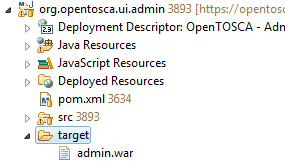

{}
---
---
<center>

  

</center>


# Developer Guide OpenTOSCA Container  

## Table of Contents

<!-- toc -->	

- [Introduction](#introduction)
- [Eclipse Installation](#eclipse-installation)
  * [Java SE Development Kit (JDK)](#java-se-development-kit-jdk)
  * [Eclipse](#eclipse)
- [Set up Eclipse](#set-up-eclipse)
  * [Add Tomcat Runtime](#add-tomcat-runtime)
  * [Code Structure](#code-structure)
  * [Import Code](#import-code)
  * [Set Container Target Platform](#set-container-target-platform)
- [How to](#how-to)
  * [Create an Eclipse Plug-in project](#create-an-eclipse-plug-in-project)
  * [Create/provide a declarative service](#createprovide-a-declarative-service)
  * [Consume / use a declarative service](#consume--use-a-declarative-service)
  * [OpenTOSCA Target Platforms](#opentosca-target-platforms)
    + [Get and add libraries](#get-and-add-libraries)
    + [Create a new directory](#create-a-new-directory)
  * [Build the admin user interface](#build-the-admin-user-interface)
    + [Install maven](#install-maven)
    + [Install the maven plugin of eclipse](#install-the-maven-plugin-of-eclipse)
    + [Initial update and build of the admin user interface web project](#inital-update-and-build-of-the-admin-user-interface-web-project)
    + [Run the admin user interface in the tomcat managed by Eclipse](#run-the-admin-user-interface-in-the-tomcat-managed-by-eclipse)
    + [Run the admin user interface in a dedicated tomcat](#run-the-admin-user-interface-in-a-dedicated-tomcat)

<!-- tocstop -->

## Introduction

This document helps to setup Eclipse to develop the OpenTosca Container and its user interfaces (UIs).
Thereby, [Section 2](#eclipse-installation) explains the installation of Eclipse, [Section 3](#set-up-eclipse) the setup of eclipse and 
[Section 4](#how-to) lists various guides regarding selected topics, e.g. how to create a declarative service. 
Some subsections are optional and can be skipped.

This introduction provides an architectural overview of the OpenTosca container including their 
package names, which should help to understand the code better. Figure 1 shows an architectural
overview of the OpenTosca container including the relations of the different components. 
Further details can be found in the respective architecture documentation of OpenTOSCA.

<center>

  
**Fig.1: OpenTOSCA Container Architecture Overview**
</center>

Figure 2 shows the architecture of the OpenTosca Container core which provides different shared 
capabilities to the other components of the container.

<center>

  
**Fig.2: OpenTOSCA Container Architecture or Core**

</center>
___

## Eclipse Installation

We use Eclipse as IDE for OpenTosca development.

### Java SE Development Kit (JDK)

If not installed already, download and install the most recent Java JDK from:
http://www.oracle.com/technetwork/java/javase/downloads/index.html

### Eclipse

If not installed already, download and install the most recent "Eclipse IDE for Java EE Developers"
from http://www.eclipse.org/downloads .  
Install Eclipse by unpacking the downloaded archieve to a location of your choice.

***

## Set up Eclipse

Start Eclipse and create a new workspace at a location of your choice.

### Add Tomcat Runtime

Some of our projects are web projects (e.g. the JSP UI project) and can be directly deployed
on a local Tomcat from Eclipse. Thus, the path to Tomcat must be specified. the following must
be done in all workspaces.

1. In Eclipse choose "**Preferences**" in the Window menu.
2. Go to "**Server**", then "**Runtime Environments**" and click on "**Add...**".
3. The wizard "**New Server Runtime Environment**" appears. select in the list "**Apache Tomcat v. 7.0**"
   and click on "**Next**".
4. If you already installed Tomcat define its path at "**Tomcat installation directionary**". 
   Otherwise you can download and install it directly from Eclipse by clicking on "**Download and Install**",
   accepting the license agreement and defining an installation directory.
5. Click on "**Finish**" to add the defined Tomcat installations as a server runtime environment.

### Code Structure

The following table shows the folder structure of the projects:

| Path (relative to Repository Root)    | Content                                            |
|:-------------------------------------:|:--------------------------------------------------:|
| OpenTOSCA\trunk\common                | Common projects, e.g. logging projects, settings   |
| OpenTOSCA\trunk\container             | Container projects and Target Platform             |
| OpenTOSCA\trunk\container-test        | Test projects of Container                         |
| OpenTOSCA\trunk\ui-jsp                | Root UI; JSP                                       |
| OpenTOSCA\trunk\ui-root               | Root UI; JSP                                       |
| OpenTOSCA\trunk\ui-vinothek           | Vinothek (self service portal); JSP                |

### Import Code

 1. Download and unzip code to a location of your choice.
 2. Menu "**File**" then ""**Import...**""
 3. Then select import source: "**General**" then "**Existing Projects into Workspace**" and click on "**Next**".
 4. Choose the location you extracted the code as "**root directory**" and select all projects
    If you want you can exclude the tests (folder container test) or the UIs (folder ui-*)
 5. Click "**Finish**"
 
### Set Container Target Platform

An Eclipse Target Platform contains libraries (OSGI bundles) that can be used/ are available in Eclipse
plug-in projects. The OpenTOSCA Target Platform is contained in the project
"**org.opentosca.targetplatform.container**".

1.open the file "OpenToscaTargetplatform.target" in the project
  "**org.opentosca.targetplatform.container**".
2.In the appearing Target Platform Editor click on "**Set as Target Platform**" in the top right corner 
  (FIG. 3)
3.After building the workspace there should be no errors left.

<center>

  
Fig.3: Eclipse Target Platform Editor

</center>
___

## How to

### Create an Eclipse Plug-in project

New Projects that should be belonging to the Container or the RAP UI must be created as Eclipse Plug-in Project (OSGI Bundle)

1. In Eclipse go to "**New**" then "**Other...**" in the File menu.
2. Select in the list "**Plug.in Project**" and click on "**Next**".
3. Define as "project name" a name that begins with "**org.opentosca**" (it's our project namespace),
   e.g. "**org.opentosca.core.file.service.impl**" (Fig. 4). At "**Target Platform**" select the radio button
   "**an OSGi framework**" and in the associated drop down list "**standard**" (Fig. 4). Click on "**Next**".

<center>

  
**Fig.4: Define details of new Eclipse plug-in project.**

</center>

4. Define at "**Name**" a human readable name of this project/bundle, e.g. "**Core File Service Implementation**"
5. A Activator is a class that contains the methods "**start**" and "**stop**" that will be executed when the
   bundle will be started/stopped in the OSGi framework. Usually a Activator is not necessary.
   Thus, deselect the checkbox "**Generate an activator...**"
6. Click on "**Finish**" to create the plug in project.

### Create/provide a declarative service

A OSGi service consists of a interface class and one or more implementation classes (e.g. the Core File Service
implementation for a database or Amazon S3) Interface and implementations should be in separate projects/bundles.

_Interface project:_

1. Create the project that contains the interface as plug-in project like it's described in 4.1.
   The project name should be "**org.opentosca.<Component>.<Function>.service**", e.g.
   "**org.opentosca.core.file.service**"
2. In a project "**org.opentosca.core.file.service**" every class should be in a package "**org.opentosca.core.file.service**"
   Thus, create a first package wirh the name of the project.
3. Create in this package the interface class "**I<Component><Function>Service**", e.g."ICoreFileService".
   In this interface you can define the methods the service should provide.
4. Open the bundle manifest "**META-INF/MANIFEST.MF**" (relative to project root).
5. In the appearing Eclipse bundle manifest editor go to the tab "Runtime".
6. At "**Exported Packages**" click on "**Add...**", select the package that includes the interface class and click on "OK". Save the manifest.

Define the packages as exported makes the included interface class available for implementation classes/projects.

_Implementation project:_

1. Create the project that contains the implementation as plug in project like it's described in 4.1.
   The project name should be "**org.openttosca.core.file.service.impl**" (Fig.4)
2. Open the bundle manifest "**META.INF/MANIFEST.MF**" (relative to project root)
3. In the appearing Eclipse bundle manifest editor go to the tab "**Dependencies**"
4. At "**Imported Packages**" click on "**Add...**", select the package in the interface project that includes
   the interface class and click on "OK". Save the manifest.
5. In a project "**org.opentosca.core.file.servie.impl**" every class shoul be in a package "**org.opentosca.core.file.service.impl**"
   Thus, create a first package with the name of the project.
6. Create in this package the implementation class "**<Component><Function>ServiceImpl**", e.g. "CoreFileServiceImpl"
7. Right click on the project root and choose in the appearing context menu "**New**" then "**Folder**".
8. Define as name of the new folder "**OSGI-INF**".
9. Right click on the "**OSGI-INF**" folder and choose in the appearing context menu "**New**" then "**Other...**"
10. Open "**Plug-in development**" and select "**Component Definition**". Click on "**Next**"
11. Define as "File name" the name of the implementation class with the ending "**_component**", e.g. "**CoreFileServiceImpl_component.xml**" (Fig. 5)

<center>

  
**Fig.5: Create a new Component Definition.**

</center>

12. Define in "**Class**" the fully qualified name of the implementation class, e.g. "**org.opentosca.core.file.service.impl.CoreFileServiceImpl**"
    and in "**Name**" the same as in "**Class**" (Fig. 5). Finally click on "**Finish**" to create the component XML.
13. The created component XML should be automatically opened in the Eclipse component editor.
    If not, manually click on the file.
14. In the component editor go to the tab "**Services**" and click at "**Provided Services**" on "**Add...**"
15. In the appearing window type in the class name of the interface project, e.g. "**ICoreFileService**" and click on "**OK**"
    to publish the service interface. Save the manifest.

Fig. 6 shows the correct project structure of the Core File Service used as example in this chapter.

<center>

 
 
**Fig. 6: Service interface and implementation project structure. The Core File Services provides the methods “getTHOR” and “storeTHOR”. Its component XML resides in the folder “OSGI-INF” in the implementation project.**
</center>


### Consume / use a declarative service

A service can be only consumed in a plug-in project.

1. Open the bundle manifest "**META-INF/MANIFEST.MF**" (relative to project root) of the plug-in
   project that should consume a service.
2. In the appearing Eclipse bundle manifest editor go to the tab "**Dependencies**"
3. At "**Imported Packages**" click on "**Add...**", select the package that includes the interface of the needed service an click on "**OK**".
   Save the manifest.
4. Right click in the root of the project and choose in the appearing context menu "**New**" then "**Folder**"
5. Define as name of the new folder "**OSGI-INF**".
6. Right click on the "**OSGI-INF**" folder and choose in the context menu "**New**" then "**Other...**"
7. Open "**Plug-in development**" and select "**Component Definition**". Click on "**Next**"
8. Define as "File name" the name of the class that needs the service with the ending "**_component**",
   e.g. "**MyClass_component.xml**"
9. Define in "**Class**" the fully qualified name of the class that needs the service,
   e.g. "**org.opentosca.util.myservice.impl.MyServiceImpl**" and in "**Name**" the same as in "**Class**".
   Finally click on "**Finish**" to creat the component XML-
10. The created component XML should be automatically openend in the Eclipse component editor.
    If not, manually double click on the file.
11. In the component editor go to the tab "**Services**" and click at "**Referenced Services**" on "**Add...**"
12. In the appearing window type in the interface class name of the needed service, e.g. "**ICoreFileService**"
    and click on "**OK**".
13. Select the new entry in the "**Referenced services**" list and click on "**Edit...**"
14. Define at "**Bind**" a name for the method that binds the service and at "**Unbind**" a name for the
	method that unbinds the service, e.g. "**bindCoreFileService**" and "**unbindCoreFileService**".
	Click on "**OK**" and save the manifest.
15. Create the service variable (e.g. "**coreFileService**") and the bind and unbind methods in the class
	that needs the service as shown in Lst. 1


```java
public class MyServiceImpl{

	private ICoreFileService coreFileService;
	
	public void process() {
		File thorFile = new File("E:\\SuperApp.thor");
		coreFileService.storeTHOR(thorFile);
	}
	
	public void bindCoreFileService(ICoreFileService coreFileService){
		if(coreFileService == null){
			System.out.println("Can't bind Core File Service.");
		}
		else{
			this.coreFileService = coreFileService;
			System.out.println("Core File Service bound.");
		}
	}
	
	public void unbindCoreFileService(ICoreFileService coreFileService){
		this.coreFileService = null;
		System.out.println("Core File Service unbound.");
	}
}
```
<center>

**Lst. 1 "MyServiceImpl" consumes the Core File Service.**

</center>

You can now use the service by calling the desired method(s) on the service varaible.
In Lst. 1 coreFileService.storeTHOR(thorFile) will be called in method process.

### OpenTOSCA Target Platforms

#### Get and add libraries

If you need a package of a library (bundle) in a project that belongs to the Container ans it's not already available,
you must add the bundle to the Target Platform project of the Container
"**org.opentosca.targetplatform.container**".

A abundle is a JAR file that contains a bundle manifest at "**META-INF\MANIFEST.MF**".
Get at first the current version of the library directly from the library website. Check in the downloaded JAR File if it
contains the bundle manifest file. Besides, the manifest must include the attribute Bundle-SymbolicName,
e.g. Bundle-SymbolicName: jcl.over.slf4j

Otherwise the JAR file is not a bundle.

If you can't get a bundle directly from the library website you can look in a bundle repository.

Eclipse Orbit Repository http://download.eclipse.org/tools/orbit/downloads  
Spring Repository http://ebr.springsource.com

Also you can look in the directory "**plugins**" in your Eclipse installation 
(Eclipse is based in OSGi) if the necessary bundle is available.

If you found the bundle you can add it to the Target Platform.

1. Open the project "**org.opentosca.targetplatform.container**" in the package explorer
2. Move the bundle JAR file in the desired directory (e.g. "**Apache**") in the project.
3. Set the container again as it's described in 3.4.

#### Create a new directory

If you want create a new directory in a Target Platform you must do the following

1. Right click on the Target Platform project and go in the appearing context menu to "**New**" then "**Folder**".
   Choose at "**Folder name**" the desired name of the directory and click on "**Finish**".
2. Open the file "**OpenToscaTargetPlatform.target**"/"ToscsGui.target" in the projetct.
3. In the appearing Eclipse target definiton editor click at "**Locations**" on "**Add...**"
4. In the appearing wizard select "**Directory**" and click on "**Next**"
5. Define at "**Location**" the path to the new directory in the following way:
   A new directory "MyDir" must be added as
   "**${workspace_loc}/org.opentosca.targetplatform.container/MyDir**" (Fig. 7)/
   "**${workspace_loc}/org.opentosca.targetplatform.ui.rap/MyDir**"

<center>

  
**Fig.7: Directory "MyDir" was added to target definition file.**

</center>

6. Save the target definition file.

Now you can add bundles to the created directory like it's described in 4.4.1.

### Build the admin user interface
#### Install maven

Download and install maven. You can follow the instructions on the following website:

http://maven.apache.org/guides/getting-started/maven-in-five-minutes.html

#### Install the maven plugin of eclipse

First open the marketplace of Eclipse.

<center>


</center>

Then search for m2eclipse-wtp:

<center>


</center>

Click on "**Install**" and follow the displayed steps.

#### Inital update and build of the admin user interface web project

After importing the project org.opentosca.ui.admin into the Eclipse workspace click with the right
mouse button on the project in the Eclipse "**Project Explorer**" and select "**Update Project...**"
in the "Maven" menu.

<center>


</center>

Then just click on "OK" to download and update all dependencies of the project.

<center>


</center>

To setup the maven build run configuration click on the black arrow on the right side of the green
play button and select "**Run Configurations...**"

<center>


</center>

With a right click on "**Maven Build**" and "**New**" you can create a new maven run configuration.
Name it "**org.opentosca.ui.admin build**" and insert the two goals clean and package. Last click on "**Apply**".

<center>


</center>

If you execute this run configuration there is an admin.war in the "**target**" folder inside your project
afterwards.

<center>



</center>

#### Run the admin user interface in the tomcat managed by Eclipse

First make sure to install a tomcat like described in chapter 3.1. Then do a right click on the
org.opentosca.ui.admin project and select "**Run As**" and then "**Run on Server**".

<center>


</center>

Then choose the existing Tomcat v7.0 server and click on "**Finish**".

<center>


</center>

Then browse to the website like http://127.0.0.1:8080/admin/index.action if the tomcat is installed
locally.

#### 	Run the admin user interface in a dedicated tomcat

Copy the admin.war inside the "webapps" folder of your tomcat installation.  
Then browse to the website like http://127.0.0.1:8080/admin/index.action if the tomcat is installed locally.


