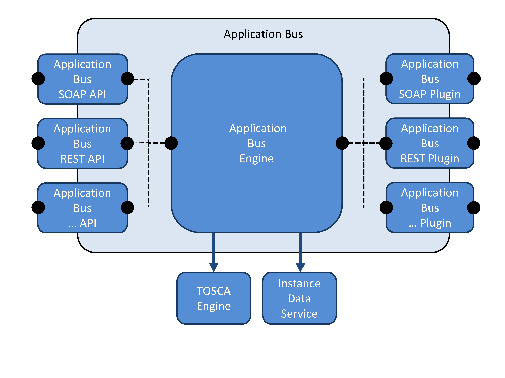
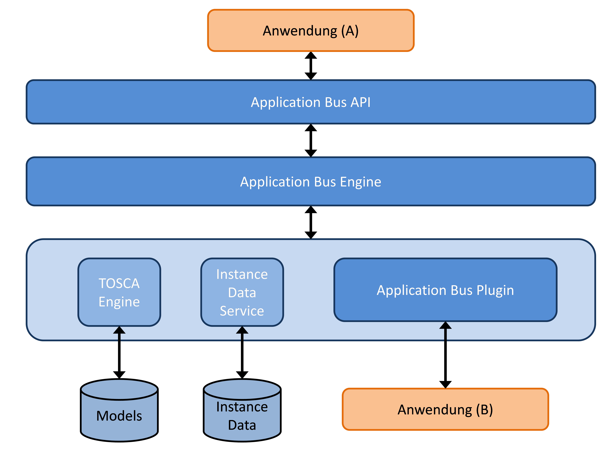
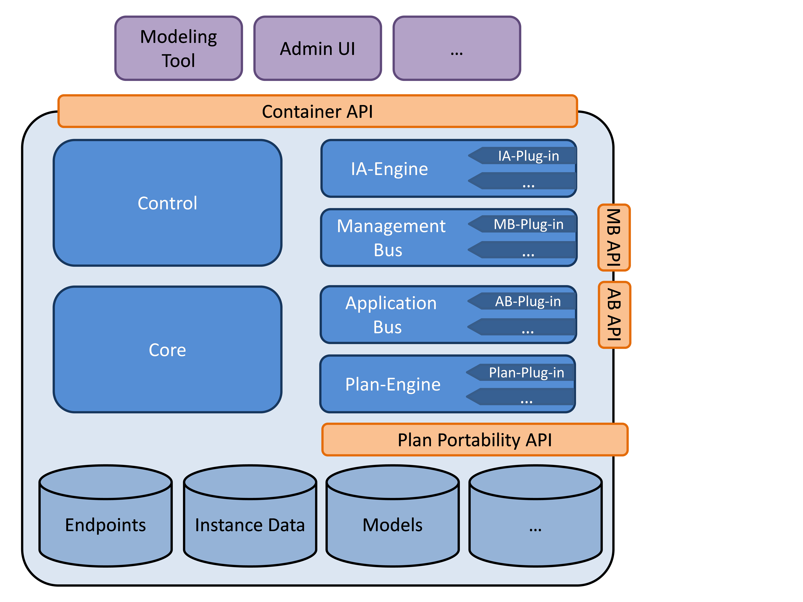
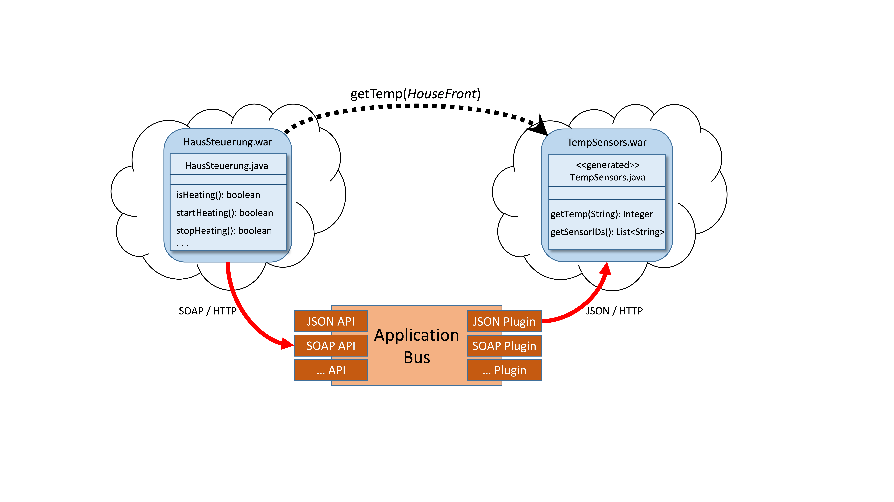
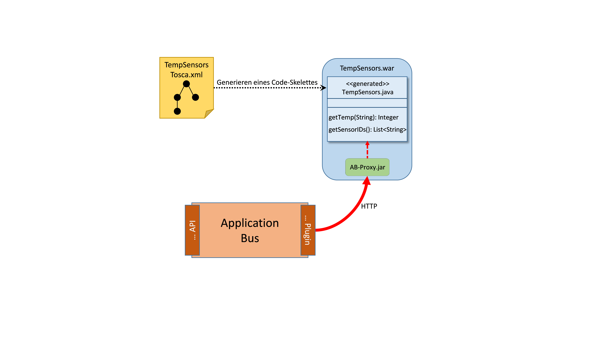
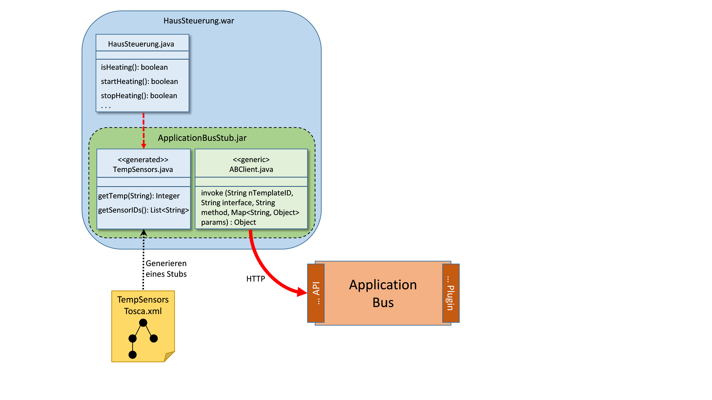
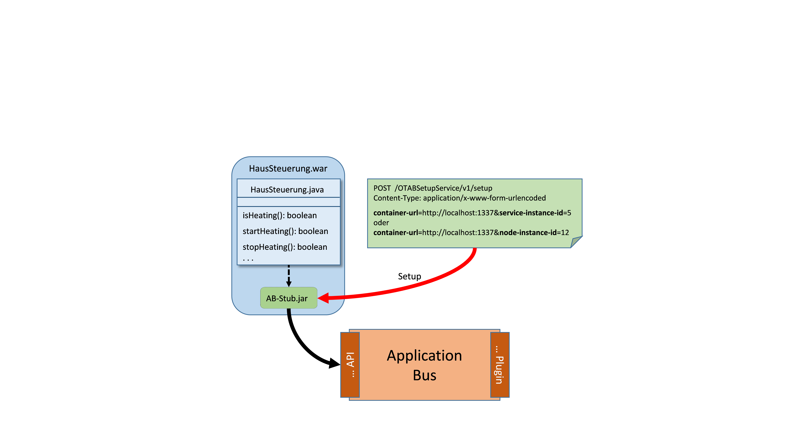
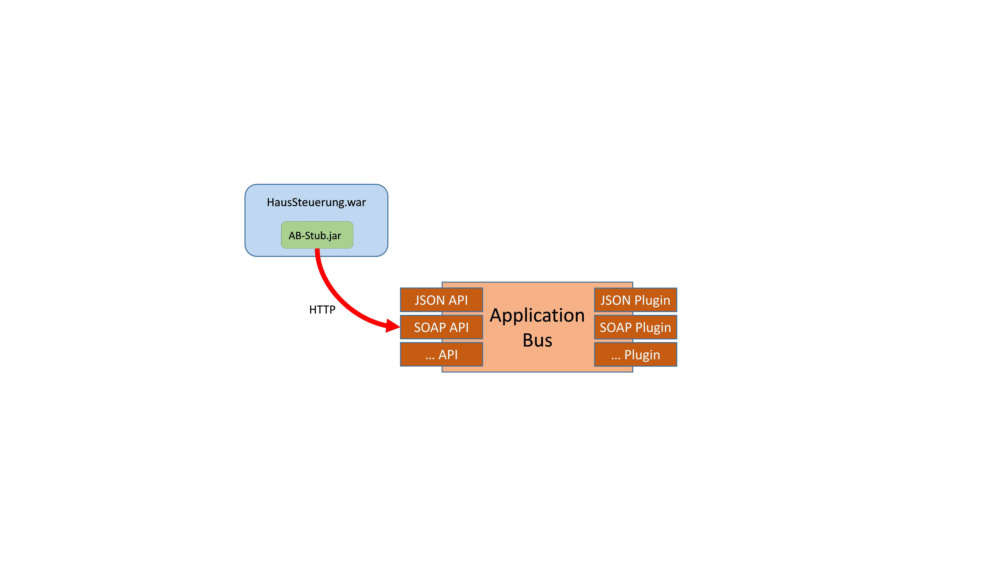
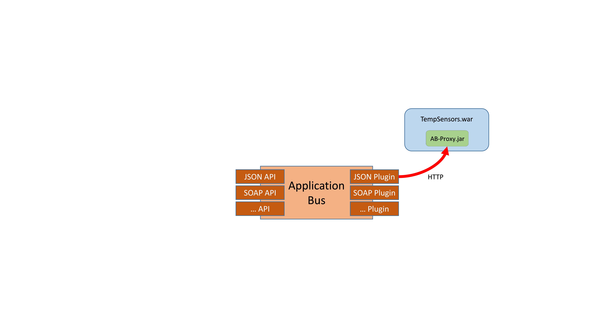

---
---
<center>
Institut für Architektur Von Anwendungssystemen

Universität Stuttgart  
Universitätsstraße 38  
D - 70569 Stuttgart


#Konzept und Implementierung einer Komponente zur Kommunikation TOSCA-basierter Anwendungen
##Kapitel 7 - 9
Michael Zimmermann

</center>


##Architektur

In diesem Kapitel wird die Architektur des im Rahmen dieser Arbeit entwickelten
Application Bus vorgestellt. dabei wird zum einen auf die Architektur von OpenTOSCA eingegangen.

In Abbildung 12 wird die Architektur des Application Bus dargestellt. Links in der 
Abbildung sind beispielhafte APIs zur Nutzung des Application Bus aufgeführt 
(siehe Abschnitt 9.2, 9.3 und 9.4) Durch diese APIs wird die Funktionalität des
Application Bus anderen Komponenten und Anwendungen zur Verfügung gestellt.
Die Abbildung zeigt beispielsweise eine SOAP sowie eine REST API. Weiterhin
können beliebige weitere APIs, auch während der Laufzeit, hinzugefügt werden
und damit die Anzahl an unterstützten Protokollen und Standards erhöht werden.

Die zentrale Komponente innerhalb des Application Bus ist die *Application Bus 
Engine*(siehe Abschnitt 9.5). Hier werden zum Aufruf einer gewünschten Operation
benötigte Informationen gesammelt beziehungsweise ermittelt. 
Beispielsweise wird in der Application Bus Engine der Endpoint der aufzurufenden 
Anwendung bestimmt. Weiterhin wird ermittelt, welches Application Bus Plugin zur
Verfügung steht, also im Container installiert und gestartet ist. Außerdem wird 
anhand der im TOSCA-Modell vorhandenen Informationen (siehe dazu Kapitel 8) ein
Plugin bestimmt, dass den Aufruf bewerkstelligen kann. 
Hierzu ist die Application Bus Engine mit anderen,benötigten Komponenten des 
OpenTOSCA Containers wie der TOSCA Engine, sowie dem Instance Data Service verbunden.
Per Instance Data Service können Instanzdaten gespeichert und abgefragt werden. 
So können zum Beispiel IP-Adressen deployter Anwendungskomponenten dort von Plänen 
abgelegt werden und diese dadurch anderen OpenTOSCA-Komponenten, wie beispielweise 
dem Application Bus, zugänglich gemacht werden.

<center>

  
**Abbildung 12: Application Bus Architektur**

</center>

Im rechten Bereich der Abbildung sind die Application Bus Plugins dargestellt (siehe
Abschnitt 9.6). Die Plugins sind für den Aufruf der spezifizierten Operati-on einer 
Anwendung zuständig und stellen ebenfalls Unterstützung für verschiedene Standards und 
Protokolle – Invocation-Type genannt – zur Verfügung. Wiederum sind hier beispielhaft 
ein SOAP sowie ein REST Plugin aufgeführt. Jedoch können auch hier, analog zu den APIs, 
beliebige neue Plugins noch zur Laufzeit hinzugefügt werden. 
Die Verwaltung der Plugins übernimmt die Application Bus Engine durch ein dafür ausgelegtes
und auf OSGi (siehe Abschnitt 2.4) basierendes Plugin-System.

Abbildung 12 zeigt weiterhin die Verbindung der einzelnen Komponenten innerhalb der Application
Bus Engine durch Camel (siehe Abschnitt 2.7). Die schwarzen Punkte stellen dabei die von der
jeweiligen Komponente definierten endpunkte dar. Die gestrichelten Linien stellen weiterhin
Camel Routen zur Verbindung dieser Endpunkte dar.

In dem hier aufgezeigten Beispiel sind jeweils die gleichen Typen (SOAP und REST) an APIs
und Plugins vorhanden. Dies ist jedoch nicht obligatorisch. Die zur Verwendung des Application 
Bus genutzte API muss nicht identisch mit dem für den Aufruf einer Operation einer Anwendung 
genutztem Plugin sein. Eine Anwendung kann somit beispielsweise den Application Bus per 
REST API ansprechen, wohingegen der effektive Aufruf der Operation einer anderen Anwendung 
per SOAP Plugin erfolgt.

<center>


**Abbildung 13: Kommunikationsdiagramm des Application Bus**

</center>

Abbildung 13 stellt den Aufbau des Application Bus als Kommunikationsdiagramm dar. 
Das Diagramm zeigt den zentralen Charakter der Application Bus Engine, die einerseits sowohl 
mit benötigten Komponenten des OpenTOSCA Containers kommuniziert sowie andererseits als 
Bindeglied zwischen den verschiedenen APIs und Plugins fungiert. 
Abbildung 13 zeigt weiterhin die beispielhafte Nutzung des Application Bus durch eine 
Anwendung (A) sowie den Aufruf einer Anwendung (B) durch ein Application Bus Plugin.

<center>


**Abbildung 14: OpenTOSCA Architektur mit Application Bus**

</center>

Abbildung 14 stellt die erweiterte Gesamtarchitektur von OpenTOSCA, im Vergleich zu Abbildung 2, 
mit integriertem Application Bus dar. Zu erkennen ist, dass die Komponenten auf der rechten 
Seite der Abbildung (IA-Engine, Ma-nagement Bus, Application Bus sowie Plan-Engine) jeweils 
mit einem eigenen Plugin-System ausgestattet sind. Dadurch kann die Funktionalität jeder 
einzelner Komponente sowie von OpenTOSCA insgesamt einfach erweitert werden. Darüber hinaus 
bringt die Verwendung eines einheitlichen Plugin-Systems eine bessere Wartbarkeit des Containers
mit sich.

---

##Erweiterung von TOSCA, Code-Generierung und Umsetzung durch den Application Bus

In Kapitel 6 wurde bereits ein grober Überblick über die Funktionsweise des Application Bus 
gegeben. In diesem Kapitel wird daher anhand eines Beispielszenarios die Nutzung und 
Funktionsweise des Application Bus detailliert vorgestellt. Dabei werden von der Entwicklung
einer Anwendung, über das Deployment dieser durch OpenTOSCA bis hin zum Aufruf der Anwendung 
mittels des Application Bus wichtige Teilschritte näher betrachtet. Hierzu wird im folgenden 
Beispielszenario die Application Bus SOAP/HTTP API (siehe Abschnitt 9.2) sowie das Application 
Bus JSON/HTTP Plugin (siehe Abschnitt 9.6) als Beispiele für eine API sowie für ein Plugin 
genutzt. Der konzeptionelle Ablauf bei der Nut-zung einer anderen API beziehungsweise eines 
anderen Plugins ist mit dem hier gezeigten vergleichbar.

<center>


**Abbildung 15: Beispielszenario**

</center>

Abbildung 15 veranschaulicht das zur Erläuterung der Nutzung und Funktionsweise des 
Application Bus verwendete Szenario. Die Abbildung zeigt, dass eine Anwendung HausSteuerung 
die Operation getTemp der Anwendung TempSensors aufrufen soll. 
Da die Anwendung HausSteuerung jedoch weder den Endpunkt der Anwendung TempSensors kennt, 
noch weiß, wie sie aufgerufen werden kann, wird der Application Bus hierfür benötigt. 
In diesem Beispiel sind die bei-den Anwendungen als Web Application Archives (WAR) 
implementiert. Es sind jedoch konzeptionell auch beliebige andere Implementierungen möglich.

Dem Ablauf des Beispielszenarios folgend ist dieses Kapitel wie folgt gegliedert: 
In Abschnitt 8.1 wird erläutert, was bei der Entwicklung einer durch den Application Bus 
aufzurufenden Anwendung (hier: TempSensors) beachtet werden muss. Anschließend wird analog 
dazu in Abschnitt 8.2 gezeigt, was bei der Entwicklung einer den Application Bus nutzenden 
Anwendung (hier: HausSteue-rung) beachtet werden muss.   
In beiden Fällen wird dabei auch auf die mögliche Unterstützung durch Code-Generierung 
eingegangen. In Abschnitt 8.3 wird anschließend das nach dem Deployment erforderliche 
Einrichten der Application Bus nutzenden Anwendung (hier: HausSteuerung) erklärt. 
Im darauf folgenden Abschnitt 8.4 wird die Kommunikation einer Anwendung 
(hier: HausSteuerung) mit dem Application Bus erläutert.   
In Abschnitt 8.5 wird schließlich die Kommunikation des Application Bus mit der 
aufzurufenden Anwendung (hier: TempSensors) vorgestellt.

### Entwicklung einer durch den Application Bus aufzurufenden Anwendung

In diesem Abschnitt wird erklärt, wie eine Anwendung für den Application Bus aufrufbar 
gemacht wird. Dabei wird erläutert welche Voraussetzungen die An-wendung dafür erfüllen muss,
wie Code-Generierung zur Unterstützung genutzt werden kann und welche Erweiterungen in TOSCA 
dafür notwendig sind.  
Als Beispielanwendung wird hierzu die im zuvor geschilderten Beispielszenario vorgestellte 
TempSensors Anwendung verwendet.

Bevor eine Anwendung mittels des OpenTOSCA Containers deployt werden kann, muss sie zuerst 
implementiert werden. Wie bereits in der in Kapitel 6 definierten Methode zur Entwicklung 
TOSCA-basierter Cloud-Anwendungen gezeigt, wird der Entwickler dabei schon unterstützt. 
Mit dem Application Bus Stub Generator (siehe Abschnitt 9.8) können aus einer mittels TOSCA 
modellierten Anwendung die Code-Skelette der dazugehörigen Methoden generiert werden 
(siehe Abbildung 16). Noch nicht implementiert, aber konzeptionell vorgesehen, ist auch das 
generieren der TOSCA Elemente aus einer bereits bestehenden Anwendung.

<center>


**Abbildung 16: Generierung eines Code-Skelettes aus TOSCA**

</center>

Listing 2 zeigt eine beispielhafte Modellierung der TempSensors Anwendung mittels TOSCA. 
In dem dargestellten Beispiel bietet die Anwendung eine Operation getTemp (Zeile 6) an. 
Weiterhin definiert die Operation einen Eingabeparameter sensorID (Zeile 10) sowie einen 
Rückgabeparameter temperature (Zeile 13). 
Um Anwendungsoperationen von Managementoperationen – welche von Implemen-tation Artifacts 
implementiert werden – unterscheiden zu können, wurde der TOSCA Standard mit einem speziell 
für OpenTOSCA vorgesehenen Element erweitert. 
Zusätzlich zu dem bereits standardmäßig vorhandenen Interfaces Element, welches für die 
Managementoperationen genutzt wird, wurde das ApplicationInterfaces Element (Zeile 3) 
eingeführt um darin Anwendungsoperationen zusammenzufassen.


```xml
<NodeType name="TempSensorsApplication">
   ...
    <opentosca:Applicationinterfaces
        xmlns:opentosca="http://www.uni-stuttgart.de/opentosca">
        <Interface name="TempSensors">
            <Operation name="getTemp">
            <documentation>Returns the temperature of the 
                speciefied sensor</documentation>
            <InputParameters>
                <InputParameter name="sensorID" type="xs:string"/>
            </InputParameters>
            <OutputParameters>
                <Outputparameter name="temperature" type="xs:int"/>
            </OutputParameters>
            </Operation>
        </Interface>
    </opentosca:Applicationinterfaces>
</NodeType>
```

<center>
**Listing 2: Beispielhafte Modellierung von Anwendungsoperationen in erweitertem TOSCA**
</center>

Listing 3 zeigt das mittels Application Bus Stub Generator generierte Code-Skelett der 
modellierten Anwendungsoperation. Der Entwickler der Anwendung kann dieses Code-Skelett 
nutzen und die generierte Methode mit der gewünschten Anwendungslogik füllen. Man sieht 
anhand des Beispiels wie die TOSCA-Elemente in Java Code überführt werden. 
Der Name des Interfaces innerhalb TOSCA (Zeile 5) wird zu dem Klassenname in Java (Zeile 1). 
Die in TOSCA modellierte Operation (Zeile 6) wird zur Methode (Zeile 6) und Input- und 
OutputParameter (Zeilen 10 und 13) werden zu Eingabe- und Rückgabewerten (Zeilen 6 und 8). 
Optionale Dokumentationen werden ebenfalls von TOSCA (Zeilen 7 und 8) in Java (Zeilen 3-5) 
überführt.

```java

public class TempSensors{
    /**
    *Returns the temeperature of the specified sensor
    */
    public static Integer getTemp(string sensorID){
        // TODO generated method stub
        return temperature;
    }
}
```

<center>

**Listing 3: Aus TOSCA generiertes Code Skelett einer Anwendungsoperation**
</center>

Damit die angebotenen Operationen einer Anwendung durch den Application Bus aufgerufen werden
können, muss die Anwendung eine Web Service Schnittstelle anbieten. Diese Schnittstelle wird 
dann von einem passenden Appli-cation Bus Plugin zur Kommunikation verwendet. 
Im Rahmen dieser Arbeit wurde eine generische Web Service Schnittstelle, Application Bus Proxy 
genannt (siehe Abschnitt 9.7), für als WAR implementierte Anwendungen entwickelt. Der Proxy 
ist in Abbildung 16 als AB-Proxy.jar zu erkennen. Der ansonsten fertig implementierten 
Anwendung muss abschließend dieser Proxy hinzugefügt werden und ist dann bereit deployt 
zu werden (siehe Kapitel 6).

Um später das zur Web Service Schnittstelle passende Application Bus Plugin sowie den 
Endpunkt der Schnittstelle bestimmen zu können, müssen in der da-zugehörigen TOSCA 
Definition noch bestimmte Informationen angegeben werden. Diese Informationen werden in den 
Properties (siehe Listing 4) eines ArtifactTemplates, welches von einem DeploymentArtifact 
referenziert wird, definiert. Das DeploymentArtifact wiederum gehört zur NodeTypeImplementation 
des eigentlichen NodeTypes.

```xml
<opentosca:ApplicationInterfacesProperties>
    <opentosca:Endpoint>/TempSensorsApp/</opentosca:Endpoint>
    <opentosca:InvocationType>JSON/HTTP</opentosca:InvocationType>
    <opentosca:ApplicationInterfaceInformations>
        <opentosca:ApplicationInterfaceInformation
         name="TempSensors" class="org.sensor.TempSensors"/>
    </opentosca:ApplicationInterfaceInformations>
</opentosca:ApplicationInterfacesProperties>
```

<center>

**Listing 4: ArtifactTemplate Properties**
</center>

Listing 4 zeigt die benötigten Daten. Aktuell müssen diese Informationen noch per Hand in die
jeweilige TOSCA-Definition eingetragen werden. Zukünftig sollen diese Informationen 
– zumindest teilweise – jedoch auch generiert werden können. Per Endpoint (Zeile 2) wird der 
standardmäßige relative Endpunkt der Anwendung angegeben. Dieser wird zur Bestimmung des 
absoluten Endpunkts der Web Service Schnittstelle benötigt. In Zeile 3 wird der InvocationType 
festgelegt. Dieser legt fest, auf welche Art die Schnittstelle genutzt werden kann und wird 
zur Bestimmung des richtigen Application Bus Plugins benötigt. In diesem Fall müsste 
beispielsweise das Application Bus JSON/HTTP Plugin (siehe Ab-schnitt 9.6) genutzt werden.

In diesem Beispielszenario muss weiterhin in Zeile 6 der voll qualifizierte Name der Klasse 
(hier org.sensor.TempSensors), welche die Operationen des jeweiligen Interfaces (hier 
TempSensors) implementiert, angegeben werden. Dies ist nötig, da der Application Bus Proxy 
– im Falle von als WAR implementierten Anwen-dungen – die gewünschte Methode per Reflection 
aufruft und dafür der qualifizierte Klassenname benötigt wird. Der in diesem Beispielszenario 
verwendete Proxy sowie dessen Implementierung werden detaillierter in Abschnitt 9.7 vorgestellt.

### Entwicklung einer den Application bus nutzenden Anwendung

In diesem Abschnitt wird erläutert, wie eine Anwendung (HausSteuerung im Beispielszenario) 
den Application Bus nutzen kann, welche Bedingungen hierzu erfüllt sein müssen und wie Code-
Generierung zur Unterstützung verwendet werden kann.

Damit eine Anwendung mit dem Application Bus kommunizieren kann, muss sie gegen eine verfügbare 
Application Bus API (siehe Abschnitt 9.2, 9.3 und 9.4) programmiert werden. Neben der Möglichkeit 
dies per Hand zu tun, kann auch wieder der Application Bus Stub Generator zur Hilfe genommen 
werden. Im in diesem Kapitel genutzten Beispielszenario (siehe Abbildung 15) soll die 
Anwendung HausSteuerung die Operation getTemp der Anwendung TempSensors aufrufen. Wie Abbildung 
17 zeigt, lässt sich zur einfacheren Verwendung der Operation getTemp, aus der TOSCA Definition 
der Anwendung TempSensors (siehe Listing 2) ein betriebsbereiter Stub der Operation generieren. 
Dieser Stub ist bereits gegen eine Application Bus API programmiert. Dadurch kann die Operation 
getTemp innerhalb der Anwendung HausSteuerung verwendet werden als wäre sie lokal verfügbar 
und die Kommunikation mit dem Application Bus wird hinter einer separaten 
Kommunikationsschicht verborgen.

<center>


**Abbildung 17. verwendung eines generierten Stubs zur Kommunikation mit dem Application Bus**

</center>

Listing 5 zeigt einen solchen generierten Stub. Die im Stub enthaltene Methode getTemp kann 
innerhalb der Anwendung HausSteuerung als normale lokale Java Methode verwendet werden. 
Innerhalb der generierten getTemp Methode wird die invoke Methode der abstrakten Klasse 
ApplicationBusClient (ABClient in Abbildung 17) aufgerufen (Zeile 9). Dabei werden die zum 
Aufruf benötigten Informationen wie Name des NodeTemplates, Namen des ApplicationInterfaces 
und der Operation sowie Eingabeparameter übergeben (Zeilen 9 und 10). Die Kommunikation mit 
dem Application Bus (siehe Abschnitt 8.4) erfolgt schließlich durch die generische 
ApplicationBusClient Klasse.

```java
public class TempSensors extends ApplicationBusClient{
    /**
    * Returns temperature of the specified sensor
    */
    public static Integer getTemp(String sensorID){
        HashMap<String, Object> params = new HashMap<>();
        params.put("sensorID", sensorID);
        Integer temperature = invoke("TempSensorsAppTemplate",
            "TempSensors", "getTemp", params);
        return temperature;
    }
}
```
<center>

**Listing 5: Aus TOSCA generierter Stub**
</center>

###Setup einer der Application Bus nutzenden Anwendung

In diesem Abschnitt wird erläutert, wie eine Anwendung (HausSteuerung im Beispielszenario) 
nach ihrem Deplyoment eingerichtet werden muss, um mit dem Application Bus kommunizieren zu können.

Damit eine Anwendung mit dem Application Bus kommunizieren kann, benötigt sie den Endpunkt 
des OpenTOSCA Containers. Da dieser nicht zwingend bereits zur Entwicklungszeit verfügbar ist,
muss er der Anwendung nach ihrem Deployment mitgeteilt werden. Hierzu wird von dem in der 
Anwendung verwendeten Application Bus Stub (siehe vorherigen Abschnitt) eine Web Service 
Schnittstelle angeboten, worüber nach dem Deployment durch OpenTOSCA der Endpunkt des Containers 
durch einen Plan (siehe Abschnitt 2.3) mitgeteilt werden kann. Dieses sogenannte Setup der 
Anwendung wird in Abbildung 18 gezeigt.

Da es mehrere Instanzen einer aufzurufenden Anwendung geben kann, muss beim Setup der Anwendung 
– neben dem OpenTOSCA Endpunkt –  ebenfalls eine Instanz-ID der aufzurufenden Anwendung 
mitgeteilt werden. Dies kann entweder in Form der NodeInstanceID oder der ServiceInstanceID 
erfolgen. Dadurch kann eine Instanz der Anwendung später vom Application Bus eindeutig 
identifiziert werden. Wie genau der Application Bus diese Instanz-IDs verwendet, wird in 
Abschnitt 9.5 näher erläutert.

<center>


**Abbildung 18: Setup einer den Application Bus nutzenden Anwendung**

</center>

###Kommunkiation einer aufrufenden Anwendung mit dem Application Bus

In diesem Abschnitt wird die Kommunikation einer Anwendung (HausSteuerung im 
Beispielszenario) mit dem Application Bus vorgestellt (siehe Abbildung 19). Beispielhaft 
wird hierfür die Application Bus SOAP/HTTP API (siehe Abschnitt 9.2) verwendet. Da ein 
einheitliches Protokoll zur Kommunikation (siehe Abbildung 6) verwendet wird, ist der 
grundsätzliche Ablauf mit der Verwendung einer anderen Application Bus API vergleichbar.

<center>


**Abbildung 19: Kommunikation einer Anwendung mit dem Application Bus**

</center>

Nachdem eine Anwendung von OpenTOSCA deployt und anschließend per Setup eingerichtet wurde, 
kann sie mit dem Application Bus kommunizieren. Listing 6 zeigt die beispielhafte Nutzung 
des Application Bus per Application Bus SOAP API. Zeile 7 zeigt die ServiceInstanceID, 
welche zuvor, wie bereits erläutert, der Anwendung nach dem Deployment per Plan mitgeteilt 
wurde. In Zeile 8 sieht man die Angabe des NodeTemplates. Durch die Angabe von 
ServiceInstanceID und NodeTemplateID kann eine Instanz der aufzurufenden Anwendung eindeutig 
identifiziert werden. Es ist auch möglich, anstelle von Ser-viceInstanceID und 
NodeTemplateID, nur die NodeInstanceID der aufzurufenden Anwendung zu übergeben. 
Listing 6 zeigt weiterhin wie die aufzurufende Operation (Zeile 10), das zur Operation 
gehörende Interface (Zeile 9) sowie die Übergabeparameter (Zeilen 12 – 18) angegeben werden.

```xml
<soapenv:Envelope
    xmlns:soapen="http://schemas.xmlsoap.org/soap/envelope/"
    xmlns:app="http://opentosca.org/appinvoker/">
    <soapenv:Header />
    <soapenv:Body>
        <app:invokeMethod>
            <serviceInstanceID>5</serviceInstanceID>
            <nodeTemplateID>TempSensorAppTemplate</nodeTemplateID>
            <interface>TempSensors</interface>
            <operation>getTemp</operation>
            <!--Optional: -->
            <Params>
                <!--1 or more repetitions: -->
                <Param>
                    <key>sensorID</key>
                    <value>HouseFront</value>
                </Param>
            </Params>
        </app:invokeMethod>
    </soapenv:Body>
</soapenv:Envelope>
```
<center>

**Listing 6: Request an die Application Bus SOAP API zum Aufruf einer Operation**

</center>

Anschließend wird der Request von der Application Bus Engine überprüft, ob alle benötigten 
Informationen übergeben wurden. Falls dies nicht der Fall ist wird eine Fehlermeldung an den 
Aufrufer zurückgegeben. Andernfalls wird dem Aufrufer, da die asynchrone Kommunikation per 
Polling realisiert wird, eine RequestID zurückgegeben. Listing 7 zeigt eine positive Antwort 
zurück an den Aufrufer. In Zeile 5 ist die RequestID festgelegt, welche für das Polling 
sowie der Abfrage des Ergebnisses benötigt wird.
 
```xml
<soap.Envolve xmlns:soap="...">
    <soap:Body>
        <ns2:invokeMethodResponse
        xmlns:ns2="http://opentosca.org/appinvoker/">
        <requestID>5</requestID>
        </ns2:invokeMethodResponse>
    </soap:Body>
</soap.Envolve>
```

<center>

**Listing 7: Reply von der Application Bus SOAP API**

</center>

Parallel zur Rückgabe der RequestID wird im Application Bus mit der Bearbei-tung der Anfrage 
begonnen. Beispielsweise bestimmt der Application Bus anhand der übergebenen Daten und mit 
Hilfe der TOSCA Engine sowie dem Instance Data Service, den Endpunkt der aufzurufenden 
Anwendung beziehungsweise des Application Bus Proxys. Details zur konkreten Implementierung 
werden in Kapitel 9 näher betrachtet. Die Kommunikation mit der aufzurufenden Anwendung durch 
ein zuvor bestimmtes Application Bus Plugin wird in Abschnitt 8.5 vorgestellt.

Während der Application Bus noch mit der Bearbeitung des in Listing 6 definierten Aufrufs 
beschäftigt ist, kann der Aufrufer per Polling bereits den Status der Bearbeitung abfragen. 
Listing 8 stellt einen solchen Polling-Request dar. In Zeile 7 sieht man die von dem 
Application Bus in Listing 7 zurückgegebene RequestID zur Identifikation des Aufrufes.

```xml
<soapenv:Envelope
    xmlns:soapenv="..."
    xmlns:app="http://opentosca.org/appinvoker/">
    <soapenv:Header/>
    <soapenv:Body>
        <app:isFinished>
            <requestID>5</requestID>
        </app:isFinished>
    </soapenv:Body>
</soapenv:Envelope>
```

<center>

**Listing 8: Polling-request an den Application Bus zur Abfrage des Bearbeitungsstatus**

</center>

Listing 9 zeigt die Antwort der Application Bus SOAP/HTTP API eines solchen Polling-Requests.
In diesem Fall wird in Zeile 5 true zurückgegeben, was bedeutet, dass die Bearbeitung 
abgeschlossen ist und das Ergebnis abgefragt werden kann. Falls die Bearbeitung noch nicht 
abgeschlossen ist, wird dementsprechend false zurückgegeben und der Client muss weiter pollen. 
Falls die RequestID innerhalb des Application Bus unbekannt ist wird eine entsprechende 
Fehlermel-dung an den Aufrufer zurückgegeben.

```xml
<soap:Envelope xmlns:soap="...">
    <soap:Body>
        <ns2:isFinishedResponse
            xmlns:ns2="http://opentosca.org/appinvoker/">
            <isFinished>true</isFinished>
        </ns2:isFinishedResponse>
    </soap:Body>
</soap:Envelope>
```

<center>

**Listing 9: Polling Response des Application Bus zurück an den Aufrufer**
</center>

Nachdem der Bearbeitungsstatus abgefragt und mit true beantwortet wurde, kann vom Client das 
Ergebnis des ursprünglichen Operationsaufrufs abgefragt werden. Listing 10 zeigt einen 
solchen Request zur Ergebnis-Abfrage. In Zeile 7 ist wiederum die zur Identifikation 
benötigte RequestID zu sehen.

```xml
<soapenv:Envelope
    xmlns:soapenv="http://schemas.xmlsoap.org/soap/envelope/"
    xmlns:app="http://opentosca.org/appinvoker/">
    <soapenv:Header/>
    <soapenv:Body>
        <app:getResult>
            <requestID>5</requestID>0
        </app:getResult>
    </soapenv:Body>
</soapenv:Envelope>
```

<center>

**Listing 10: Request an den Application Bus zur Abfrage des Ergebnisses eines Operationsaufrufs**

</center>

Listing 11 zeigt die Antwort der Application Bus SOAP/HTTP API. In Zeile 5 ist das Ergebnis 
des Operationsaufrufs zu sehen. Falls die bei der Anfrage übergebene RequestID unbekannt ist,
wird dem Aufrufer eine entsprechende Fehlermeldung zurückgegeben. Weiterhin wird im 
Falle eines Fehlers innerhalb des Application Bus, beim Aufruf der Methode durch ein 
Application Bus Plugin oder innerhalb der aufgerufenen Operation selbst, dem Aufrufer 
ebenfalls eine Fehlermeldung zurückgegeben.

```xml
<soap:Envelope xmlns:soap="...">
    <soap:Body>
        <ns2:getResultResponse
            xmlns:ns2="http://opentosca.org/appinvoker/">
            <result>-11</result>
        </ns2:getResultResponse>
    </soap:Body>
</soap:Envelope>
```
<center>

**Listing 11: Response des Application Bus mit dem Ergebnis des Methodenaufrufs**
</center>

###Kommunikation des Application Bus mit einer aufzurufenden Anwendung

In diesem Abschnitt wird die Kommunikation des Application Bus mit einer aufzurufenden 
Anwendung (TempSensors im Beispielszenario) vorgestellt. Beispielhaft wird hierfür das zum 
Application Bus Proxy passende Application Bus JSON/HTTP Plugin verwendet (siehe Abbildung 20).

<center>


**Abbildung 20: kommunikation des Application Bus mit einer aufzurufenden Anwendung**

</center>

Nachdem in der Application Bus Engine (siehe Abschnitt 9.5) alle benötigten Informationen
gesammelt wurden, übernimmt das passende Application Bus Plugin die Kommunikation mit 
der aufzurufenden Anwendung. Listing 12 zeigt die Nachricht des Application Bus 
JSON/HTTP Plugins an den Application Bus Proxy der aufzurufenden Anwendung. 
In Zeile 3 ist die aufzurufende Methode getTemp, sowie in Zeile 4 die implementierende 
Klasse org.sensor.SensorApp (aus Listing 4) angegeben. Weiterhin ist in Zeile 7 der 
Eingabeparameter sensorID mit dem Wert HouseFront angegeben.

```json
{
    "invocation-information":{
        "operation": "getTemp",
        "class": "org.sensor.TempSensors"
        },
    "params":{
        "sensorID": "HouseFront"
    }
}
```

<center>

**Listing 12: Request des Application Bus JSON/HTTP Plugins an eine aufzurufende Anwendung**

</center>

Die Kommunikation zwischen Application Bus JSON/HTTP Plugin und dem dazugehörigen 
Application Bus Proxy erfolgt ebenfalls per Polling. Das Application Bus Plugin 
bekommt dafür nach dem Aufruf von dem Proxy ebenfalls eine RequestID zurückgegeben. 
Mittels der RequestID kann das Plugin in regelmäßigen Abständen abfragen, ob die 
Bearbeitung beendet wurde und gegebenenfalls das Ergebnis abrufen. Nachdem das 
Ergebnis abgefragt wurde, wird dieses im Application Bus zusammen mit der RequestID 
des ursprünglichen Aufrufers (5, siehe Listing 7) abgelegt. Anschließend kann das 
Ergebnis von der aufrufenden Anwendung (HausSteuerung im Beispielszenario) wie im 
vorherigen Abschnitt  gezeigt, abgefragt werden.

Das im Rahmen dieser Arbeit implementierte Application Bus JSON/HTTP Plugin sowie der 
dazugehörige generische Application Bus Proxy verwenden ebenfalls das in Kapitel 4 
vorgestellte Kommunikationsprotokoll. Die detaillierte Implementierung wird jeweils 
in Abschnitt 9.6 sowie Abschnitt 9.7 vorgestellt. Die Kommunikation mit der 
aufzurufenden Anwendung kann jedoch auch beliebig anders als hier gezeigt erfolgen 
und ist ausschließlich von der konkreten Implementierung des jeweiligen Application 
Bus Plugins sowie des dazugehörigen Proxys abhängig.   
Beispielsweise kann auch ein Plugin implementiert werden, dass Callbacks wie es zum 
Beispiel SOAP ermöglicht unterstützt.

---

## Implementierung