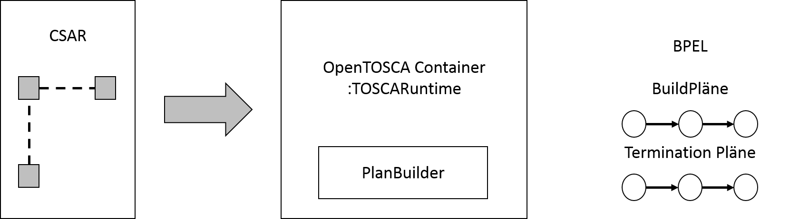
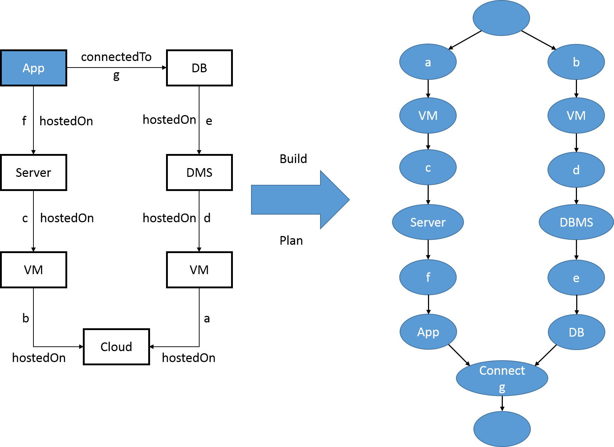
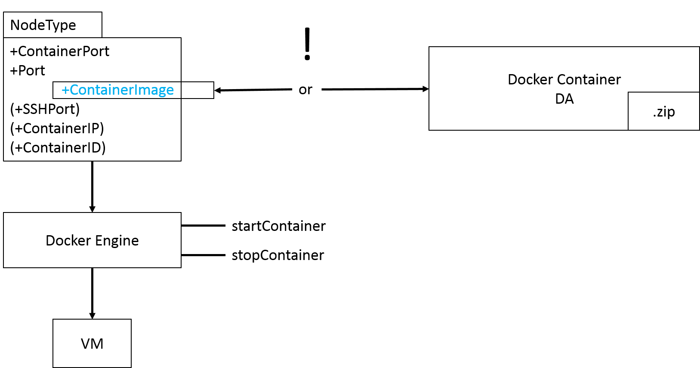
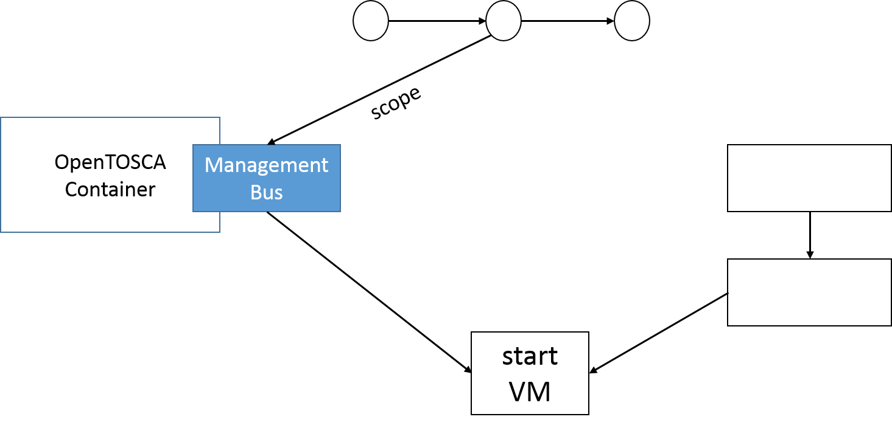

Dokumentation Plan Builder

Im OpenTOSCA-Container werden, in der Tosca Runtime, aus bereitgestellte CSAR-Dateien vom Plan Builder Build- und Termination- Pläne im BPEL Format generiert. 
Diese BPEL- Pläne durchlaufen vorgegebene Abläufe, anhand derer Aktivitäten durchgeführt werden.

Im Folgenden werden der Build- und der Termination-Plan erklärt und die verwendeten PlugIns vorgestellt.

***Build Plan***

Ein Build Plan beschreibt die Aktivitäten, die zum Erstellen eines Service benötigt werden. 
Dabei beinhaltet er die einzelnen Komponenten und ihre Instanzen. 
Die Instanzen definieren dabei die Build-Reihenfolge der Komponenten. 
Folgendes Beispiel zeigt den Aufbau eines Cloud-Service und seinen dazugehörigen Build-Plan als Baumstruktur:

Abbildung 1a zeigt den gewünschten Aufbau eines Cloud-Service. 
Dabei stellen die Kanten die Instanzen und die Knoten die Komponenten des Service dar. 
Es gibt zwei unterschiedliche Instanzen:

-   hostedOn: Auf einer bestehenden Komponente wird eine weitere Komponente instanziiert. 
    Dies bedeutet in diesem Beispiel, dass zuerst eine VM existieren muss, um darauf einen Server zu starten.

-   connectTo: Ein Service kann aus mehreren, unabhängigen Servicekomponenten bestehen. 
    Diese benötigen zum Zeitpunkt ihres Erstellens separate Abläufe, die parallel ausgeführt werden können.
    So kann die Baumstruktur eines Build Plans mehrere Pfade enthalten.
    Die einzelnen Stacks eines Service werden durch die connectTo-Instanz synchronisiert und zusammengeführt. 
    In diesem Beispiel gibt es zwei separate Pfade (Application-Pfad und Datenbankpfad), die durch die connectTo-Instanz zusammengefasst und synchronisiert werden.

Liegt ein Buid-Plan vor, kann ein Service automatisiert gestartet werden.

***Termination Plan***

Ein Termination-Plan definiert die Aktivitäten und deren Reihenfolge zum Herunterfahren eines Service. 
Im Prinzip arbeitet der Termination Plan die einzelnen Komponenten und Instanzen entgegengesetzt zum Build-Plan ab. 
Dabei wird zuerst die Synchronisierung der einzelnen Pfade aufgehoben. 
Danach werden die einzelnen Komponenten innerhalb der Pfade Schritt für Schritt heruntergefahren.

Die Servicekomponenten des Beispiels werden zuerst anhand der connectTo-Instanz desynchronisiert. 
Daraufhin können die Komponenten der einzelnen Pfade nach und nach heruntergefahren werden.

***Grundlagen***

Allgemein besteht der Vorteil bei der Verwendung von Build- und Termination-Plänen darin, dass anhand einzelner Befehle komplexe Prozesse automatisiert ausgeführt werden. 
Letztendlich liegen die Pläne als BPEL-Datei vor.

Für jede Komponente benötigt man unterschiedliche Aktivitäten zum Beispiel zum Starten oder Beenden der Komponenten. 
Dabei definiert jede Aktivität ein BPEL-Flow. 
Innerhalb des BPEL-Flows definiert der Scope in welchem Zusammenhang die Aktivitäten ausgeführt werden. 
Beispielsweise ist für das Starten einer VM, der Scope die VM selbst. 
So definiert jede Instanz und Komponenten ihre eigenen Aktivitäten mit pre-/provisioning-/post-Phase. 
Diese Phasen werden in BPEL als Sequenzen dargestellt.

Die Umsetzung des Codes wird anhand einer SkeletonCompletion (anhand eines PlugIn-Systems) realisiert. (Parametrisierung des Service)

**Skeleton Completion**

Im PlanBuilder PlugIn-System wird durch die Skeleton Completion ein eingegebenes Skelet eines PlugIns vervollständigt, um es später in OpenTOSCA ausführen zu können. 
Das PlugIn ist dabei wie folgt aufgebaut:

Die Bool-Variablen beschreiben, welche Templates innerhalb des PlugIns verwendet werden können. 
Sollten Sie dabei anzeigen, dass die Templates nicht handhabbar sind, ist eine weitere Bearbeitung nicht möglich. 
Die Handle-Methoden beschreiben wie ein Template gehandhabt wird.

***Lifecycle-Plugin-System***

Neben der Skeleton Completion, können über das Lifecycle-PlugIn-System NodeTemplates verarbeitet werden. 
Das System versteht lediglich Node Templates der folgenden Form:

Das PlugIn akzeptiert dabei Operationen in einer festen Reihenfolge, erlaubt jedoch vordefinierte Skips. 
NodeTemplates halten sich dabei an folgende, festvorgegebene Reihenfolge: 
- install 
- configure 
- start
Auf diese Weise kann durch Eingabe eines NodeTypes samt seiner Methoden der dazugehörige Code generiert werden. 
Je nach Definition der Methoden des NodeTypes erfolgt ein passender Funktionsaufruf.

Der oben beschriebene Ablauf findet dabei in der Provisioning Phase des Lifecycle-Systems statt. 
Operationen können Webservices, Code oder typisierte Objekte, die hier verarbeitet werden können, sein.

Das Lifecycle-System hat 3 Plugin-Arten, die verschiedene Methoden beinhalten:

-   DeploymentArtifact-Plugin

    -   (public) canHandle(ArtifactType, Impl)
    -   (public) Handle(DeploymentArtifact)

-   ImplementationArtifact-Plugin

    -   (public) canHandle(ArtifactType) Die war-files werden dabei auf einem TOSCARuntime Tomcat ausgeführt

-   Provisioning Plugin

    -   (Public) canHandle(ArtifactType) Das DA kann dabei typenabhängig auf einem Infrastructure Node des gleichen Typs installiert werden.

Die oben genannten Plug-Ins durchlaufen während ihrer Laufzeit verschiedene Phasen.

1.  PrePhase

In der PrePhase werden sowohl DA- als auch IA-Uploads durchgeführt. 
Das Plug-In versteht DAs, diese stellen nach dem Upload SupPlugins dar.

1.  ProvPhase

Die ProvPhase ruft Operation auf. Versteht das Sub-Plug-In diese, werden die Operationen basierend auf ArtifactTemplates in Code umgewandelt. 
Bei der Verwendung von bereits bekannten, vordefinierten ArtifactTypes, ist lediglich die Definition der Operationen notwendig. 
Es existieren vordefinierte Konfigurationen für bestimmte Typen.

Nach der Durchführung der Operationen werden die CSAR-Files auf die VM repliziert. 
Properties im NT werden dabei als Variablen in das Main-BPEL-File gesetzt.

1.  PostPhase

Nach der Konfiguration startet während der Runtime die PostPhase.
Hierbei werden Variablen gesetzt, die zu Beginn der Laufzeit noch nicht definiert wurden (IP's, API's, Properties updaten).

***Ubuntu-Plug-In***

TopologyContext Plan Completion

Der Cloud Provider überprüft, ob Ubuntu aktiv ist und fährt danach im Ubuntu- Scope die VM hoch.

***DockerContainer***

***ConnectsTo-Type-Plug-In***

Topology Context

PlanCompletion

Das connectTo-Plug-In behandelt nicht die Nodes, sondern die Relationen.
Hierdurch ergibt sich die Synchronisierung der einzelnen Dienste.

Einfacher Java-Code wird dabei direkt in BPEL umgewandelt. 
Sobald der Java-Code jedoch bereits einfache if, else-Bedingungen beinhaltet, ist eine automatische Umwandlung nicht mehr möglich.

***Invoker-Plug-In***

Das Invoker-Plug-In stellt einen speziellen Lifecycle dar, der unabhängig von den vorangegangen Plug-Ins aufgerufen wird.