# Service Invoker

<!-- toc -->

- [Abstract](#abstract)
- [Introduction](#introduction)
- [Thematic fundamentals and related work](#thematic-fundamentals-and-related-work)
  * [Cloud Computing](#cloud-computing)
  * [TOSCA](#tosca)
  * [OSGi](#osgi)
  * [OpenTOSCA](#opentosca)
  * [Plan Invocation Engine](#plan-invocation-engine)
  * [ESB](#esb)
  * [Camel](#camel)
- [Requirements](#requirements)
  * [Functional Requirements](#functional-requirements)
  * [Nonfunctional Requirements](#nonfunctional-requirements)
- [Concept & architecture](#concept--architecture)
  * [Design decisions](#design-decisions)
  * [Architecture](#architecture)
  * [Description of the chosen solution concept](#description-of-the-chosen-solution-concept)
- [Implementation](#implementation)
  * [Service Invocation Enum](#service-invocation-enum)
  * [Service Invocation SOAP API](#service-invocation-soap-api)
  * [Service Invocation OSGi event API](#service-invocation-osgi-event-api)
  * [Service Invocation Engine](#service-invocation-engine)
  * [Service Invocation Plugin Interface](#service-invocation-plugin-interface)
  * [Service Invocation SOAP/HTTP plugin](#service-invocation-soaphttp-plugin)
  * [Service Invocation REST/HTTP plugin](#service-invocation-resthttp-plugin)
- [Assumptions](#assumptions)
- [Review of the concept and implementation](#review-of-the-concept-and-implementation)
- [Summery and future work](#summery-and-future-work)
- [Sources](#sources)

<!-- tocstop -->

# Abstract

Cloud computing is a much discussed topic in information and communication technology.
It enables companies to focus on their core area without having to forgo professional IT infrastructure.
There is however the risk of vendor lock in, meaning dependency on a particular cloud provider.
TOSCA takes on this problem.
TOSCA is a standard to describe inter operable cloud applications.
It facilitates the description of structure, deployment and management.
The university of Stuttgart develops a runtime environment named OpenTOSCA for this standard.
A prototypical but non the less functional implementation is already completed.
In it invocations of services are performed, however this happens outside of the visibility range of the OpenTOSCA container.
This bachelor thesis introduces a concept for the generic invocation of services through a central component of the OpenTOSCA container.
It features an in depth look at the requirements and design decisions as well as the architecture and possibilities of the solution concept.
Furthermore the prototypical implementation of the concept is part of this thesis.
Which means that important and interesting points of the implementation are presented and explained.

# Introduction
According to a survey of the Bundesverband Informationswirtschaft, Telekommunikation und neue Medien e.V. (BITKOM) cloud computing is the most important high tech topic of the ITK business 2013.
It enables among other things high availability, adaptability, cost reduction and the usage of powerful IT resources without having to have extensive knowledge about administration and suchlike.
A problem of cloud computing is the lock in effect, that is the dependency of the customer of a particular cloud provider.
In contrast to that Topology and Orchestration Specification for Cloud Applications (TOSCA)<a href="#ref29">[29]</a> offers a standard to describe inter operable and portable cloud applications.
OpenTOSCA <a href="#ref23">[23]</a> is a first open source implementation of a TOSCA runtime environment developed by the University of Stuttgart that is continuously improved and expanded.

In the current implementation of OpenTOSCA services to manage the cloud application, like plans or implementation artifacts are invoked directly and therefore outside the visibility range of the container, which makes logging and monitoring of the executed invocations impossible.
Furthermore the invoker does not have a unified interface.
Thus the invoker is forced to deal with the particularities of different technologies like SOAP and REST.
Beyond that an additional program is needed to invoke plans.

In the scope of this thesis a concept for a central component, called Service Invocation Interface, for OpenTOSCA to invoke services specified in TOSCA is formulated, to get rid of these restrictions.
In the practical part of this thesis this functionality is to be implemented and integrated with OpenTOSCA.

The structure is as follows: Chapter 2 introduces the basic concepts necessary to understand this thesis to the reader.
This will elaborate on cloud computing, TOSCA, OSGi, OpenTOSCA as well as an extension and the plan invocation engine.
Options to integrate different components and services are explored with sections about ESB and Camel.
The requirements for the service invocation interface are formulated and documented in Chapter 3.
Chapter 4 presents the concept and architecture of the service invocation interface, keeping in mind the design decisions, as well as demonstrate the possibilities of the chosen solution.
Chapter 5 presents the implementation.
An overview of the assumptions made to implement the service invocation interface can be found in chapter 6.

# Thematic fundamentals and related work
This chapter explains the fundamentals to understand this thesis.
At first a look at cloud computing an its possibilities.
Followed by TOSCA basics and an introduction of the OSGi framework.
After that the OpenTOSCA container, an extension of it and the plan invocation engine are considered.
The chapter closes with integration options like enterprise service buses and integration frameworks.

## Cloud Computing

Cloud computing is an IT infrastructure that is elastically adaptable to the current user requirements and accessible through a network with standardized technologies.
It offers infrastructure (Hardware like i.e. server), platforms as well as software as a service. <a href="#ref25">[25]</a>

Four essential deployment models are differentiated.
These are Public, Private, Community, and Hybrid Cloud and are presented as follows.

**Public Cloud**. The public cloud is a cloud often provided by an IT business and accessible by any person and organisations.
The customer of the public cloud can choose an appropriate offer for his current requirements without having to make expansive purchases. <a href="#ref25">[25]</a>

**Private Cloud**. The private cloud is a cloud especially set up for an organisation.
Usage and access are restricted to the organisation and possibly extended to authorized persons like customers.
The hardware of the private cloud is often inside the organisation and administration is in-house. <a href="#ref25">[25]</a>

**Community Cloud**. The community cloud is similar to the private cloud, the key difference being that multiple organisations share a cloud.
A reason for this could be cost reduction or similar interests. <a href="#ref24">[24]</a>

**Hybrid Cloud**. The hybrid cloud is any combination of conventional IT environments and the presented cloud types. <a href="#ref25">[25]</a>

Cloud computing also differentiates three types of services: IaaS, PaaS and SaaS.

**IaaS (Infrastructure-as-a-Service)**. With IaaS the customer is provided with a infrastructure (i.e. server) from an IT service provider.
The customer has to install and administrate the required software themselves.
An example of IaaS is Amazons EC2 <a href="#ref14">[14]</a>. <a href="#ref25">[25]</a>

**PaaS (Platform-as-a-Service)**. With PaaS the IT service provider provides the costumer with a complete and operational platform, consisting of hard-, middle and possibly software als well as the administration of all components.
The customer is able to operate and administrate software on this platform.
An example of PaaS is Microsoft's Windows Azure <a href="#ref26">[26]</a>. <a href="#ref25">[25]</a>

**SaaS (Software-as-a-Service)**. With SaaS the IT service provider provides the costumer with software via internet or intranet and also administrates the software. 
The costumer is able to access the software with for example a web browser.
An example of a SaaS application is Google Mail <a href="#ref20">[20]</a>. <a href="#ref25">[25]</a>

These three service types have in common that the costumer does not have to buy hardware and possibly software.
These concepts furthermore offer a high scalability and remove the complexity of installation and administration for the costumer.

Cloud applications typically consists of multiple cloud services.
Provisioning of the heterogeneous components cannot be easily automated because of different technologies (z.B. REST <a href="#ref19">[19]</a>, SOAP <a href="#ref40">[40]</a>, Chef <a href="#ref32">[32]</a>, Puppet <a href="#ref38">[38]</a>, AWS API, Azure API, etc.).
It is necessary to integrate the technologies as well as different types of provisioning tools.
TOSCA uses so called plans to this end.
Plans describe workflows and use management operations of different services to manage cloud applications and so enable automation.
The writing of these plans is however difficult because of the different technologies and interfaces used.
Therefore a unified interface to invoke the management operations is necessary which hides the different technologies from the plan.
This makes it easier to create plans and makes them less complex.

## TOSCA

This chapter explains the most important basics of TOSCA <a href="#ref29">[29]</a> for this thesis.

The Topology and Orchestration Specification for Cloud Applications (TOSCA) is a language to describe cloud applications.
It was developed as an initiative of OASIS (Organization for the Advancement of Structured Information Standards) <a href="#ref28">[28]</a> and its current version is 1.0 <a href="#ref29">[29]</a>.
The goal of TOSCA is to define a standard for interoperability and portability of cloud environments that enables automated provisioning and management.
To achieve this TOSCA can describe the individual service components of a cloud application, their relationships and their management operations independently of a concrete cloud environment.
A document that contains such a description is called Definition in TOSCA.

The TOSCA elements Implementation Artifacts (IAs) and Plans, which offer outgoing services are of special interest in this thesis and will be considered in greater detail.

Implementation artifacts offer management operations of components of a cloud application.
An implementation artifact for example enables the creation of a database on a server or the installation of required drivers.
TOSCA allows for the implementation of different types of implementation artifacts.
Web archives (WARs), which offer a SOAP Web Service as well as complex scripts, which can be administrated with other technologies like Chef <a href="#ref32">[32]</a> or Puppet <a href="#ref38">[38]</a> and executed on the target infrastructure.

Plans, also called management plans, use the operations provided by the implementation artifacts to manage service components and so manage the cloud application.
Equivalent to implementation artifacts plans can be realized with different plan languages like BPMN (Business Process Model and Notation) <a href="#ref31">[31]</a> or  BPEL (Web Services Business Process Execution Language) <a href="#ref30">[30]</a>.

## OSGi

This section introduces the OSGi framework which is used to implement OpenTOSCA.

The OSGi framework is a java based software platform and enables the modularization of applications. 
The OSGi specification <a href="#ref35">[35]</a> is developed by the OSGi Alliance <a href="#ref37">[37]</a>.
There are multiple commercial and open source implementations of the OSGi standard.
For the implementation of OpenTOSCA and the service invocation interface Eclipse Equinox <a href="#ref17">[17]</a> is used.

Software components - called Bundles and services - called Services are differentiated in the context of OSGi. 
Bundles are mostly self contained units, consisting of classes and resources, packed as JAR Archive and can be deployed in the OSGi framework.
Services implement interfaces and offer their functionalities to other components as a service.
A bundle can offer multiple services.
Multiple implementations (services) of an interface as well as different versions of a bundle can be present in a OSGi environment.
OSGi supports Hot Deployment (adding and starting during runtime).

Declarative services are of special importance for the understanding of the implementation of OpenTOSCA and the service invocation interface.
Declarative services enable the configuration of services with XML configuration files.
This makes the definition of the services provided and/or required for each component possible.
So enabling among other things an automatic resolution of the relationships of different components.
Required services can be marked as optional and do not have to be available during the start of the component.
The consumer of a service can dynamically react to the start and stop of a service, with bind and unbind methods, so enabling the implementation of a plug-in system like the one used by OpenTOSCA.

## OpenTOSCA

This chapter describes the current implementation state of OpenTOSCA, a open source TOSCA container developed by the University of Stuttgart.

With OpenTOSCA Cloud Service Archives (CSARs) <a href="#ref29">[29]</a> can be installed.
CSARs contain the TOSCA definition and all required artifacts like for example implementation artifacts or plans.

Figure 1 shows the architecture of OpenTOSCA.
Main components of the container are OpenTOSCAControl, IA Engine and Plan Engine.

The function of the OpenTOSCAControl component is to direct the processing sequence of a CSAR file.
It also offers functions to that are available to the outside, among other things a graphical user interface, via the OpenTOSCA container API with a REST interface.

The IA-Engine is responsible for the deployment of implementation artifacts, which are contained in the CSAR.
Because implementation artifacts can have different types, the IA-Engine is realized with a plugin system.
Which is why new plugins, which execute the actual deployment of the implementation artifacts, can be added during the runtime.
The endpoints of the successfully deployed implementation artifacts are saved in the endpoint database.
Currently the deployment of Web Archives (WAR) on Tomcat <a href="#ref6">[6]</a> as well as Axis Archives on Apache Axis <a href="#ref1">[1]</a> is supported.

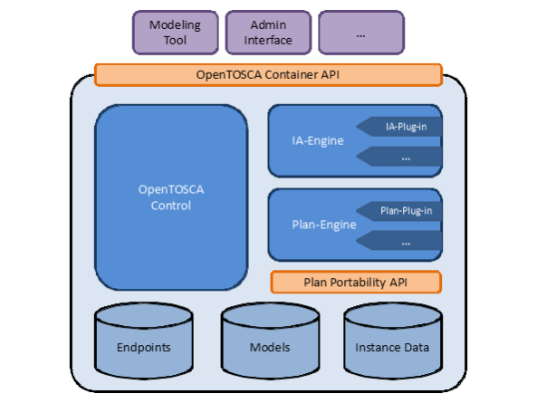
Figure 1: Architecture of OpenTOSCA

Equivalent to the IA-Engine the Plan-Engine facilitates the deployment of plans.
The Plan-Engine is also fitted with a plugin system, to expand the number of supported plan types.
The endpoints of deployed plans are saved in the endpoint database as well.
In the current state the OpenTOSCA container only supports deployment of BPEL plans on WSO2 Business Process Server (BPS) <a href="#ref45">[45]</a>.
In the current implementation the management operations provided by the implementation artifacts are bound by the Plan-Engine before the plans are deployed.
To do this the plan is first analyzed and subsequently bound to the endpoints in the endpoint database.

There are further components, for example an InstanceDataService to hold the instance data or a TOSCAEngine to administrate TOSCA models.

The development of OpenTOSCA as the first reference implantation of the TOSCA specification is as of this moment not completed and is advanced among other things by different student theses.
The next chapter presents such an extension of OpenTOSCA.

## Plan Invocation Engine

This section introduces the Plan Invocation Engine <a href="#ref18">[18]</a>, an extension of the OpenTOSCA container.

The Plan Invocation Engine was developed in a bachelor thesis that ran in parallel to this one and enables the user to manage plans or rather instances of plans.
It takes care of the administration of CSARs and process instances as well as providing a history of them.
The Plan Invocation Engine furthermore allows for the creation of the message necessary to invoke a plan with a graphical user interface (see figure 2) to input the required parameters.
To invoke a plan with the plan invocation engine the service invocation interface developed in this thesis shall be used. <a href="#ref18">[18]</a>

Figure 2 shows a screenshot of the plan invocation engines graphical user interface.
A window to input parameters can be seen in the bottom right.
In the background further information about the plan is visible, like a history over executed invocations or the plan generation date.

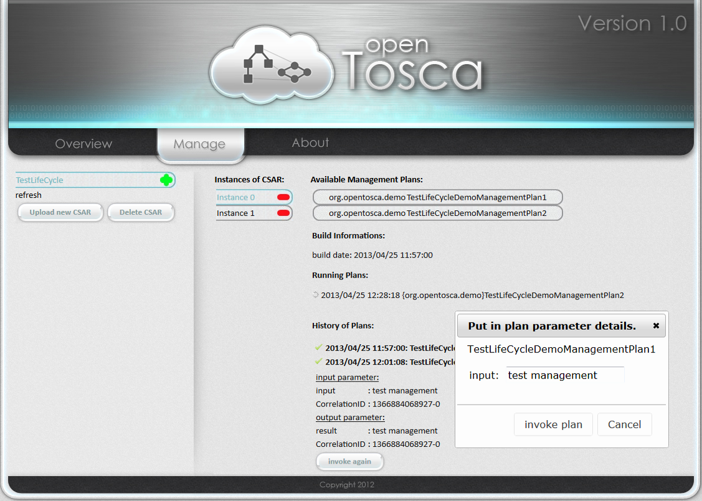

Figure 2: GUI of the Plan Invocation Engine 

## ESB

This chapter is about the so called Enterprise Service Bus (ESB).
There will not be an in depth look at the technologies just a quick look at the basics necessary to understand the concept.
For an in depth look we refer to <a href="#ref16">[16]</a>.

There are many definitions for EBS.
Like for example the definition from David A. Chappell from his book *Enterprise Service Bus* <a href="#ref16">[16, page 1]</a>:

An ESB is a standards-based integration platform that combines messaging, web services, data transformation, and intelligent routing to reliable connect and coordinate the interaction of significant numbers of diverse applications across extended enterprises with transactional integrity.

Figure 3 illustrates an exemplary architecture, consisting of five different components, one with the usage of a ESBs and one without.
Without the usage of ESB the components communicate directly with each other.
When the data formats or transport protocols differ between components this necessitates many interfaces between the components.
With an ESB a central communication component is created that connects the the components to each other and simplifies communication.

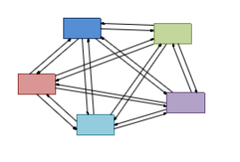
 

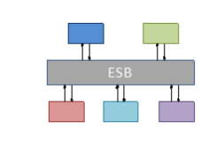

Figure 3: Example architecture with five components without and with ESB

## Camel

This section introduces the Open Source Integration framework Apache Camel <a href="#ref2">[2]</a>, which is used in the implementation of the Service Invocation Interface.

The project Camel started in 2007 and currently is on version 2.11.0.
It enables the routing of messages, the conversion of data formats and the implementation of many Enterprise Integration Patterns (EIPs) <a href="#ref3">[3]</a> to integrate different components and services.
Camel offers different domain-specific languages (DSLs) like Java and XML.
Because of its modular make up and a multitude of preset components Camel is lightweight and flexible on one hand and powerful in regards to its functionality on the other hand.
It can be used as an standalone application as well as embedded in a OSGi container. <a href="#ref2">[2]</a>

Summarized Camel offers, analog to an ESB, the integration of different components to a complete system.
In regards to the similarity to ESB the responsible at Camel write on their page:

\[...\] a rule based routing & mediation engine which can be used inside a full blown ESB, a message broker or a web services smart client. Though if you want to, you could consider that Camel is a small, lightweight embeddable ESB since it can provide many of the common ESB services like smart routing, transformation, mediation, monitoring, orchestration etc. <a href="#ref11">[11]</a>

So according to the Camel developers Camel is a rule bases routing and connection engine, which can be used in a complete ESB, a message broker or a web service smart client.
But because Camel offers many of the same functionality as ESBs like intelligent routing, transformation, mediation, monitoring, orchestration, etc it can be viewed as a lightweight embeddable ESB.

On the other hand they say that they themselves view an ESB as a container consisting of integration components.
They view something like Apache ServiceMix <a href="#ref4">[4]</a>, which is based on OSGi (and optionally JBI) and therefore offers a standardized integration platform as a proper ESB:

However our view is that an ESB is more of a container of integration components, so we view Apache ServiceMix to be a true ESB based around OSGi (and optionally JBI) to provide a standards based integration platform of components.<a href="#ref11">[11]</a>

So they say it is fair to call Camel a ESB, but they themselves do not view it that way.

What follows are some important concepts of Camel that are required to understand this thesis.

**Endpoint**. An endpoint is identified with an URI and describes the endpoint of a communication channel in Camel.
For example jetty://http://localhost:9080/myservice describes an endpoint realized with the Camel-Jetty <a href="#ref12">[12]</a> component. <a href="#ref10">[10]</a>

**Message and Exchange**. A message in Camel represents the data that is passed between different endpoints.
A message can consist of headers, a body and attachments.
Headers in Camel are implemented as HashMaps, Bodies as objects.
The exchange is the container of a message and contains the message, errors that occurred during processing or routing information. <a href="#ref10">[10]</a>

**Processor**. Messages can be processed with a processor.
For example further data can be added or the route can be changed based on the existing data.
Existing processors as well as self implemented ones can be used. <a href="#ref10">[10]</a>

**Route**. A route consists of a sequence of processors and endpoints and represents the processing sequence of a message. <a href="#ref10">[10]</a>
This architecture template to describe a data stream is called Pipes and Filters <a href="#ref21">[21]</a>.
Figure 4 shows a schematic presentation of this architecture template.
Filters are the processing units.
Within them the incoming data is processed.
Pipes are connections between the filters.


Figure 4: Pipes and Filter architecture template

# Requirements

In this chapter the requirements put on the service invocation interface will be explained.
3.1 presents the functional requirements while the non functional requirements are presented in 3.2.

## Functional Requirements

This section presents the functional requirements put on the service invocation interface.
The service invocation interface is designed with these requirements in mind.

**Options how to invoke IAs and plans**

Implementation artifacts and plans represent executable services in the context of TOSCA.
Because the goal of the service invocation interface is the ability to generically invoke every service available in TOSCA, the service invocation interface has to support the the invocation of any implementation artifacts as well as plans.

Plans will be mainly invoked through implementation artifacts with the service invocation interface.
Other invocations like for example the invocation of implementation artifacts through other artifacts, invocation of plans trough implementation artifacts or different variants have to be supported by the service invocation interface.

Especially the invocation of plans through the plan invocation engine has to be supported (see chapter 2.5).

**Option of asynchronous invocation**

The invoker (client) has to be able to invoke the service invocation interface asynchronously.
The invoker does not have to wait for an answer from the service invocation interface and is not blocked in his processing.

Especially plans, which make up the gross of clients of the service invocation interface profit greatly from asynchronous invocations with regards to their processing time.
They can initiate long running processes early and execute other necessary steps in parallel.
A plan for can example initiate the creation of all required databases in the beginning and then install required drivers on a independent virtual machine in the mean time.

Naturally all other invokers with long running and parallel processes can profit from asynchronous communication.

**Dynamic identification of the information necessary to invoke IAs/plans**

The service invocation interface has to be able to dynamically get the information necessary to invoke implementation artifacts and plans.
This reduces the number of parameters the invoker has to pass to the service invocation interface and enables the creation of more generic or rather more dynamic plans or implementation artifacts.

Required information among other things are the endpoints stored in the endpoint database of the implementation artifacts or plans as well the respective invocation type of the implementation artifact or plan.
This data can come from either the TOSCA definition or can be provided during the runtime from the OpenTOSCA container.

Furthermore the service invocation interface has to provide the function to get further information from their sources.
An example would be the acquisition of information about a specific operation of an implementation artifact from the WSDL of a SOAP web service.

**Support of different invocation types**

The service invocation interface has to enable the generic invocation of implementation artifacts or plans from a CSAR and its corresponding TOSCA.

This implementation requires a multitude of supported protocols, standards, data formats, etc.
The service invocation interface has to be implemented in such a way, that it can be extended in regards to the supported invocation types.

**Passing of input parameters as key/value pairs and XML documents**

The parameters required for the invocation have to be passed to the service invocation interface as key/value pairs and XML document.
This ensures a fixed and therefore known delivery form for the parameters and enables easy processing.

**Usage of the instance data service**

The service invocation interface has to be able to communicate with the instance data service.

Instance data storage has a among other things a web service interface, that enables plans and implementation artifacts to store instance data there. 
Data required for later use for different plans, implementation artifacts and the service invocation interface can be made accessible like this.
This enables the service invocation interface to update input parameters with more current values, stored with the instance data service and so gives plans a much more flexible and effective usage.

**Connection to containers**

The service invocation interface has to become part of the OpenTOSCA container.
It has to be implemented in such a way, that it can access existing components of the container and is started automatically with the start of the container.

This means, that the service invocation interface has to be implemented with the help of OSGi or another compatible technology, otherwise it has no access to the existing and as OSGi services implemented components.

## Nonfunctional Requirements

In this chapter the nonfunctional requirements on the service invocation interface are presented.
These requirements are important characteristics of the service invocation interface and have to be taken into consideration during development.

**Easy extendability**

The service invocation interface has to be constructed in such a way, that it can be extended in its function range without drastic changes to the architecture.
These extensions refer on the one hand to the option to invoke different implementation artifacts and plans and on the other hand the option of invoking the service invocation interface itself.

Furthermore more function extending components, like a logging component, have to be easily integrated with the service invocation interface.

**Performance**

The service invocation interface has to be able to process multiple invocation, even from different invokers, at the same time,
This parallel processing can however not have a negative impact on the processing time.

**Flexibility**

Because the service invocation interface can invoke different implementation artifacts a prediction about the different data formats returned from the invoked implementation artifacts cannot be made.
Therefore the service invocation interface has to be able to flexibly handle different data formats and a great number of data formats have to be supported to facilitate this.

# Concept & architecture
In this chapter the developed concept, as well as the architecture of the service invocation interface is illustrated and explained.
First the the decision made based on the earlier formulated requirements are presented and justified.
Following is a description of the architecture of the service invocation interface and the possibilities of the solution concept are presented.

## Design decisions

This section presents important decisions with regards to the conception and implementation of the service invocation interface.
These are decisions regarding the technologies used and regarding interfaces of components, meaning the concrete implementation.

One of the central decisions during the conception of the service invocation interface is the question with which type of integration technology it should be realized.
With the help of a complete ESB system, an integration framework or a complete in house development.

Figure 5 shows an overview of the three options as well as an assessment of its usability regarding the integration of the service invocation interface with the OpenTOSCA container and the associated complexity.
For a more thorough explanation see below.

An argument for the choice of an ESB is that it is a powerful and, depending on the choice of ESB, an for the application purpose proven software product, which only has to be configured.
Some of the ESB products are specialized on specific technology areas and are therefore not suitable for the implementation of the service invocation interface.
The Apache Synapse ESB <a href="#ref5">[5]</a> based on Apache Axis2<a href="#ref13">[13]</a> is an example that is mainly specialized on web service environments <a href="#ref44">[44]</a>.
Without adaption of existing (OSGi) components of the OpenTOSCA container this could lead to complications.
Because the components are implemented with OSGi and do not offer a web service interface like for example SOAP they cannot be directly invoked with Synapse ESB and therefore cannot be used.
An option to solve the problem is the transformation of components in web services or the creation of a web service interface to invoke the components..
This adaption would require considerable effort.
Furthermore ESBs are by far the heaviest and most complex alternative of the three possible solutions to realize the service invocation interface and can bring unnecessary and therefore superfluous functions with them <a href="#ref43">[43]</a>.

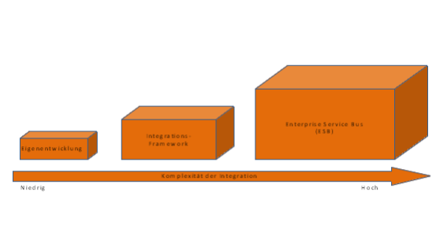

Figure 5: Options of integration technologies

The disadvantage of superfluous functions is solved with the development of a complete in house solution, without integration tools.
A solution that is flexible and completely adapted to the requirements can be realized this way.
This alternative however, assuming a complete development with standard Java API has a huge and more importantly largely unnecessary implementation effort.
For many communications standards and protocols already completed and tested libraries exist that can and should be used.
A self developed solution most likely will not be as polished as a tested library.
To not take advantage of this would result in unnecessary work.
With the use of a multitude of libraries however comes the risk that the overview over the exact functionality of the libraries can be lost or the risk of compatibility issues with the use of libraries from different manufacturers.

The third option to realize the service invocation interface does not have the possible problem that comes from different sources of libraries.
The use of an integration framework combines the advantages mentioned from the other two options without bringing their disadvantages with them.
Integration frameworks offer, similarly to ESB support for many standards and protocols, but because they are not a independent product but rather Java libraries they can be easily integrated into existing projects and their functionality extended.
Integration frameworks allow for a equal parts lightweight, flexible and individually adaptable solution, because of their architectural composition of singular functional components.
Furthermore there is the great advantage of using a self-made product consisting of finely attuned and therefore highly compatible components, as well as the uniform usage. 

Because of this argumentation the integration framework Apache Camel <a href="#ref2">[2]</a> is chosen for this thesis.

The reason for this is among other things a multitude of components (over 125, see <a href="#ref7">[7]</a>) which supports many technologies and standards.
For example there is a FTP component <a href="#ref9">[9]</a> to send and receive data per FTP or a CXF component <a href="#ref8">[8]</a> to integrate SOAP web services.
Furthermore Camel offers the option to easily develop and use components to extend functionality.
Another reason for choosing Camel is the option, unlike for example with the alternative integration frameworks Spring integration <a href="#ref39">[39]</a> and Mule ESB <a href="#ref27">[27]</a>, to use a Java DSL beside a XML DSL <a href="#ref43">[43]</a>.
This brings with it the common advantages of an IDE like autocompletion of code and therefore more efficient work.
Also Camel is the integration framework used in Apache ServiceMix <a href="#ref4">[4]</a>, an OSGi based ESB container.
This makes it possible to operate OpenTOSCA in Apache ServiceMix if ESB functionality is required at a later date.

An extension system is required to facilitate the easy extendability of the functionality scope of the service invocation interface in regards to the supported invocation types.
This is realized in the form of a plugin system.

In the IA engine and plan engine (see 2.3 basics of OpenTOSCA) the technology of OSGi Declarative Services (see 2.3, basics of OSGi) to administrate plugins has proven itself.
Therefore the service invocation interface is at its core conceptualized as an engine to administrate the plugins realized with declarative services.
By keeping with this uniform mechanic this leads to a uniform architecture of the container and so to better maintainability.

A further question that has to be answered is if for each invocation typ of a implementation artifact an individual endpoint database is created.
For example a own database for SOAP web service implementation artifacts and a own database for REST web service implementation artifacts.
Based on the database the service invocation interface can determine how the implementation artifact has to be invoked.
The deployment of the implementation artifacts and the saving of endpoints is done through the IA engine and its plugins.
The IA engine distinguishes implementation artifacts not based on their invocation type, like the SI engine, but through their implementation artifact type.
For example a SOAP web service implementation artifact and a REST web service implementation artifact, if both are packed as Web Application Archive (WAR), are assigned the same implementation artifact type and deployed with the same IA plugin.
However to invoke both of these implementation artifacts two different SI interface plugins are necessary: a REST and a SOAP capable plugin.
In conclusion the IA engine and the SI engine distinguish implementation artifacts differently.
Therefore the separation of endpoint databases brings no advantage.
Equivalently to the endpoint information for the IA engine the invocation type of the implementation artifact can be noted in the TOSCA definition.
This can be read by the SI engine and the appropriate plugin determined.
Therefore the endpoints are stored in a shared database.

Furthermore the design of the interfaces of the SI plugins is an important decision.
The plugins require an endpoint to invoke implementation artifacts or plans, the operations that are to be invoked and the data that is to be transmitted.
In the case of asynchronous invocations, like for example with SOAP web services, a Correlation ID to determine the response belonging to the invocation is required.
The design of the interfaces can be implemented in different ways.
Listing 1 and Listing 2 show the two available options.

```
public Object invoke(String endpoint, String operationName, 
     HashMap<String, String> params, String correlationID);
```

Listing 1: Plug-in Interface Alternative 1

In the first alternative (Listing 1) the above mentioned parameters are passed as standard Java objects like strings or a map.
This clearly defines the interface.
The only possible return value is an object, because this enables the return of different data types and so enhances the flexibility.
The Correlation ID has to be returned as well.
Two individual return values are impossible in Java.
An object has to be created that contains the actual return value and the correlationID.
A further critic with this alternative is the fixed interface.
It cannot be easily extended.
If the requirements change and the interface has to be adapted all existing plugins become faulty and have to be adapted.
Another required (or even optional) parameter could be such a change.
This alternative also limits the passing of data directed at implementation artifacts or plans to HashMaps <a href="#ref34">[34]</a>.
This is not optimal because for example the plan invocation engine returns the message necessary to invoke a plan as a org.w3c.com.Document object <a href="#ref33">[33]</a>.
This has to be converted into a HashMap first before it can be passed to the plugin.
To invoke a SOAP web service this HashMap has to be converted again into a SOAP message (XML). 

```
public Exchange invoke(Exchange exchange);
```
Listing 2: Plug-in Interface Alternative 2

The second available alternative (Listing 2) uses the Exchange Object from Camel to pass parameters (see Camel basics, 2.7).
The Exchange Object is used as a container for message objects with any content.
In contrast to the first alternative the second one does not offer a clearly defined interface for the passing of parameters of used objects.
The exchange object however enables a flexible development as well as the usage of plugins, therefore exactly what is necessary for the service invocation interface.
In the header of the message of the exchange objects the parameters like endpoint, name of the operation, etc can be stored, whereas the passed data, in which ever form, can be stored in the body (detailed explanation can be found in chapter 4.3).
This enables an easy extension of the plugins without having to adapt the interface.
If a plugin requires more data those can be defined as a new header inside the message object.
Plugins that know about the new header and are prepared for it can use it.
Old plugins that miss this information still work as expected.
A further reason for choosing the exchange object alternative is that it is already used by Camel as a container to transport messages and therefore guarantees a uniform mechanic.

Because of this argumentation alternative 2 (Listing 2) is chosen.
Detailed explanation on the usage of the exchange object like for example the headers follows in chapter 4.3.

## Architecture
In this chapter the architecture of the service invocation interface is illustrated and explained.
Because it is part of the OpenTOSCA container it will be presented in this setting.

Figure 6 shows the architecture of the service invocation interface.
One of the main components of the service invocation interface, besides the in chapter 2.4 presented TOSCA engine, endpoint service and instance data service, the SI Engine (see chapter 5.4).
It forms the central unit of the service invocation interface with its connection to the other  important components within the OpenTOSCA container.
Furthermore the Service Invocation APIs (see 5.2 and 5.3) are an important part of the service invocation interface.

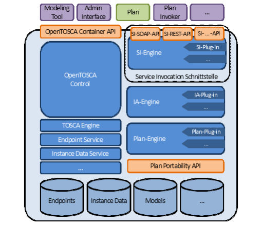

Figure 6: Architecture of the OpenTOSCA container with service invocation interface

The SI engine has among other things the task to determine the implementation artifact that belongs to the invoke request, further required information, as well as the invocation type of the implementation artifact with the TOSCA engine.
Furthermore the SI engine uses the endpoint service to acquire the endpoints of the implementation artifact or plans.
An interface with the instance data service offers the option to invoke and use instance data of previously executed plans.

The invocations of implementation artifacts or plans happen through the so called SI plugins (see chapter 5.5).
These plugins offer support for different protocols and standards (invocation types), like for example sending a message with SOAP via HTTP or the invocation of an OSGi implementation artifacts and can be added and started during the runtime if necessary.
The administrator of the SI plugins is also the SI engine, with an extra designed OSGi based plugin system.

The functionality of the service invocation interface is provided with different service invocation APIs, like for example a SI SOAP API or a SI REST API.
With them other components, applications and implementation artifacts and especially plans can use the service invocation interface.
If for an example a plan wants to invoke a management operation declared in TOSCA, which is implemented with a SOAP/HTTP implementation artifact.
The plan sends a message to the service invocation SOAP API which contains all the necessary information.
The contents of this message are passed to the SI engine.
There further data like the endpoint is acquired and subsequently all information is passed on to a suitable plugin where the invocation is executed.
The exact processing process is explained in more detail in the following chapter.

## Description of the chosen solution concept

In this chapter the concept of the service invocation interface and the options of the concept are explained.

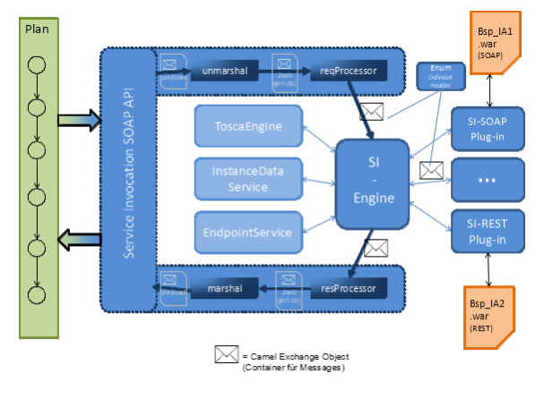

Figure 7: Conceptual structure of the components

Figure 7 shows that the SI engine constitutes the central component within the service invocation interface.
It enables the communication with existing and required components of the OpenTOSCA container (TOSCA engine, endpoint service, instance data service) and provides the connection between the service invocation API and the different SI plugins, it therefore takes on the routing of messages within the service invocation interface.
Figure 8 illustrates this with a layer diagram.

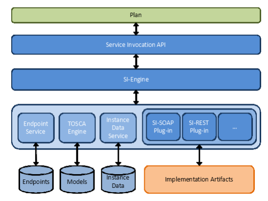

Figure 8: Service invocation interface as layer diagram

Figure 7 shows the usage of the exchange object.
Within the service invocation interface and the components the exchange object provided by Camel is used to pass data and messages.
The communication between the SI engine (and therefore the service invocation interface) and the other components of the OpenTOSCA container happens trough passing individual parameters.
This has the advantage that within the service invocation interface the advantages of the exchange objects can be used, the other components of the container however can stay independent of Camel and therefore independent of the service invocation interface which means they do not have to be adapted.

Figure 7 also features an Enum.
This Enum (see chapter 5.1) is defined and specifies the keys of the headers and the message object.
This ensures that the messages passed from the service invocation API to the SI engine and the messages passed from the SI engine to the SI plugin are uniform in there make up regarding the parameters contained in the headers.
This enables the componentwise identical and reliable read out of all necessary information like CsarID or ServiceTemplateID.
It would also be possible to make an object with fields for the required parameters (CsarID, ServiceTemplateID, OperationName, ...).
The HashMap as object for the headers simulates such an object together with the Enum to pass the required parameters.
But the solution with the enum, which determines the keys for the required parameters in the header HashMap, is more flexible and intended in Camel.

Figure 9 shows the sequence of an exemplary processing sequence inside the service invocation interface beginning with the invocation trough a plan, processing of the query in the SI engine and the invocation of the implementation artifact, and the response back to the plan.

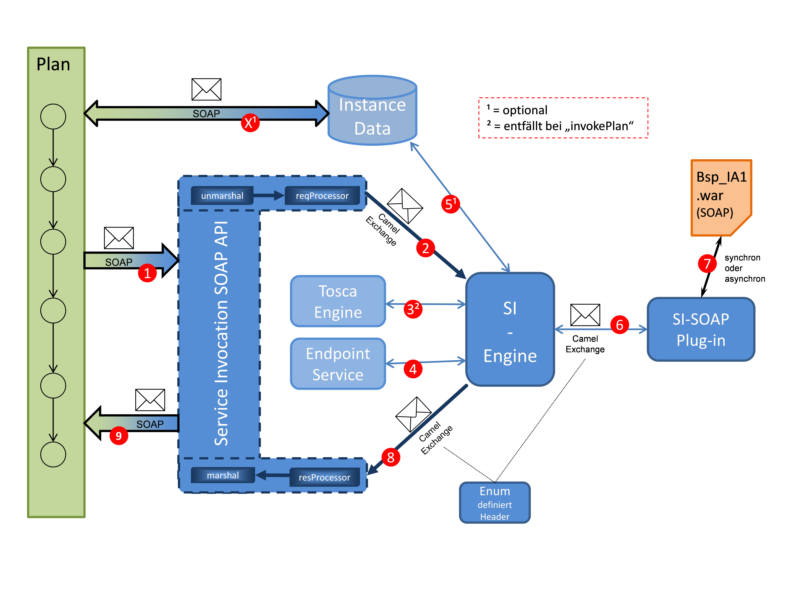

Figure 9: Processing sequence to invoke a service

First the plan invokes the service invocation SOAP API with a SOAP message containing all the data required to invoke the implementation artifact.
The service invocation SOAP API unmarshalles this SOAP message, reads the passed data, writes it into a exchange object and forwards this to the SI engine.
The parameters in the headers to determine the implementation artifacts are in a format comprehensible to the SI engine because of the defined Enum.

The SI engine collects information about the to be invoked implementation artifact, like name and invocation type, with the TOSCA engine and the received data.
Furthermore it determines the message exchange pattern (MEP) of the implementation artifact, from the in the TOSCA definition specified values for the to be invoked operation.

As part of the service invocation interface we differentiate between the two WSDL 2.0 based MEPs, [In-Out](http://en.wikipedia.org/wiki/Request-response) and In-Only,.
The In-Out pattern specifies that for an incoming message (Input) an answer has to be given (Output).
Listing 3 shows an example of the In-Out pattern in a TOSCA definition.
In contrast the In-Only pattern specifies that for a query no answer is sent.
An example for this is displayed in Listing 4.

```
01 <Operation name="createDB">
02 	<InputParameters>
03 		<InputParameter name="Size" type="xs:string"/>
04	 	<InputParameter name="Host" type="xs:string"/>
05 		<InputParameter name="User" type="xs:string"/>
06 		<InputParameter name="Password" type="xs:string"/>
07 	</InputParameters>
08 	<OutputParameters>
09 		<OutputParameter name="URL" type="xs:string"/>
10 	</OutputParameters>
11 </Operation>
```
Listing 3: Example In-Out Pattern
```
01 <Operation name="deleteDB">
02 	<InputParameters>
03 		<InputParameter name="URL" type="xs:string"/>
04 		<InputParameter name="User" type="xs:string"/>
05 		<InputParameter name="Password" type="xs:string"/>
06 	</InputParameters>
07 </Operation>
```

Listing 4: Example In-Only Pattern

Subsequently the SI engine determines with the additional information the endpoint of the implementation artifact with the help of the endpoint service (see 4).

Optionally, if during the invocation of the service invocation SOAP API the ID of an CSAR instance is given, the SI engine examines if saved instance data exist for this CSAR instances and if that is the case uses it.
The instance data can have been saved by any previous plan.

Afterwards the SI engine determines with the invocation type of the implementation artifact a suitable SI plugin and sends all collected data to it with an exchange object.

The plugin creates an request message from the received information and sends it to the implementation artifact (see 7).
The invocation can happen synchronous or asynchronous depending on the implementation of the implementation artifact and the responsibility lies with the respective plugin.

The response of the implementation artifact is sent from the SI plugin to the SI engine and from there to the service invocation SOAP API (see 8).
There it is unmarshalled and converted in a SOAP message.
Finally the service invocation API sends this SOAP message back to the plan (see 9), which can now work with the data received from the implementation artifact.

In this example the invocation of a as a SOAP web services implemented implementation artifact happens through a plan.
Naturally other invocation scenarios are possible.
For example the invocation of an implementation artifact implemented as a RESTful web service of an OSGi service.
Furthermore there is the possibility to invoke a plan, initiated with the plan invocation engine or another plan.

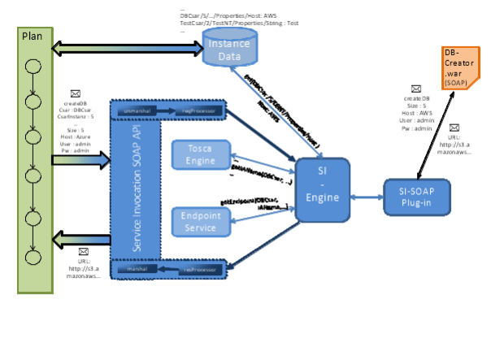

Figure 10: Exemplary messages / invocations

Figure 10 shows the described scenario - the invocation of a SOAP web service implementation artifact with a plan - in an example with concrete messages und values.
The messages and invocations are truncated in the figure.
The complete messages and invocations are explained below.

Listing 5 shows the extensive SOAP invocation of the plan to the service invocation SOAP API.
Goal of the invocation is to invoke the implementation artifact, specified in rows 8 to 18 with the operation createDB and the parameters specified in rows 22 to 40.
The specification of ReplyTo in row 19 tells the service invocation interface at which address the callback with the response should be sent.
The MessageID is sent back to the plan from the service invocation interface, because it is required by the workflow engine to be able to assign the query response as well as the correct plan instance.

```
01 <soapenv:Envelope xmlns:soapenv="http://schemas.xmlsoap.
02 									org/soap/envelope/" xmlns:
03 									sch="http://siserver.
04 									org/schema">
05 		<soapenv:Header/>
06 		<soapenv:Body>
07 			<sch:invokeOperation>
08 			<CsarID>DBCsar</CsarID>
09 			<!--Optional:-->
10 			<ServiceInstanceID>Instance5</ServiceInstanceID>
11 			<ServiceTemplateIDNamespaceURI>
12 				http://CsarDBCreator.org/DB/
13 			</ServiceTemplateIDNamespaceURI>
14 			<ServiceTemplateIDLocalPart>
15 				DBCreator\_ServiceTemplate
16 			</ServiceTemplateIDLocalPart>
17 			<NodeTemplateID>DB\_NodeTemplate</NodeTemplateID>
18 			<OperationName>createDB</OperationName>
19 			<ReplyTo>http://localhost:1337/callback</ReplyTo>
20 			<MessageID>A7ZD70AH</MessageID>
21 			<!--Optional:-->
22 			<Params>
23 				<!--1 or more repetitions:-->
24 				<Param>
25 					<key>Size</key>
26 					<value>5</value>
27 				</Param>
28 				<Param>
29 					<key>Host</key>
30 					<value>Azure</value>
31 				</Param>
32 				<Param>
33 					<key>User</key>
34 					<value>admin</value>
35 				</Param>
36 				<Param>
37 					<key>Password</key>
38 					<value>p8ilR6N9</value>
39 				</Param>
40 			</Params>
41 		</sch:invokeOperation>
42 	</soapenv:Body>
43 </soapenv:Envelope> 
```
Listing 5: SOAP message of a plan to the service invocation interface to create a database

The SOAP message is converted by the service invocation SOAP API, illustrated in figure 11, and forwarded to the SI engine.
This is done using the exchange object that is provided by Camel.
The parameters for the implementation artifact (size, host, user, password) are saved in the message body.
The data to determine the implementation artifact and its invocation are in the message header.
Further values like ReplyTo and MessageID are also put in the header.
Those values however are not defined by the SI Enum, because they are not needed by the SOAP API or other SI components. 

Figure 11: Messages sent from the service invocation SOAP API to the SI engine

The SI engine gets the required data from the header, uses it to determine the implementation artifact with the help of the TOSCA engine and acquires the endpoint with the endpoint service.
This is also put into the header of the message object under the key defined by the SI Enum.

Furthermore the SI engine checks per instance data service if instance data for this invocation is saved and if so gets it from there.
This is however optional and only happens for ServiceInstanceIDs specified by the invoker.
Subsequently the input parameters in the message body are replaced with the values from the instance database and updated.
Like this IP addresses of a previously setup virtual machine can be used for example.

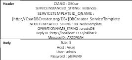

Figure 11: Message from the service invocation SOAP API to the SI engine

Finally after the invocation type of the implementation artifact has been determined with the TOSCA engine a fitting plugin is chosen and the exchange message supplied with all necessary information is forwarded to it.

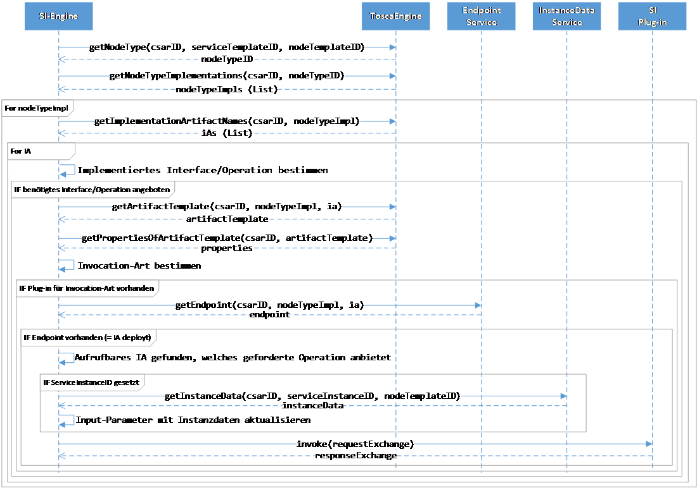

Figure 12: Sequence diagram of the SI engine

Figure 12 displays the communication of the SI engine with the TOSCA engine, endpoint service, instance data services and a SI plugins as a sequence diagram.
It shows how the SI engine determines an invokable implementation artifact with the parameters and the TOSCA engine.
First the NodeType that belongs to the parameters CsarID, ServiceTemplateID and NodeTemplateID is determined (NodeTypes categorize NodeTemplates). Subsequently all NodeTypeImplementations for this NodeType are queried.
The list of NodeTypeImplementations is iterated and all implementations artifacts are determined.
This list of implementation artifacts is also iterated and each implementation artifact is checked if it offers the required operation.
If the name of the operation is unique within a NodeType, only the specification of the name is required.
If however the operation is not only offered by the interface of one NodeType the name of the interface has to be specified as well to uniquely identify it.
If the operation is offered it is also checked if a invocation type was specified in the TOSCA definition and if a plugin is available.
If that is the case the endpoint service check if an endpoint for this implementation artifact is saved and if it was deployed by the container.
If that is also the case a invokable implementation artifact has been found.
The sequence diagram shows furthermore the communication with the instance data service (if a ServiceInstanceID has been provided) as well as the invocation of an SI plugin.

In figure 13 the message enriched by the SI engine is shown.
The endpoint of the implementation artifact was determined and added as header, a parameter in the body was replaced by a value from the instance database.
In this example the implementation artifact is told to create a database at Amazon Web Services (AWS) instead of at Microsoft Azure.
A previously executed plan could have this saved and after checking that the prices for databases at AWS are better then at Azure.

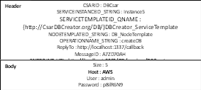

Figure 13: A message directed to a SI plugin enriched from the SI engine

After the message has been passed to the SI plugin suitable to the invocation type, it reads the information required (OperationName, Endpoint) for the invocation of the implementation artifact from the header and gets the parameters from the body.
What happens afterwards with this data and how the actual invocation of the implementation artifact happens is plugin specific and therefore can differ from plugin to plugin.
In the case of the SOAP/HTTP plugin for example further information is read from the WSDL belonging to the implementation artifact, a SOAP message corresponding to the WSDL is created and this is sent to the implementation artifact.
From the response, in the case of a SOAP message this would be the body, the output parameters are extracted and those are put into the body of the message object which gets returned to the SI engine.

```
01 <soap:Envelope
02 xmlns:soap="http://www.w3.org/2001/12/soap-envelope"
03 soap:encodingStyle="http://www.w3.org/2001/12/soap-encoding">
04 	<soap:Body xmlns:m="http://www.DBIA.org/DBCreator">
05 		<m:CreateDBRequest>
06 		<m:Size>5</m:Size>
07 		<m:Host>AWS</m:Host>
08 		<m:User>admin</m:User>
09 		<m:Password>p8ilR6N9</m:Password>
10 		</m:CreateDBRequest>
11 	</soap:Body>
12 </soap:Envelope>
```

Listing 6: SOAP message created with the SOAP/HTTP plugin

Listing 7 shows the answer of the implementation artifact.
In this example on the query to create a database the address of the database is returned as response.

```
01 <soap:Envelope
02 xmlns:soap="http://www.w3.org/2001/12/soap-envelope"
03 soap:encodingStyle="http://www.w3.org/2001/12/soap-encoding">
04 	<soap:Body>
05 		<CreateDBResponse>
06 			<URL>http://s3.amazonaws.com/my-5GB-DB</URL>
07 		</CreateDBResponse>
08 	</soap:Body>
09 </soap:Envelope>
```
Listing 7: Response of the implementation artifact

Figure 14 shows the exchange message from the SI engine and forwarded from there to the service invocation SOAP API.
The body contains the information received from the implementation artifact which has been encoded as a HashMap by the SOAP plugin.
To do this in the incoming SOAP message the name of the element is assigned as key and the content of the element as value.
It is assumed that the names of the elements returned by the implementation artifact is identical to the return values specified by the TOSCA definition.

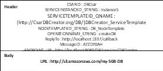

Figure 14: Return of the SI plugin with the received information of the implementation artifact

The service invocation SOAP API (see chapter 5.2) takes the body of the exchange message and the MessageID from the header for the SOAP message directed at the plan (see Listing 8).
The HashMap with the returned data of the invoked implementation artifact contained in the body is converted as follows: The key-value pairs of the HashMap are pairwise transferred as key and value elements of the SOAP message (see Listing 8). 
The plan receives a uniform answer which is consistent with the parameters specified in TOSCA and is independent of the technology of the invoked implementation artifact.
Because the invocation of the service invocation interface is done through the parameters specified in TOSCA, this results in a generic and uniform interface for the invoker to invoke services.
A plan to invoke an implementation artifact only requires the information specified in TOSCA und does not have to know anything about its implementation.

Finally the created SOAP message that was passed in the beginning from the plan to the service invocation interface is sent to the address (ReplyTo) in the header.

```
01 <soapenv:Envelope xmlns:soapenv="http://schemas.xmlsoap.
02 									org/soap/envelope/" xmlns:
03 									sch="http://siserver.
04 									org/schema">
05 	<soapenv:Header/>
06 	<soapenv:Body>
07 		<sch:invokeResponse>
08 			<MessageID>A7ZD70AH</MessageID>
09 			<Params>
10 				<Key>URL</Key>
11 				<Value>http://s3.amazonaws.com/my-5GB-DB</Value>
12 			</Params>
13		</sch:invokeResponse>
14 	</soapenv:Body>
15 </soapenv:Envelope>
```
Listing 8: Message from the SOAP API back to the invoker

Until now the concept of the service invocation interface has only been explained with the service invocation SOAP API and SOAP/HTTP SI plugin.
That this concept of the service invocation interface offers much more options is explained in the following paragraph.

Figure 15 shows the option to realise an OSGi plugin.
This plugin enables the invocation of implementation artifacts implemented as OSGi services.
It should be noted that the OpenTOSCA container currently, because a suitable IA plugin is as of yet missing, is not yet able to deploy OSGi implementation artifacts, those are therefore not yet supported by the container.
The service invocation interface was implemented with further implementation of artifact types in mind and has concepts in store to deal with those.

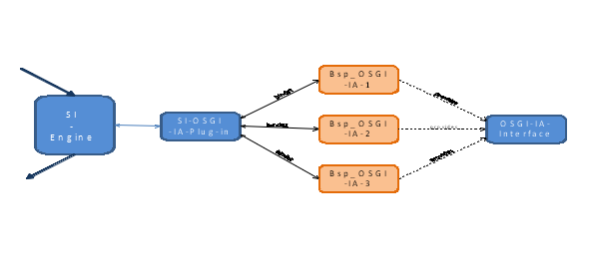

Figure 15: Example for the possibilities of more plugin types

The OSGi plugin uses, equivalent to the SI engine and its plugins, the option of declarative services provided by OSGi.
This means that OSGi implementation artifacts implement a set interface and have to offer it as a service.
This is required for the implementation of declarative services, also enables adding and starting implementation artifacts during the runtime.
Based on the implemented interface and the so specified service the OSGi SI plugin can bind and use the OSGi implementation artifact.
The endpoint of the implementation artifact in this case has to be the ID of the respective OSGi service.
Listing 9 shows the methods set by the interface.

```
01 public void invoke(String operationName, HashMap<String,
02 					  String> params);
03
04 public Object invoke(String operationName, HashMap<String,
05						String> params);
06
07 public getID();
```
Listing 9: Methods of the OSGi implementation artifact interface

The two invoke methods are necessary to realise the two MEPs request-response and one-way.
The method getID is used during the binding of the OSGi implementation artifact to get its ID and save it.
The SI plugin can then choose and invoke the correct OSGi service based on the endpoint.

As mentioned earlier it is also possible to extend the service invocation interface with further service invocation APIs.
This makes it possible to make the functionality of the service invocation interface available to more technologies.
The addition of further service invocation APIs can, equivalent to the plugins, be done during the runtime.

Figure 16 shows the service invocation interface exemplary running on service invocation SOAP as well as service invocation REST API.
As the names of the APIs suggest, this makes it possible to invoke the service invocation interface and therefore the invocation of implementation artifacts and plans with SOAP and REST at the same time.

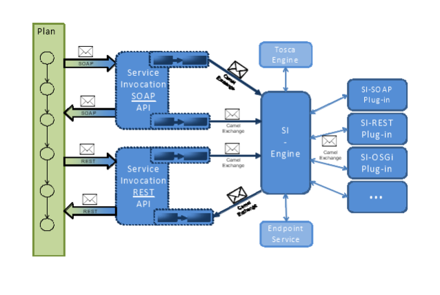

Figure 16: Example of a further service invocation API

In the scope of this bachelor thesis implemented components of the service invocation interface will be presented in the following chapter.

# Implementation

In this chapter the implementation of the service invocation interface and its components is explained. 
The Enum to specify the headers of the exchange message is presented first.
Followed by the service invocation API for SOAP and OSGi events.
Lastly the SI engine is explained with a closer look at the SI plugins and the interface.

## Service Invocation Enum

This section illustrates the SI Enum.
It is used to pass the parameters required for a implementation artifact or plan in a specified way.

Listing 10 shows the set SI enum and the so defined values.
The values serve as the key for the key/value pairs in the header.
This enables the components of the service invocation interface to read out parameters.
CSARID serves as identifier of the correct CSAR file.
SERVICEINSTANCEID_STRING is required if data is to be retrieved with the instance data service and is used to determine the instance.
If present NODEINSTANCEID_STRING is used to transmit the ID of a specific instance.
This value is not used by the SI engine to recall instance data with the instance data service but is passed as a parameter to a implementation artifact.
The implementation artifact gets the required data itself with the instance data service.
SERVICETEMPLATEID_QNAME serves to determine the service template of a TOSCA definition.
Equivalently NODETEMPLATEID_STRING determines the node template.
OPERATIONNAME_STRING specifies the operation to be invoked of the implementation artifact or plan.
If the operation name is not unique within a node type the name of the interface has to be specified as well.
This is done with the INTERFACENAME_STRING.
PLANID_QNAME is used if a plan is to be invoked and serves to identify the plan.

```
public enum SIEnum {
CSARID, SERVICEINSTANCEID_STRING, NODEINSTANCEID_STRING, SERVICETEMPLATEID_QNAME, NODETEMPLATEID_STRING,
INTERFACENAME_STRING, OPERATIONNAME_STRING, PLANID_QNAME, ENDPOINT_URI, SPECIFICCONTENT_DOCUMENT
}
```
Listing 10: SI-Enum

All values mentioned so far are already being passed to the SI engine from the respective service invocation API.
Only the values of ENDPOINT_URI and if applicable SPECIFICCONTENT_DOCUMENT are set by the SI engine.
ENDPOINT_URI is determined with the endpoint service and specifies the endpoint of an implementation artifact or plan.
SPECIFICCONTENT_DOCUMENT is determined with the TOSCA engine (if specified in the TOSCA definition) and can contain important information for the plugin, like for example information about the mapping of the parameters (see chapter 5.7).

## Service Invocation SOAP API

In this chapter the service invocation SOAP API to invoke the service invocation interface with SOAP messages is explained.
Also more details on the usage of Camel.

Listing 11 shows conceptually the implemented route and its endpoints (see Camel basics, chapter 2.7) of the service invocation SOAP API.
The strings defined in rows one to 16 INVOKE, CALLBACK, ENGINE_AI and ENGINE_PLAN represent the endpoints of the route.
The route itself is defined in rows 17 to 22.

The string INVOKE, rows one to six, serves as endpoint to invoke the service invocation SOAP API.
With it a SOAP web services is started on http://localhost:8081/invoker per CXF component [8].
The invoker.wsdl serves as WSDL of the web service.
The service and port are defined by the WSDL.

```
01 String INVOKE = "cxf:http://localhost:
02                  8081/invoker?wsdlURL=META-INF/invoker.
03                  wsdl&serviceName={http://siserver.org/wsdl}
04                  SIServerInvokeService&portName={http:
05                  //siserver.org/wsdl}
06                  SIServerInvokePort";

07 String CALLBACK = "cxf:${header[ReplyTo]}?wsdlURL=META-
08                  INF/invoker.wsdl&serviceName={http:
09                  //siserver.org/wsdl}
10                   SIServerCallback&portName={http://siserver.
11                  org/wsdl}CallbackPort";

12 String ENGINE_IA = "bean:siengineinterface.
13                  SIEngineInterface?method=invokeOperation";

14 String ENGINE_PLAN = "bean:siengineinterface.
15                  SIEngineInterface?method=invokePlan";

16 from(INVOKE).unmarshal(requestJaxb).process(requestProcessor)
17       .choice().when(this.header(CxfConstants.OPERATION_NAME).
18      isEqualTo("invokeOperation")).to(ENGINE_IA).when(this.header(
19      CxfConstants.OPERATION_NAME).isEqualTo("invokePlan")).
20      to(ENGINE_PLAN).end().process(responseProcessor).
21      marshal(responseJaxb).recipientList(this.simple(CALLBACK));
```

Listing 11: Route of the Service Invocation SOAP API

The string CALLBACK defines the endpoint required for asynchronous invocations to send reply messages to the invoker.
This also uses the CXF component as well as the invoker.wsdl.
The respective service and port is also given.
The address where the SOAP message should be sent is determined dynamically.
${header[ReplyTo]} means the value of ReplyTo from the header of the exchange message should be read and used as address for the response message.
This value has to be transmitted by the invoker at the time of invocation of the service invocation SOAP API.
The service invocation SOAP API supports the transfer, as shown in chapter 4.3 listing 5 as parameter in the body or as WS addressing header [42].
Correspondingly the MessageID can be transmitted with both methods.

In rows 12 and 13, as well as 14 and 15 the two methods of the SI engine are set as endpoints.
One endpoint to invoke implementation artifacts (ENGINE_IA) and one endpoint to invoke plans (ENGINE_PLAN).

Rows 16 to 21 show the route that is processed after an invocation.
From(INVOKE) defines the INVOKE endpoint as entry point of the route.
The SOAP message of an invocation is unmarshalled (unmarshal(requestJaxb)) and then processed in requestProcessor.
During processing all parameters defined with the SI enum as well as all headers from the SOAP message are applied as header of the exchange message.
Then the header OPERATION_NAME is read and used to determine if an implementation artifact or plan should be invoked and accordingly the method of the SI engine is invoked (ENGINE_IA or ENGINE_PLAN).
After the SI engine or respectively a suitable plugin has executed the invocation and the exchange message with the reply from the implementation artifact or plan has been returned to the service invocation SOAP API, this is processed again (process(responseProcessor).
The reply is read from the body of the exchange message and, if possible, converted into a marshallable object.
Subsequently the response object is marshalled and sent as SOAP message to the CALLBACK endpoint.

##  Service Invocation OSGi event API

This chapter presents the implementation of the service invocation OSGi event API.
Special focus lies on the general functionality of OSGi events and the collaboration with the plan invocation engine (see chapter 2.5).

The service invocation OSGi event API enables the usage of the service invocation interface with the OSGi event admin service[31, chapter 113].
With the OSGi event admin services events can be sent and received with the **publish and subscribe** pattern.
This technology enables asynchronous communication between the service invocation interface and for example the plan invocation engine.

Figure 17 shows the service invocation interface with service invocation OSGi event API and plan invocation engine.
Furthermore the function of the publish and subscribe pattern is shown.
The plan invocation engine sends the message enriched with the required information to a list (Request Topic).
The service invocation OSGi event API receives the message, because it is subscribed to this list, and can process it further.
Transmitted information like CSAR ID or plan ID, familiar from the service invocation SOAP API, are set as header and the transmitted payload as body of an exchange message object.
The payload can be for example a HashMap with parameters as key/value pairs, or as is the case with the plan invocation engine be of the type org.w3c.com.Document [33].
Subsequently the exchange message is passed to the SI engine to be processed further.
After the response from the SI engine returns, the service invocation OSGi event API sends the response message to more lists (Response Topic).
The plan invocation engine is subscribed to this list and can so receive the response messages and process them.

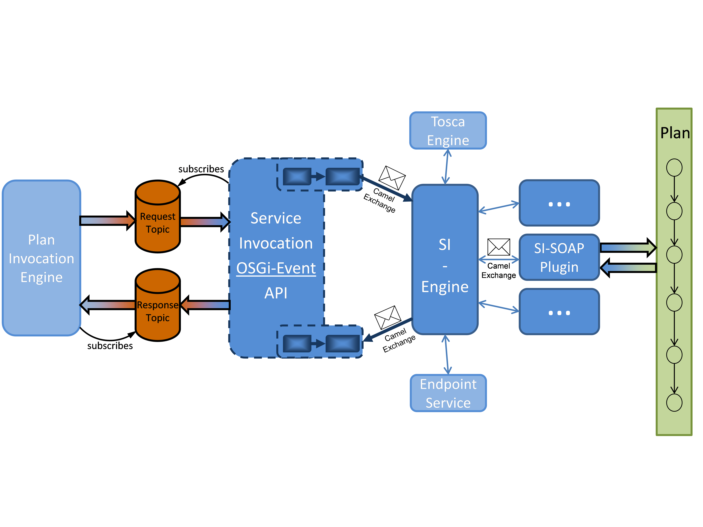

Figure 17: Invocation of a plan initiated with the plan invocation engine

Listing 12 shows based on the service invocation OSGi event API how OSGi event services are used.
First, like in every OSGi XML configuration file (Component Description [36, chapter 112.2]), the name (row two to four) and the class (row five and six) of the respective component are set.
The EventAdmin service has to be bound so that the components can send events to lists (rows seven to eleven).
bindEventAdmin (row seven) sets the method to bind the service and has to be present in org.opentosca.siengine.api.osgievent.SIEventHandler, the class specified in rows five and six and implemented correspondingly.
Rows twelve to fifteen specify that the class mentioned above offers the service EventHandler.
The class has to implement the interface EventHandler and the corresponding method to receive events handleEvent(Event event).
The names of the lists (event.topics) the component is subscribed to have to be specified.
In this example this is the list org_opentosca_plans/request which is used for example by the plan invocation engine to send query for the invocation of plans.

```
01 <scr:component xmlns:scr="http://www.osgi.org/xmlns/scr/v1.1.
02 							0" immediate="false" name="org.
03							opentosca.siengine.api.osgievent.
04							SIEventHandler">
05 	<implementation class="org.opentosca.siengine.api.
06 						 osgievent.SIEventHandler"/>
07 	<reference bind="bindEventAdmin" cardinality="1..1"
08 					interface="org.osgi.service.event.
09 					EventAdmin" name="EventAdmin"
10 					policy="static"
11 					unbind="unbindEventAdmin"/>
12 	<service>
13 		<provide interface="org.osgi.service.event.
14 							EventHandler"/>
15 	</service>
16 	<property name="event.topics" type="String"
17 					value="org_opentosca_plans/requests"/>
18 </scr:component>
```

Listing 12: Usage of the OSGi event service

Equivalently the plan invocation engine is subscribes to the list org_opentosca_plans/responsnes, which is used to send the responses messages with the service invocation OSGi event API.
The sending of an event is done with the method postEvent(Event event) offered by the EventAdmin service.

## Service Invocation Engine 

In this section the implementation of the SI engine is presented.
The focus lies on the methods offered by the SI engine and the system to administrate the SI plugins.

The SI engine provides two methods.
First InvokeOperation(Exchange exchange) to invoke implementation artifacts and second invokePlan(Exchange exchange) to invoke plans.
Although implementation artifacts and plans can be viewed as services the queries for their invocation has to be handled differently.
Figure 18 illustrates the processes of both methods.

Identical in both methods is that they have the read the headers relevant for them from the exchange message.
In the case of invokeOperation this would be the values CSARID, SERVICEINSTANCEID_STRING, NODEINSTANCEID_STRING, SERVICETEMPLATEID_QNAME, NODETEMPLATEID_STRING, INTERFACENAME_STRING and OPERATIONNAME_STRING.
In the case of invokePlan CSARID, SERVICEINSTANCEID_STRING, NODETEMPLATEID_STRING and PLANID_QNAME.
Subsequently, if invokeOperation was called, the TOSCA engine is used to determine a suitable implementation artifact, its message exchange pattern and the corresponding properties.
The corresponding sequence diagram (Figure 12) was already presented in chapter 4.3.
The query for instance data, if a ServiceInstanceID is available and a HashMap as payload happens in both cases.
If the method was invokeOperation it is also checked if a NodeInstanceID was specified.
If this is the case and the Payload is in form of a HashMap the NodeInstanceID is taken in as parameter of the HashMap.
This enables implementation artifacts to determine current values from the instance data themselves.
Independently of the two methods the respective endpoint of the implementation artifact or plan is determined with the endpoint service.
For the invocation of implantation artifacts the invocation type of a suitable plugin is determined with the properties queried earlier.

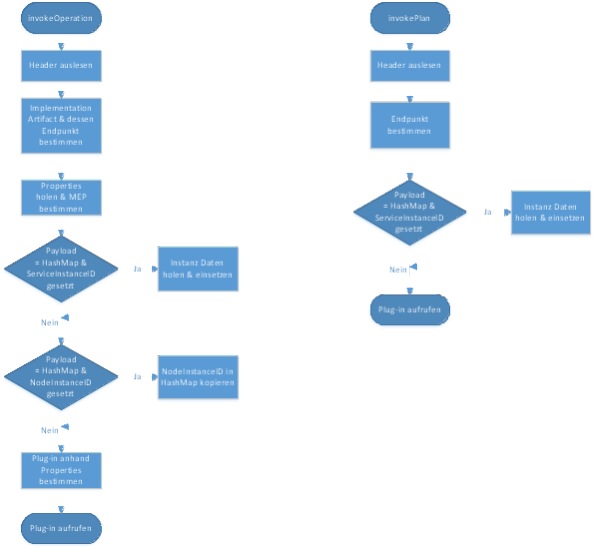

Figure 18: Workflow diagram of both SI engine methods invokeOperation and invokePlan

If a plan is invoked the exchange message is directly passed to the SOAP plugin (see chapter 5.6) because the OpenTOSCA container so far only supports BPEL plans.
If more plan types are supported in the future the invocation type and therefore the choice of plugin has to be determined based on the management plan language.

Listing 13 shows how the invocation type of an implementation artifact is specified within the TOSCA definition.
The option to define properties (row three to twelve) provided by the artifact templates is used for this.
The rows eight to ten in this example are relevant for the service invocation interface.
With the InvocationType element the invocation type of the implementation artifact is set.
In this case SOAP/HTTP.
The SI engine would then forward this request for the invocation of this implementation artifact to a plugin that can handle SOAP/HTTP.

```
01 	<p:ArtifactTemplate id="EC2VMService" type="toscatypes:
02 						WAR">
03 		<p:Properties>
04 			<opentosca:WSProperties>
05 				<opentosca:ServiceEndpoint>
06 						/services/EC2VMIAService
07 				</opentosca:ServiceEndpoint>
08 				<opentosca:InvocationType>
09 						SOAP/HTTP
10 				</opentosca:InvocationType>
11 			</opentosca:WSProperties>
12 		</p:Properties>
13 		<p:ArtifactReferences>
14 			<p:ArtifactReference reference=
15 					"IAs/EC2VMService/EC2-VM-Service.war" />
16 		</p:ArtifactReferences>
17 	</p:ArtifactTemplate>
```

Listing 13: Example ArtifactTemplate with invocation type specification

Furthermore another property (ServiceEndpoint) is defined in listing 13.
This is used by the IA engine to determine the correct endpoint of the implementation artifact.
This ensures that the IA engine stores an endpoint with the endpoint service that is usable by the service invocation interface.

An important requirement on the service invocation interface is the option that the spectrum of invocation types can be extended.
This is achieved with a plugin system, which is now explained in more detail.

The plugin system is realized with declarative services (see chapter 2.3).
The SI plugins implement the specified interface SIPluginInterface (see chapter 5.5) and respectively provide the service ISIEnginePluginService.
This is shown in rows four and five in listing 14.

```
01 <scr:component ...>
02 	<implementation class= .../>
03 	<service>
04 		<provide interface="org.opentosca.siengine.plugins.
05 							service.ISIEnginePluginService"/>
06 	</service>
07 </scr:component>
```
Listing 14: Providing a service per OSGi XML configuration file
```
01 <scr:component ...>
02 	<implementation class= .../>
03 	<reference bind="bindPluginService" cardinality="0..n"
04 					interface="org.opentosca.siengine.plugins.
05 					service.ISIEnginePluginService"
06 					name="SIPluginInterface" policy="dynamic"
07 					unbind="unbindPluginService"/>
08 </scr:component>
```
Listing 15: Binding a service per OSGi XML configuration file

Because the SI engine binds all these services (see Listing 15, rows three to seven), during the start of an SI plugin the SI engine automatically calls a method to bind this plugin.
In this example the method is called bindPluginService (see row 3 in Listing 15).

Furthermore the SI plugins have a method getType(), specified with the interface, which returns the invocation type as string.
This method is called by the SI engine when a plugin is bound and the return value (the invocation typ) together with the respective plugin is stored in a map (see Listing 16, rows three to six).
Row one and two show the map to administrate the SI plugins.
The key is the invocation type and the value is the plugin.
During the stopping of a plugin the unbind method is executed and the plugin is removed from the map (row 8 to eleven).
Because of this system the SI engine always has a current list of available SI plugins and can choose a suitable plugin based on the invocation type of the implementation artifact.

```
01 Map<String, ISIEnginePluginService> pluginServicesMap = Collections.
02 synchronizedMap(new HashMap<String, ISIEnginePluginService >());

. . .

03 public void bindPluginService(ISIEnginePluginService plugin) {
04
05 		pluginServicesMap.put(plugin.getType(), plugin);
06 }
07
08 public void unbindPluginService(ISIEnginePluginService plugin) {
09
10 		pluginServicesMap.remove(plugin.getType());
11 }
```

Listing 16: Implementation of the plugin system

## Service Invocation Plugin Interface

This chapter presents the interface for the SI plugins.
As mentioned earlier all plugins usable by the service invocation interface have to implement this interface and provide the service ISIEnginePluginService.

```
01 public interface ISIEnginePluginService {
02
03 	public Exchange invoke(Exchange exchange);
04
05 	public String getType();
06
07 }
```
Listing 17: Interface of the SI plugins

Listing 17 shows the interface specified for the SI plugins.
The interface defines two methods.
The method getType() explained earlier, that retrieves the supported invocation type of a plugin, and the method invoke(Exchange exchange) to transmit the exchange message to the SI plugins.
The invoke method returns the exchange message, with which it was called, together with the response message of the invoked implementation artifact or plan as return value in the body.

## Service Invocation SOAP/HTTP plugin

This chapter presents an implementation of the SI plugin interface.
Specifically it presents a SOAP/HTTP plugin, meaning a SI plugin that can invoke implementation artifacts and plans with a SOAP message via HTTP.

After the invocation of the invoke method and the transmission of the exchange message through the SI engine, the SOAP/HTTP plugin reads the endpoint of the implementation artifact or plan from the header.
Endpoints can differ depending on the required plugin.
In the case of the SOAP/HTTP plugin the endpoint has to either point directly to the WSDL definition of the implementation artifact or plan, or has to achieve this by attaching "?wsdl".
If for example the WSDL definition of an to be invoked implementation artifact is available under the address http://localhost:8080/EC2IA/services/EC2Service?wsdl either this address or this one http://localhost:8080/EC2IA/services/EC2Service has to be provided as endpoint.
This is necessary because the WSDL definition describes the interface to invoke the webservice and the information contained to create and send the invocation message and therefore the plugin has to read it.
The MEP is detzermined like this for example, or if a HashMap is transmitted with the input parameters as body of the exchange message, the WSDL definition is used to generate a correct SOAP message from it.

The SOAP/HTTP plugin supports in the current implementation three exchange types of messages.
Those will be explained in the following paragraph and figure 19.

**One-Way (In-Only)**: The service is called with a SOAP message, does not send a response message.
Listing 18 shows an exemplary One-Way operation in a WSDL definition.

```
01 	<wsdl:operation name="one-wayOperation">
02 		<wsdl:input message="tns:inputMessage">
03 		</wsdl:input>
04 	</wsdl:operation>
```

Listing 18: One-Way Operation

**Request-Response (In-Out)**:  The client (the plugin) sends a SOAP message to the service and waits for the response message.
An example of a request response operation is in shown in listing 19.

```
01 	<wsdl:operation name="request-responseOperation">
02 		<wsdl:input message="tns:requestMessage">
03 		</wsdl:input>
04 		<wsdl:output message="tns:responseMessage">
05 		</wsdl:output>
06 	</wsdl:operation>
```

Listing 19: Request-Response operation

**Request-Callback (asynchronous Request-Response)**: The client sends a SOAP message to the service, does not require a immediate response.
Instead it is informed when the response from the service arrives.
The service has to be given an address for the callback and a MessageID.
The MessageID has to be contained in the response message of the service, so that a correlation between the invocation message and the response message is possible.

The SOAP/HTTP plugin enables the transmission of callback addresses and MessageIDs as parameters in the SOAP body of the message and with WS addressing header.
The request callback however is realized from the WSDLs point of view as two one way operations and is not specified by the WDSL definition alone.
To finally determine the information gotten from the WSDL additional MEPs from the TOSCA definition have to be used.
Accordingly an In-Only operation (from the TOSCA definition) and an In-Only operation (from the WSDL definition) make a One-Way SOAP message (without response message) to the service.
In contrast an In-Out operation (from the TOSCA definition) and an In-Only operation (from the WSDL definition) make a message exchange through request callbacks.

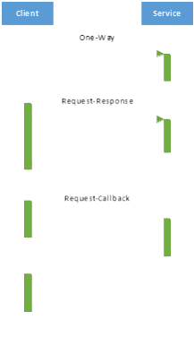

Figure 19: Presentation of the three MEPs supported by the SOAP/HTTP plugin

## Service Invocation REST/HTTP plugin

This section explains the implementation of the REST/HTTP plugin.
Special focus lies on how mapping information of the passed parameters can be specified in the TOSCA definition.

HTTP allows the passing of parameters inside the URL (query string) as well as in the message body.
To enable the plugin to create the message according to the implementation of the implementation artifact, information about the mapping of the parameters can be given in the TOSCA definition.
This information is determined in the SI engine with the TOSCA engine and passed to the plugin.
Listing 20 shows the schema to describe mapping information, which have to be defined inside the implementation artifact (as artifact specific content).

```
01 <DataAssign>
02 		<Operations>
03 			<Operation name="String" ?
04 						interfaceName="String" ?
05 						endpoint="no | yes" ?
06 						params="queryString | payload" ?
07 						contentType="urlencoded | xml" ?
08 						method="POST | GET" ? >
09 			</Operation> +
10 		</Operations>
11 </DataAssign>
```

Listing 20: Schema to describe the parameter mapping

Implementation artifacts implement the interfaces and operations offered by a NodeType.
Because an implementation artifact can implement a single operation of an interface, all operations of an interface, or all interfaces with their operations the attributes name and interfaceName are required.
They specify for which operations the respective mapping information is valid.
If the implementation artifact only implements a single operation name and interfaceName are not required.
Similarly the interfaceName is only required if the implementation artifact implements multiple interfaces.
The endpoint attribute specifies that the name of the operation and the interface are to be attached (with / as separator) to the endpoint received from the endpoint service.
The params attribute specifies if the parameter should be transmitted as part of the URL (queryString) or in the body (payload).
If it is part of the body the content type can be specified.
Currently the two content types application/x-www-form-urlencoded (urlencoded) as well as application/xml (xml) are supported.
The required HTTP method (GET or POST) can be specified with method-Attribute.

Additionally to the mapping information the plugin has its own assumptions or rather requirements on the structure of a message.
For example if the parameter is passed as a query string the key value pairs are separated with & and the key value values are separated with =.
The first key value pair is appended a ? to separate tge endpoint from the parameters.
Listing 21 shows an example of the specification for such a mapping definition and the resulting query.
Identical (with & and = as separators) the parameters are encoded in the body if they are passed urlencoded.
For the passing with XML the parameters are converted as follows: The names of the parameters become elements with the value of the respective parameter as content.
The name of the operation is used as root element.
Listing 22 shows an example for this.

```
<DataAssign>
	<Operations>
		<Operation name="createDB"
					endpoint="yes"
					params="queryString"
					method="GET" >
		</Operation> 
	</Operations>
</DataAssign>

GET /DB/services/DBCreator/createDB?Size=5&Host=AWS&User=
		admin&Password=p8ilR6N9 HTTP/1.1
Host: localhost:8080

...
```
Listing 21: Example for the parameter passing with query string

```
<DataAssign>
	<Operations>
		<Operation name="createDB"
				params="payload"
				contentType="xml" >
		</Operation> 
	</Operations>
</DataAssign>

POST /DB/services/DBCreator HTTP/1.1
Host: localhost:8080

...

<createDB>
	<Size>5</Size >
	<Host>AWS</Host >
	<User>admin</User >
	<Password>p8ilR6N9</Password >
</createDB>
```

Listing 22: Example for the parameter passing as content type xml

In the future it could be possible to use web application description language (WADL), equivalent to WSDL in the SOAP plugin, to acquire required information.
But because it is rarely used and is much more complex this prototype implementation of the plugin has its own, specifically created schema to specify information.

# Assumptions

Some assumptions have to be made and requirements put on the creators of TOSCA definitions and plugin developers (of the service invocation interface) so that the concept and the implementation based on it can work correctly.
These are explained in this chapter.

**Accuracy of the passed parameters**
The parameters passed to the service invocation interface can be put in two groups.
On one hand the data required to determine the implementation artifact or plan and on the other hand the data required to invoke the implementation artifact or plan.

The parameters passed to the service invocation interface to determine a fitting implementation artifact or plan, have to be correct and known within the OpenTSCA container.
Known within the OpenTOSCA container means, that this data, like for example the CSARID or ServiceTemplateID has to be invokable with the TOSCA engine and therefore exist as Java objects.
If this is not the case required information like the name of the implementation artifact and so the its endpoint cannot be determined and the invocation cannot be made.

The input parameters required for the invocation of the implementation artifact plan have to correspond to the parameters specified by the implementation artifact or plan.
This means that the names and the number (after additional parameters like instance data has been added) of passed parameters have to be identical.
The operations to be executed also have to match with the implementation artifacts or plans as well as their input parameters.
If an operation is present in different interfaces of one NodeType the name of the interface has be specified as well.
If this is not specified it is assumed that the operation is unique within the NodeType and the implementation artifact is determined only with that.

**Existence of an endpoint**

Without information under which name or which address a specific implementation artifact is reachable it cannot be invoked.
Therefore implementation artifacts deployed with the IA engine or rather its plugins, or similarly deployed plans, have to have a correct endpoint, stored with the endpoint service.

These endpoints can differ based on the type of implementation artifact.
The endpoint of a SOAP web service implementation artifact would be saved as a URL which specifies the address to the WSDL file of the SOAP web service.
The endpoint of an OSGi service implementation artifact would be represented with the ID of this OSGi service.
The different plugins of the service invocation interface know how to interpret the different endpoints.

The deployed implementation artifacts and plans (for invocations) have to be available from the OpenTOSCA container environment.

**Usage of specified interfaces**
New, to be developed SI plugins, have to implement the interface specified by the existing plugin.
This is necessary to ensure correct functionality of the plugin system based on OSGi.

Furthermore the invocation types, which are used to identify plugins, have to differ from each other.

For the concept of the OSGi plugin (see chapter 4.3) the implementation artifacts have to implement this interface as well.

**Required information within the TOSCA definition**

Required information, like for example the invocation type of an implementation artifact, has to be specified in the TOSCA definition.
This information is used by the service invocation interface among other things to determine a suitable SI plugin.
Without this data no suitable plugin can be found and the invocation of the implementation artifact fails.

The optional input and output values of the NodeType operations to determine the message exchange pattern (MEP) have to be specified as well.
If they are not specified request-response is assumed.

**Usage of the Enum**

The SI enum explained in 4.4.1 is required for the exchange of the required information.
It defines the header of the exchange message and so ensures a standardised format.

New service invocation APIs have to use this enum, equivalently to the existing service invocation SOAP API.
Otherwise the SI engine cannot read the information and the invocation of the implementation artifact of plan can not be executed.

# Review of the concept and implementation

This chapter describes if and how the requirements from chapter three have been implemented in the concept and implementation of the service invocation interface.

The first requirement was that the service invocation interface can be used to invoke plans as well as implementation artifacts.
That this requirement is met is shown for example in chapter 5.4.
There the implementation of the SI engine is presented and shown that the invocations of implementation artifacts and plans can be processed.
The service invocation engine should be made usable by the plan invocation engine (see chapter 2.5).
This has been implemented with the OSGi event API, which was presented in chapter 5.3.

Another requirement was that asynchronous invocations should be possible.
An exemplary processing of such an asynchronous invocation of the SOAP API including the functionality of the MessageID and ReplyTo (Callback address) has been shown in chapter 4.3.
Furthermore chapter 5.3 presented how the plan invocation engine communicates asynchronous with the service invocation interface with the publish-subscribe pattern.

The information required for the invocation of a service should be acquired dynamically.
This requirement was met with the connection of the TOSCA engine and endpoint service.
The sequence diagram from chapter 4.3 shows the connection of that component to the service invocation interface. 
In chapter 5.6 is explained how the SOAP/HTTP plugin determines for example the MEP, based on the WSDL of a web service.

A great number of supported invocation types, or rather the option to extend these easily was another requirement.
To enable this the SI engine was fitted with a plugin system (see chapter 5.4), which enables the addition of plugins during the runtime.
Also Camel was used to implement the service invocation interface, it offers a multitude of components for different standards and protocols (see chapter 2.7).

Another requirement was that it should be possible to pass input data with a HashMap [34] as well as with an XML field [33].
In chapter 4.1 and 5.3 the options to pass different data types are explained and chapter 4.3 has an example invocation for the passing with a HashMap.

The service invocation interface should be able to communicate with the instance data service, so that it can query previously stored instance data and update or complete parameters like this.
The connection of the instance data service is shown in chapter 4.3 and described with an example.

The service invocation interface should be integrated in the existing OpenTOSCA container.
To facilitate this it was realized with OSGi (see chapter 2.3).

The service invocation interface should be easy to extend.
This is achieved with the usage of the plugin system (see chapter 5.4) and Camel and the associated pipes-filter pattern (see chapter 2.7), which makes it easy to integrate processing steps into the route.
New APIs can be integrated easily because all data between the SI components are transferred uniformly because of the usage of exchange objects and the SI enum (see chapter 4.3, 51).

The service invocation interface should ba able to run multiple invocations in parallel without a drop in performance.
This is facilitated by the option for asynchronous invocations (see chapter  4.3), the implementation of SI components as OSGi services (see chapter 4.2) and the usage of Camel as integration framework (see chapter 4.1)

The last requirement was that the service invocation interface should have the highest degree of flexibility in regards to data formats.
This is also achieved with the usage of Camel.
Camel natively offers with its multitude of components (see chapter 2.7) a great number of supported data formats as well as type converters, which can be extend with self-made ones.
Also the message objects in the message body can be any data type, chapter 4.3 has an example of this.

# Summery and future work

The following is a summarization of the most important findings of this thesis and a look at the aspects for further work.

The goal of this thesis was to create a concept to extend the OpenTOSCA container with the ability to generically invoke services referenced in TOSCA and to implement it.
To achieve this the necessary fundamentals to understand the concept were presented and a catalog of requirements was created.
Based on this an overview of possible technologies and concrete implementations for the integration of different components was made and the design decisions were based on this (see chapter 4.1).
This lead to the realisation that Apache Camel was the best alternative for the implementation based on the advantages presented.

Based on this the architecture for the components was designed (see chapter 4.2) and the concept was worked out (see chapter 4.3).
Especially important was the integration of existing components.
That the solution concept meets the requirements was made certain with the options shown in this thesis.

In the implementation part the until then abstract descriptions of the components and their functionality was made concrete with code or xml snippets.
It was also shown exemplary how easy it is for other extension of OpenTOSCA to use the components developed in this thesis (see chapter 5.3).

It was however necessary that certain assumptions regarding the TOSCA definition, plans and component extensions (see chapter 6) are made to ensure the correct functionality of the developed components.

Overall it can be said, that this thesis created a concept and a first prototypical implementation to invoke services in the context of TOSCA.
Currently a SOAP/HTTP API (see chapter 5.2) as well as a OSGi event API (see chapter 5.3) to invoke the service invocation interface is implemented.
Furthermore a SOAP/HTTP plugin (see chapter 5.6) to invoke SOAP web services as well as a REST/HTTP plugin (see chapter 5.7) was realized.
To support a greater number of standards and protocols further plugins and APIs have to be implemented.
Because the concept was created with this in mind, the integration of new components should not pose a great challenge.

**Appendix A. WSDL of the SOAP-API**
```
01 <?xml version="1.0" encoding="UTF-8"?>
02 <wsdl:definitions xmlns:xsd="http://www.w3.
03 								org/2001/XMLSchema"
04 		xmlns:wsdl="http://schemas.xmlsoap.org/wsdl/" xmlns:
05 				tns="http://siserver.org/wsdl"
06 		xmlns:ns="http://siserver.org/schema" xmlns:soap="http:
07 				//schemas.xmlsoap.org/wsdl/soap/"
08 		name="SIServerImplService" targetNamespace="http://siserver.
09 			org/wsdl">
10
11 		<wsdl:types>
12 			<xsd:schema xmlns="http://www.w3.org/2001/XMLSchema">
13 				<xsd:import namespace="http://siserver.org/schema"
14 						schemaLocation="invoker.xsd" />
15 			</xsd:schema>
16 		</wsdl:types>
17 		<wsdl:message name="invokeOperationMessage">
18 			<wsdl:part element="ns:invokeOperation"
19 					name="invokeOperation">
20 			</wsdl:part>
21 		</wsdl:message>
22 		<wsdl:message name="invokeOperationAsyncMessage">
23 			<wsdl:part element="ns:invokeOperationAsync"
24 					name="invokeOperationAsync">
25 			</wsdl:part>
26 		</wsdl:message>
27 		<wsdl:message name="invokeOperationSyncMessage">
28 			<wsdl:part element="ns:invokeOperationSync"
29 					name="invokeOperationSync">
30 			</wsdl:part>
31 		</wsdl:message>
32 		<wsdl:message name="invokePlanMessage">
33 			<wsdl:part element="ns:invokePlan" name="invokePlan">
34 			</wsdl:part>
35 		</wsdl:message>
36 		<wsdl:message name="invokeResponse">
37 			<wsdl:part element="ns:invokeResponse"
38 					name="invokeResponse">
39 			</wsdl:part>
40 		</wsdl:message>
41 		<wsdl:portType name="InvokePortType">
42 			<wsdl:operation name="invokeOperation">
43 				<wsdl:input message="tns:invokeOperationMessage">
44 				</wsdl:input>
45 			</wsdl:operation>
46 			<wsdl:operation name="invokeOperationAsync">
47 				<wsdl:input message="tns:invokeOperationAsyncMessage">
48 				</wsdl:input>
49 			</wsdl:operation>
50 			<wsdl:operation name="invokeOperationSync">
51 				<wsdl:input message="tns:invokeOperationSyncMessage">
52 				</wsdl:input>
53 				<wsdl:output message="tns:invokeResponse">
54 				</wsdl:output>
55 			</wsdl:operation>
56 			<wsdl:operation name="invokePlan">
57 				<wsdl:input message="tns:invokePlanMessage">
58 				</wsdl:input>
59 			</wsdl:operation>
60 		</wsdl:portType>
61 		<wsdl:portType name="CallbackPortType">
62 			<wsdl:operation name="callback">
63 				<wsdl:input message="tns:invokeResponse">
64 				</wsdl:input>
65 			</wsdl:operation>
66 		</wsdl:portType>
67 		<wsdl:binding name="InvokeBinding" type="tns:
68 						InvokePortType">
69 			<soap:binding style="document"
70 					transport="http://schemas.xmlsoap.org/soap/http" />
71 			<wsdl:operation name="invokeOperation">
72 				<soap:operation soapAction="http://siserver.
73 							org/invokeOperation"
74 						style="document" />
75 				<wsdl:input>
76 					<soap:body use="literal" />
77 				</wsdl:input>
78 			</wsdl:operation>
79 			<wsdl:operation name="invokeOperationAsync">
80 				<soap:operation soapAction="http://siserver.
81 							org/invokeOperationAsync"
82 						style="document" />
83 				<wsdl:input>
84 					<soap:body use="literal" />
85 				</wsdl:input>
86 			</wsdl:operation>
87 			<wsdl:operation name="invokeOperationSync">
88 				<soap:operation soapAction="http://siserver.
89 							org/invokeOperationSync"
90 						style="document" />
91 				<wsdl:input>
92 					<soap:body use="literal" />
93 				</wsdl:input>
94 				<wsdl:output>
95 					<soap:body use="literal" />
96 				</wsdl:output>
97 			</wsdl:operation>
98 			<wsdl:operation name="invokePlan">
99 				<soap:operation soapAction="http://siserver.
100 						org/invokePlan"
101 					style="document" />
102 			<wsdl:input>
103 				<soap:body use="literal" />
104 			</wsdl:input>
105 		</wsdl:operation>
106 	</wsdl:binding>
107 	<wsdl:binding name="CallbackBinding" type="tns:
108 					CallbackPortType">
109 		<soap:binding style="document"
110 				transport="http://schemas.xmlsoap.org/soap/http" />
111 		<wsdl:operation name="callback">
112 			<wsdl:input>
113 				<soap:body use="literal" />
114 			</wsdl:input>
115 		</wsdl:operation>
116 	</wsdl:binding>
117 	<wsdl:service name="InvokerService">
118 		<wsdl:port binding="tns:InvokeBinding" name="InvokePort">
119 			<soap:address location="http://localhost:8081/invoker" />
120 		</wsdl:port>
121 		<wsdl:port binding="tns:CallbackBinding"
122 					name="CallbackPort">
123 			<soap:address location="http://localhost:8088/callback" />
124 		</wsdl:port>
125 	</wsdl:service>
126 </wsdl:definitions>
```
**Appendix B. XSD of the SOAP-API**
```
01 <?xml version="1.0" encoding="UTF-8"?>
02 <xs:schema xmlns:xs="http://www.w3.org/2001/XMLSchema"
03 		xmlns:ns="http://siserver.org/schema"
04 			attributeFormDefault="unqualified"
05 		elementFormDefault="unqualified" targetNamespace="http:
06 						//siserver.org/schema">
07 		<xs:complexType name="ParamsMapItemType">
08 			<xs:sequence>
09 				<xs:element name="key" type="xs:string" />
10 				<xs:element name="value" type="xs:string" />
11 			</xs:sequence>
12 		</xs:complexType>
13 		<xs:complexType name="ParamsMap">
14 			<xs:sequence>
15 				<xs:element maxOccurs="unbounded" name="Param"
16 						type="ns:ParamsMapItemType" />
17 			</xs:sequence>
18 		</xs:complexType>
19 		<xs:complexType name="Doc">
20			<xs:sequence>
21 				<xs:any minOccurs="0" maxOccurs="1"
22 					processContents="skip"/>
23 			</xs:sequence>
24 		</xs:complexType>
25 		<xs:element name="invokeOperation" type="ns:
26 						invokeOperationAsync" />
27 		<xs:element name="invokeOperationAsync" type="ns:
28 						invokeOperationAsync" />
29 		<xs:complexType name="invokeOperationAsync">
30 			<xs:sequence>
31 				<xs:element minOccurs="1" maxOccurs="1" name="CsarID"
32 						type="xs:string" />
33 				<xs:element minOccurs="0" maxOccurs="1"
34 						name="ServiceInstanceID"
35 						type="xs:string" />
36 				<xs:element minOccurs="0" maxOccurs="1"
37 						name="NodeInstanceID"
38 						type="xs:string" />
39 				<xs:element minOccurs="1" maxOccurs="1"
40 						name="ServiceTemplateIDNamespaceURI" type="xs:string" />
41 				<xs:element minOccurs="1" maxOccurs="1"
42 						name="ServiceTemplateIDLocalPart" type="xs:string" />
43 				<xs:element minOccurs="1" maxOccurs="1"
44 						name="NodeTemplateID"
45 						type="xs:string" />
46 				<xs:element minOccurs="0" maxOccurs="1"
47 						name="InterfaceName"
48 						type="xs:string" />
49 				<xs:element minOccurs="1" maxOccurs="1"
50 						name="OperationName"
51 						type="xs:string" />
52 				<xs:element minOccurs="1" maxOccurs="1" name="ReplyTo"
53 						type="xs:string" />
54 				<xs:element minOccurs="1" maxOccurs="1" name="MessageID"
55 						type="xs:string" />
56 				<xs:choice>
57 					<xs:element minOccurs="0" name="Params" type="ns:
58 					ParamsMap" />
59 					<xs:element minOccurs="0" name="Doc" type="ns:Doc" />
60 				</xs:choice>
61 			</xs:sequence>
62 		</xs:complexType>
63 		<xs:element name="invokeOperationSync" type="ns:
64 						invokeOperationSync" />
65 		<xs:complexType name="invokeOperationSync">
66 			<xs:sequence>
67 				<xs:element minOccurs="1" maxOccurs="1" name="CsarID"
68 						type="xs:string" />
69 				<xs:element minOccurs="0" maxOccurs="1"
70 						name="ServiceInstanceID"
71 						type="xs:string" />
72 				<xs:element minOccurs="0" maxOccurs="1"
73						name="NodeInstanceID"
74 						type="xs:string" />
75 				<xs:element minOccurs="1" maxOccurs="1"
76 						name="ServiceTemplateIDNamespaceURI" type="xs:string" />
77 				<xs:element minOccurs="1" maxOccurs="1"
78 						name="ServiceTemplateIDLocalPart" type="xs:string" />
79 				<xs:element minOccurs="1" maxOccurs="1"
80 						name="NodeTemplateID"
81 						type="xs:string" />
82 				<xs:element minOccurs="0" maxOccurs="1"
83 						name="InterfaceName"
84 						type="xs:string" />
85 				<xs:element minOccurs="1" maxOccurs="1"
86 						name="OperationName"
87 						type="xs:string" />
88 				<xs:choice>
89 						<xs:element minOccurs="0" name="Params" type="ns:
90 						ParamsMap" />
91 						<xs:element minOccurs="0" name="Doc" type="ns:Doc" />
92 				</xs:choice>
93			</xs:sequence>
94 		</xs:complexType>
95 		<xs:element name="invokePlan" type="ns:invokePlan" />
96 		<xs:complexType name="invokePlan">
97 			<xs:sequence>
98 				<xs:element minOccurs="1" maxOccurs="1" name="CsarID"
99 						type="xs:string" />
100 			<xs:element minOccurs="0" maxOccurs="1"
101 					name="ServiceInstanceID"
102 					type="xs:string" />
103 			<xs:element minOccurs="1" maxOccurs="1"
104 					name="PlanIDNamespaceURI"
105 					type="xs:string" />
106 			<xs:element minOccurs="1" maxOccurs="1"
107 					name="PlanIDLocalPart"
108 					type="xs:string" />
109 			<xs:element minOccurs="1" maxOccurs="1"
110 					name="OperationName"
111 					type="xs:string" />
112 			<xs:element minOccurs="1" maxOccurs="1" name="ReplyTo"
113 					type="xs:string" />
114 			<xs:element minOccurs="1" maxOccurs="1" name="MessageID"
115 					type="xs:string" />
116 			<xs:choice>
117 					<xs:element minOccurs="0" name="Params" type="ns:
118 					ParamsMap" />
119 					<xs:element minOccurs="0" name="Doc" type="ns:Doc" />
120 			</xs:choice>
121 		</xs:sequence>
122 	</xs:complexType>
123 	<xs:element name="invokeResponse" type="ns:invokeResponse"
124 					/>
125 	<xs:complexType name="invokeResponse">
126 		<xs:sequence>
127 			<xs:element minOccurs="0" maxOccurs="1" name="MessageID"
128 					type="xs:string" />
129 			<xs:choice>
130 					<xs:element minOccurs="0" name="Params" type="ns:
131 					ParamsMap" />
132 					<xs:element minOccurs="0" name="Doc" type="ns:Doc" />
133 			</xs:choice>
134 		</xs:sequence>
135 	</xs:complexType>
136 </xs:schema>
```
# Sources 

<span id="ref1"></span>\[1\] Apache Software Foundation: Apache Axis, URL: [http://axis.apache.org/](http://axis.apache.org/%20)

<span id="ref2"></span>\[2\] Apache Software Foundation: Apache Camel , URL: [http://camel.apache.org/](http://camel.apache.org/%20)

<span id="ref3"></span>\[3\] Apache Software Foundation: Apache Camel: Enterprise Integration Patterns, URL: [http://camel.apache.org/enterprise-integration-patterns.html](http://camel.apache.org/enterprise-integration-patterns.html%20)

<span id="ref4"></span>\[4\] Apache Software Foundation: Apache ServiceMix, URL: <http://servicemix.apache.org/>

<span id="ref5"></span>\[5\] Apache Software Foundation: Apache Synapse Enterprise Service Bus (ESB), URL: <http://synapse.apache.org/>

<span id="ref6"></span>\[6\] Apache Software Foundation: Apache Tomcat, URL: [http://tomcat.apache.org/](http://tomcat.apache.org/%20)

<span id="ref7"></span>\[7\] Apache Software Foundation: Components, URL: <http://camel.apache.org/component.html>

<span id="ref8"></span>\[8\] Apache Software Foundation: CXF Component, URL: [http://camel.apache.org/cxf](http://camel.apache.org/cxf%20)

<span id="ref9"></span>\[9\] Apache Software Foundation: FTP/SFTP/FTPS Component, URL: <http://camel.apache.org/ftp2.html>

<span id="ref10"></span>\[10\] Apache Software Foundation: Getting Started with Apache Camel, URL: [http://camel.apache.org/book-getting-started.html](http://camel.apache.org/book-getting-started.html%20)

<span id="ref11"></span>\[11\] Apache Software Foundation: Is Camel an ESB?, URL: [http://camel.apache.org/is-camel-an-esb.html](http://camel.apache.org/is-camel-an-esb.html%20)

<span id="ref12"></span>\[12\] Apache Software Foundation: Jetty Component, URL: [http://camel.apache.org/jetty](http://camel.apache.org/jetty%20)

<span id="ref13"></span>\[13\] Apache Software Foundation: Welcome to Apache Axis2/Java, URL: [http://axis.apache.org/axis2/java/core/](http://axis.apache.org/axis2/java/core/%20)

<span id="ref14"></span>\[14\] AWS: Amazon EC2, URL: [http://aws.amazon.com/de/ec2/](http://aws.amazon.com/de/ec2/%20)

<span id="ref15"></span>\[15\] BITKOM: Die wichtigsten Hightech-Themen 2013, URL: [http://www.bitkom.org/de/presse/30739\_74757.aspx](http://www.bitkom.org/de/presse/30739_74757.aspx%20)

<span id="ref16"></span>\[16\] Chappell, David A. : Enterprise Service Bus, O'Reilly Media 2004

<span id="ref17"></span>\[17\] Eclipse: Equinox, URL: [http://www.eclipse.org/equinox/](http://www.eclipse.org/equinox/%20)

<span id="ref18"></span>\[18\] Endres, Christian: Management von Cloud Applikationen in OpenTOSCA. Cloud Application Management in OpenTOSCA, Bachelorarbeit, 03.05.2013

<span id="ref19"></span>\[19\] Fielding, Roy Thomas: Architectural Styles and the Design of Network-based Software Architectures URL: <http://www.ics.uci.edu/~fielding/pubs/dissertation/top.htm>

<span id="ref20"></span>\[20\] Google: Gmail, URL: [https://mail.google.com/](https://mail.google.com/%20)

<span id="ref21"></span>\[21\] Hohpe , Gregor/ Woolf , Bobby: Pipes and Filters, URL: <http://www.eaipatterns.com/PipesAndFilters.html>

<span id="ref22"></span>\[22\] Hohpe , Gregor/ Woolf , Bobby: Publish-Subscribe Channel, URL: [http://www.eaipatterns.com/PublishSubscribeChannel.html](http://www.eaipatterns.com/PublishSubscribeChannel.html%20)

<span id="ref23"></span>\[23\] IAAS Universität Stuttgart: OpenTOSCA - Open Source Laufzeitumgebung für TOSCA, URL: <http://www.iaas.uni-stuttgart.de/OpenTOSCA/>

<span id="ref24"></span>\[24\] IT Wissen: Community Cloud, URL: [http://www.itwissen.info/definition/lexikon/Community-Cloud-community-cloud.html](http://www.itwissen.info/definition/lexikon/Community-Cloud-community-cloud.html%20)

<span id="ref25"></span>\[25\] Manhart, Klaus: Cloud Dienste - Das müssen Sie wissen! Cloud Computing - SaaS, PaaS, IaaS, Public und Private (02.08.2011), URL: [http://www.tecchannel.de/server/cloud\_computing/2030180/cloud\_computing\_das\_muessen\_sie\_wissen\_saas\_paas\_iaas/](http://www.tecchannel.de/server/cloud_computing/2030180/cloud_computing_das_muessen_sie_wissen_saas_paas_iaas/%20)

<span id="ref26"></span>\[26\] Microsoft: Windows Azure, URL: [http://www.windowsazure.com/de-de/](http://www.windowsazure.com/de-de/%20)

<span id="ref27"></span>\[27\] Mule Community: Mule ESB - The easiest way to integrate
anything, anywhere, URL: [http://www.mulesoft.org/](http://www.mulesoft.org/%20)

<span id="ref28"></span>\[28\] OASIS: Advancing open standards fort he information society, URL: <https://www.oasis-open.org>

<span id="ref29"></span>\[29\] OASIS: Topology and Orchestration Specification for Cloud Applications Version 1.0, URL: <http://docs.oasis-open.org/tosca/TOSCA/v1.0/TOSCA-v1.0.html>

<span id="ref30"></span>\[30\] OASIS: Web Services Business Process Execution Language, URL: [http://docs.oasis-open.org/wsbpel/2.0/OS/wsbpel-v2.0-OS.html](http://docs.oasis-open.org/wsbpel/2.0/OS/wsbpel-v2.0-OS.html%20)

<span id="ref31"></span>\[31\] OMG: Business Process Model and Notation , URL: <http://www.bpmn.org/>

<span id="ref32"></span>\[32\] Opscode: Chef, URL: <http://www.opscode.com/chef/>

<span id="ref33"></span>\[33\] Oracle: Document (Java Platform SE 6), URL: <http://docs.oracle.com/javase/6/docs/api/org/w3c/dom/Document.html>

<span id="ref34"></span>\[34\] Oracle: HashMapURL (Java Platform SE 6), URL: [http://docs.oracle.com/javase/6/docs/api/java/util/HashMap.html](http://docs.oracle.com/javase/6/docs/api/java/util/HashMap.html%20)

<span id="ref35"></span>\[35\] OSGi Alliance: OSGi Service Platform Core Specification (Release 4, Version 4.2, June 2009), URL: [http://www.osgi.org/download/r4v42/r4.core.pdf](http://www.osgi.org/download/r4v42/r4.core.pdf%20)

<span id="ref36"></span>\[36\] OSGi Alliance: OSGi Service Platform Service Compendium (Release 4, Version 4.2, August 2009), URL: [http://www.osgi.org/download/r4v42/r4.cmpn.pdf](http://www.osgi.org/download/r4v42/r4.cmpn.pdf%20)

<span id="ref37"></span>\[37\] OSGi Alliance: OSGi - The Dynamic Module System for Java, URL: [http://www.osgi.org/Main/HomePage](http://www.osgi.org/Main/HomePage%20)

<span id="ref38"></span>\[38\] Puppet Labs: IT Automation Software for System Administrators, URL: <https://puppetlabs.com/>

<span id="ref39"></span>\[39\] Spring: Spring Integration, URL: <http://www.springsource.org/spring-integration>

<span id="ref40"></span>\[40\] W3C: SOAP Specifications, URL: <http://www.w3.org/TR/soap/>

<span id="ref41"></span>\[41\] W3C: Web Services Description Language (WSDL) Version 2.0 Part 2: Predefined Extensions, URL: [http://www.w3.org/TR/2004/WD-wsdl20-extensions-20040803/\#patterns](http://www.w3.org/TR/2004/WD-wsdl20-extensions-20040803/%23patterns%20)

<span id="ref42"></span>\[42\] W3C: Web Services Addressing (WS-Addressing), URL: [http://www.w3.org/Submission/ws-addressing/](http://www.w3.org/Submission/ws-addressing/%20)

<span id="ref43"></span>\[43\] Wähner, Kai: Mittler zwischen den Welten. Freie Integrations-Frameworks auf der Java-Plattform (13.08.2012), URL: [http://www.heise.de/developer/artikel/Freie-Integrations-Frameworks-auf-der-Java-Plattform-1666403.html](http://www.heise.de/developer/artikel/Freie-Integrations-Frameworks-auf-der-Java-Plattform-1666403.html%20)

<span id="ref44"></span>\[44\] Wissmeier, Jörg / Kraus, Adrian: Top Ten ESB: Viele ESBs, viele Möglichkeiten, URL: [http://jaxenter.de/artikel/Top-Ten-ESB-Viele-ESBs-viele-Moeglichkeiten](http://jaxenter.de/artikel/Top-Ten-ESB-Viele-ESBs-viele-Moeglichkeiten%20)

<span id="ref45"></span>\[45\] WSO2: WSO2 Business Process Server , URL: [http://wso2.com/products/business-process-server/](http://wso2.com/products/business-process-server/%20)