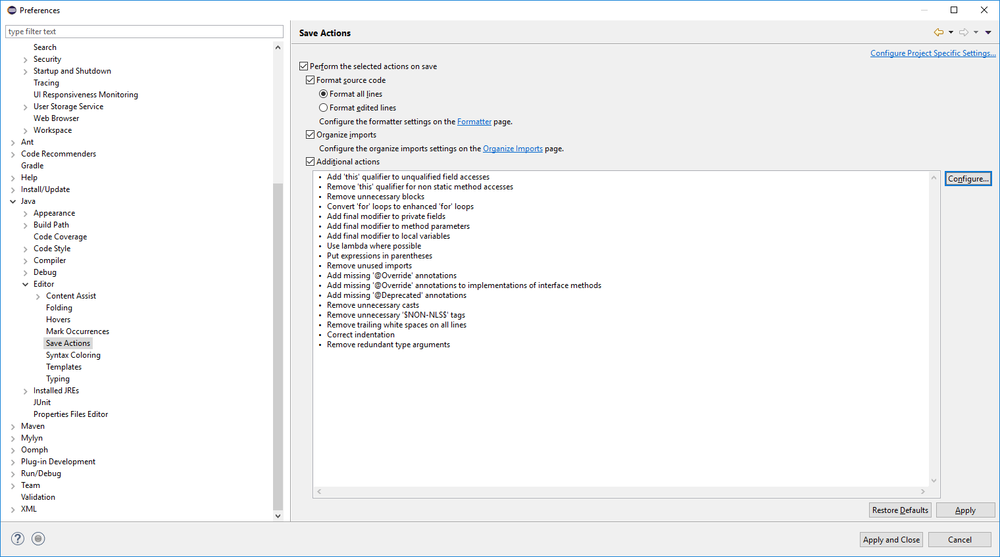
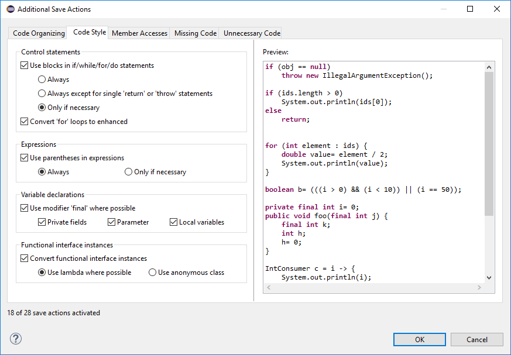
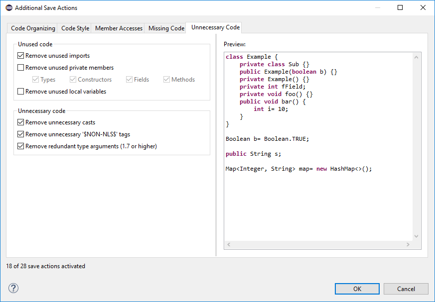

# Applying the IAAS Code Style Settings
Unifying the code style is important for git merges; otherwise, unnecessary conflicts are introduced.
The process invloves importing a profile for code formatting (which would be applied when the "Source > Format" command is invoked), importing the profile for code cleanup  (which would be applied when the "Source > Clean Up" command is invoked), and finally setting the correct Save Actions which would be applied whenever a source file is edited and saved.

## Importing the Formatter Profile
In Eclipse:
Window > Preferences > Java > Code Style > Formatter > Click on "Import..." > Navigate to the file "container/docs/codestyle/IAAS_CodeStyle.xml" and open it > Click on "Apply and Close"

As mentioned before, you can use code styling by selecting one or more code files / projects in the Package Explorer and then "Right click > Source > Format", or when a code file is open through the key shortcut "ctrl + shift + f".

## Importing the Clean Up Profile
In Eclipse:
Window > Preferences > Java > Code Style > Clean Up > Click on "Import..." > Navigate to the file "container/docs/codestyle/IAAS_CleanUp.xml" and open it > Click on "Apply and Close"

As mentioned before, you can use code styling by selecting one or more code files / projects in the Package Explorer and then "Right click > Source > Clean Up"

## Applying Save Actions
In Eclipse, open:
Window > Preferences > Java > Editor > Save Actions
and then follow these steps:

Step 1

Now click on "Configure..." and continue with the following steps:

Step 2

Step 3

Step 4

Step 5

Step 6

Then click on "OK" then on "Apply and Save"