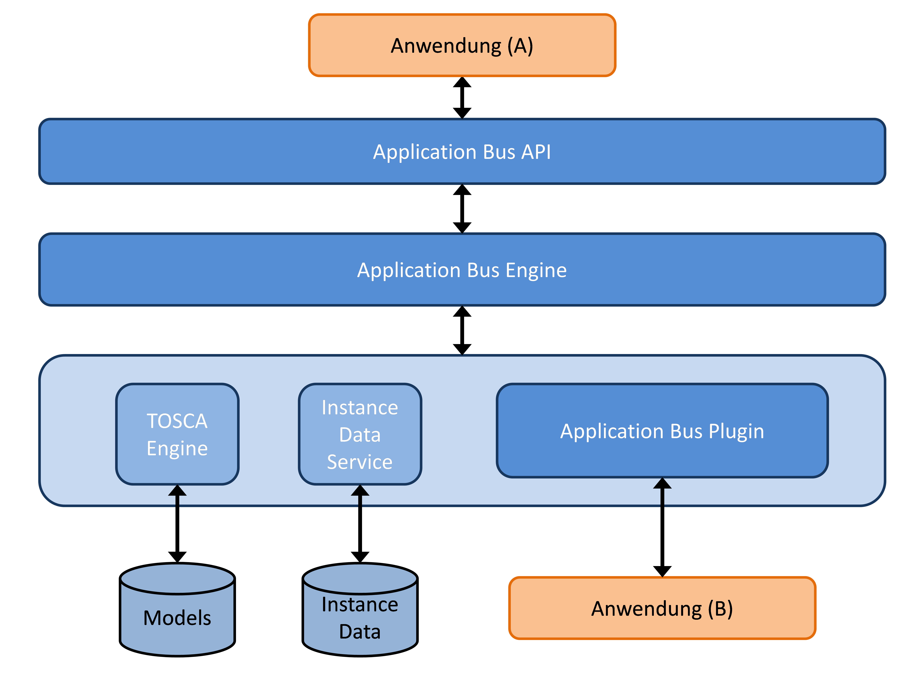
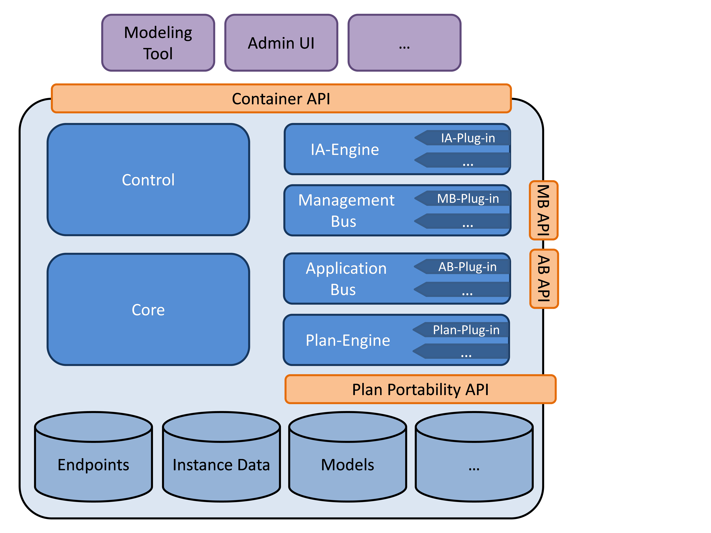
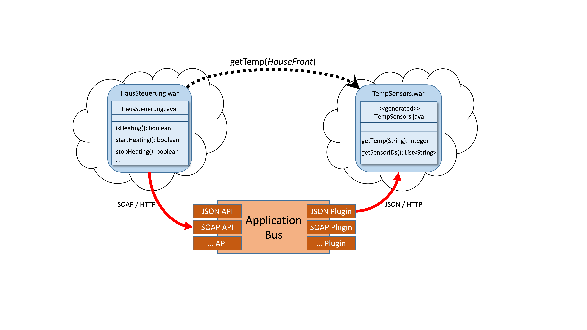
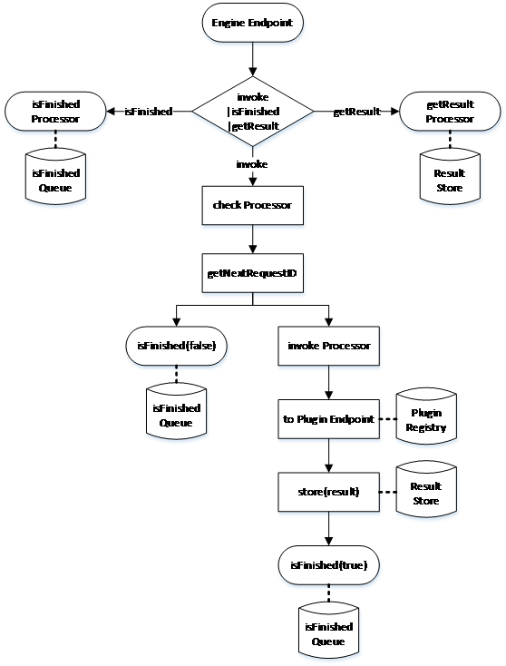

---
---
# Application Invoker

<!-- toc -->

- [Architecture](#architecture)
- [Expansion of TOSCA, code generation and implementation by the Application Bus](#expansion-of-tosca-code-generation-and-implementation-by-the-application-bus)
  * [Development of an application that is invoked by the Application Bus](#development-of-an-application-that-is-invoked-by-the-application-bus)
  * [Development of an application that uses the Application Bus](#development-of-an-application-that-uses-the-application-bus)
  * [Setup of an application that uses the Application Bus](#setup-of-an-application-that-uses-the-application-bus)
  * [Communication between Application Bus and an invoking application](#communication-between-application-bus-and-an-invoking-application)
  * [Communication between Application Bus and an invoked application](#communication-between-application-bus-and-an-invoked-application)
- [Implementation](#implementation)
  * [Application Bus constants and exceptions](#application-bus-constants-and-exceptions)
  * [Application Bus SOAP/HTTP API](#application-bus-soaphttp-api)
  * [Application Bus JSON/HTTP API](#application-bus-jsonhttp-api)
  * [Application Bus REST/HTTP API](#application-bus-resthttp-api)
  * [Application Bus Engine](#application-bus-engine)
  * [Application Bus JSON/HTTP Plugin](#application-bus-jsonhttp-plugin)
  * [Application Bus Proxy](#application-bus-proxy)
  * [Application Bus Stub Generator](#application-bus-stub-generator)

<!-- tocstop -->

## Architecture

This is a visualization of the Application Buses architecture with some example APIs to the left.
Those APIs provided the functionality of the Application Bus to other components and applications.
Pictured here are a SOAP and a REST API.
Further APIs can be added, even during the run time, to increase the number of supported protocols and standards. 
The central component of the Application Bus is the [Application Bus Engine](#application-bus-engine)
The information needed to invoke an operation is determined and collected here. 
The Application Bus engine is used, for example to determine the endpoint of the invoked application.
Availability of the Application Bus plugin, meaning which plugin is installed and started in the container, is also determined.
The information provided by the TOSCA model is used to determine a plugin that is capable of the invocation.
Which is why the Application Bus engine is connected to the necessary components of the OpenTosca container like the TOSCA Engine and the Instance Data Service. 
The Instance Data Service is used to query for and save instance data.
IP addresses of deployed application components can be stored there, this makes them available to other OpenTOSCA components, for example the Application Bus.


**Application Bus Architecture**

Displayed on the right hand side are the [Application Bus plugins](#application-bus-jsonhttp-plugin).
Plugins are responsible for the invocation of specified operations of an application and provide support for different standards and protocols -- called *Invocation-Type* --.
Again exemplified with a SOAP and REST plugin.
New plugins can be added even during the run time, similarly to APIs. 
The Application Bus engine, which features a OSGi based plugin system designed for this purpose, is responsible for plugin management. 
Also demonstrated in this figure is the connection of the individual components within the Application Bus engine through Camel.
The black dots represent the endpoints defined by the respective component.
The dotted lines represent the Camel routes to connect the endpoints.
The same types (SOAP and REST) of APIs and plugins are present in this example.
This is however not obligatory. 
The API utilized to use the Application Bus does not have to be identical with the plugin used to invoke the operation of an application.
One Application can call on the Application Bus with REST API, while the invocation of an operation from a different application can be via SOAP plugin. 



**Communication diagram of the Application Bus**

Pictured here is the Application Buses structure with a communication diagram.
Shown is the central character of the Application Bus engine, as it is needed to communicate with the necessary components of the OpenTOSCA container as well as its role as link between different APIs and plugins.
An example usage of the Application Bus by an application (A), as well as the invocation of an application (B) through the Application Bus plugin is also depicted.



**OpenTOSCA Architecture with Application Bus**

This figure shows the expanded complete architecture of OpenTOSCA with integrated Application Bus.
All components on the right (IA-Engine, Management Bus, Application Bus and Plan-Engine) each have their own plugin system.
This makes it easy to expand the functionality of each individual component as well as OpenTOSCA as a whole.
Usage of a unified plugin system also improves the containers maintainability. 

## Expansion of TOSCA, code generation and implementation by the Application Bus

In the following the usage and functionality of the Application Bus gets explained in more detail with an example. 
This entails taking a closer look at the steps necessary to implement an application, deploy it with OpenTOSCA and finally invoking it with the Application Bus.
This scenario uses a [Application Bus SOAP/HTTP API](#application-bus-soaphttp-api) and a [Application Bus JSON/HTTP Plugin](#application-bus-jsonhttp-plugin) as examples for an Application Bus API and plugin.
The procedure stays comparable with the usage of different APIs and plugins.



**Example scenario**
This depicts the scenario used to explain the usage and functionality of the Application Bus.
The application *HausSteuerung* invokes the operation *getTemp* from the *TempSensors* application. 
The application HausSteuerung knows neither the endpoint of the application TempSensor nor how to invoke it, for this the Application Bus is needed.
Both application in this example are implemented as Web Application Archives (WAR).
However any other implementation is conceptually possible. 

Following along with the scenarios process these points are addressed in order:
What has to be noted when developing an application, in this case TempSensors, that is to be invoked by the Application Bus. 
What is important for the reversed case, development of an application that uses the Application Bus, the HausSteuerung application. 
In both cases the possibility to support development with code generation is also considered. 
How to configure application that uses the Application Bus after deployment.
How the application (HausSteuerung) communicates with the Application Bus.
And how the Application Bus communicates with the application (TempSensors). 

### Development of an application that is invoked by the Application Bus
How is an application made invokable by the Application Bus?
Which prerequisites the application has to have, how code generation can be used as support and what expansions for TOSCA are necessary. 
The application TempSensors is used to illustrate this.
Prior to deploying an application with the OpenTOSCA container it has to be implemented.
The [Application Bus Stub Generator](#application-bus-stub-generator) can generate the code skeletons of associated methods for an application that was modeled with TOSCA.
The generation of TOSCA elements from an existing application has been planed for but is not yet implemented.  


**Generating a code skeleton from TOSCA**
This is an example of modeling the application *TempSensors* with TOSCA.
The application offers an operation *getTemp*, this operation defines the input parameter *sensorID* as well as the return parameter *temperature*  
The TOSCA standard was expanded with an element created specifically for OpenTOSCA, to distinguish application operations from management operations, which are implemented with implementation artifacts.
TOSCA already has the *Interfaces* element, which is used for management operations, the *ApplicationInterfaces*  is the new element used to sum up application operations. 

```xml
<NodeType name="TempSensorsApplication">
    ...
    <opentosca:ApplicationInterfaces
        xmlns:opentosca="http://www.uni-stuttgart.de/opentosca">
        <Interface name="TempSensors">
            <Operation name="getTemp">
                <documentation>Returns the temperature of the
                    specified sensor</documentation>
                <InputParameters>
                    <InputParameter name="sensorID" tzpe="xs:string"/>
                </InputParameters>
                <OutputParameters>
                    <OutputParameter name="temperature" type="xs:int"/>
                </OutputParameters>
            </Operation>
        </Interface>
    </opentosca:ApplicationInterfaces>
</NodeType>
```

**Exemplary modeling of application operations in expanded TOSCA**

The developer can use these code skeletons and fill out the generated method with the desired application logic. 
This example demonstrates how TOSCA elements can be transferred into java code. 
The name of the interface in TOSCA becomes the class name in java. 
The operation modeled with TOSCA becomes the method and Input- and OutputParameter become input parameters and output values. 
Optional documentation gets mapped from TOSCA to java as well. 

```java
public class TempSensors{
    /**
    * Returns the temperature of the specified sensor
    */
    
    public static Integer getTemp(String sensorID){
        //TODO generated method stub
        return temperature;
    }
}
```

**Code skeleton of an application operation modeled from TOSCA**
The application has to have a web service interface, otherwise the Application Bus is unable to invoke its operations.
This interface gets used, with an appropriate Application Bus plugin, to communicate. 
The generic web service interface, called  [Application Bus Proxy](#application-bus-proxy), developed here can be used for applications implemented as WARs. 
It appears in figures as AB-Proxy.jar. 
This proxy must be added to the otherwise complete application before deployment. 
To be able to determine the appropriate Application Bus plugin for the web service interface and the interfaces endpoint additional information has to be added to the TOSCA definition.
This information is to be defined in the properties of a *ArtifactTemplate*, which is referenced by a *DeploymentArtifact*. 
The *DeploymentArtifact* in turn is part of the *NodeTypeImplementation* of the *NodeType*. 


```xml
<opentosca:ApplicationInterfacesproperties>
    <opentosca:Endpoint> /TempSensorsApp</opentosca:Endpoint>
    <opentosa:InvocationType>JSON/HTTP</opentosa:InvocationType>
    <opentosca:ApplicationInterfaceInformations>
        <opentosca:ApplicationInterfaceInformation
            name="TempSensors" class="org.sensor.TempSensors"/>
    </opentosca:ApplicationInterfaceInformations>
</opentosca:ApplicationInterfacesproperties>
```

**ArtifactTemplate Properties**
This shows the required data.
Right now this information has to be added by hand in the respective TOSCA definitions.
In future  it should be possible to generate this information at least in parts. 
*Endpoint* denotates the default relative endpoint of the application. 
This is needed to determine the absolute endpoint of the web service interface.
The *InvocationType* is also defined here, it determines how the interface can be used and which is the correct Application Bus plugin.
In this case the Application Bus JSON/HTTP plugin has to be used.
The fully qualified class name (here *org.sensor.TempSensors*) must also be specified, which implements the operations of the respective interface (here *TempSensors*).
This is necessary because the Application Bus proxy, if the application is implemented as WAR, calls the desired method per reflection which requires the qualified class name. 
More details about the proxy and its implementation can be found below.

### Development of an application that uses the Application Bus

To be able to communicate with the Application Bus the application has to be programmed against an available Application Bus API.
This can be done manually as well as with the Application Bus stub generator. 
To illustrate this the application HausSteuerung shall invoke the operation getTemp from the TempSensors application. 
An operational stub of the operation can be generated from the TOSCA definition of the TempSensors application, this simplifies the use of the getTemp operation. 
This stub is already programmed against the Application Bus API. 
Now the operation getTemp can be used within the application HausSteuerung as if it were available locally and the communication with the Application Bus is hidden with a separate communication layer. 


** Usage of a generated stub to communicate with the Application Bus**
This shows a generated stub.
The stub contains the method getTemp which can be used within the HausSteuerung application as a normal local java method. 
The *invoke* method of the abstract class *ApplicationBusClient* is called inside the generated getTemp method. 
The information necessary for the invocation like the name of the *NodeTemplate*, *Operation* and names of the *ApplicationInterfaces* as well as input parameters is transferred.
Communication with the application bis is achieved with the generic ApplicationBusClient class. 

```java
public class TempSensors extends Application Bus Client{
    /**
    * Returns temperatur of the specified sensor
    */
    public static Integer getTemp(String sensorID){
        HashMap<String, Object> params = new HashMap<>();
        params.put("sensorID", sensorID);
        Integer temperature = invoke("TempSensorsAppTemplate",
            "TempSensors", "getTemp", params);
        return temperature;
    }
}
```

**Stub generated from TOSCA**

### Setup of an application that uses the Application Bus
How to configure an application after deployment to be able to communicate with the Application Bus?
To be able to communicate with the Application Bus an application requires the endpoint of the OpenTOSCA container.
During development this endpoint is not always already available and has to be transmitted to the application after deployment. 
The Application Bus stub offers a web service interface that can be used after deployment with OpenTOSCA to transmit, via a plan, the containers endpoint. 
This so called *Setup* is shown below.
In addition to the OpenTOSCA endpoint the instance ID of the application has to be transmitted for the setup, because multiple instances of an application can exist. 
The ID can be either in the form of the *NodeInstanceID* or the *ServiceInstanceID*. 
This makes the definite identification by the Application Bus possible.
For a more in depth look into the usage of instance IDs by the Application Bus see below. 


**Setup of an application that uses the Application Bus**

### Communication between Application Bus and an invoking application
The example of the HausSteuerung application and the Application Bus SOAP/HTTP API is used to demonstrate communication between application and Application Bus. 
Because a unified protocol is used for communication, the process is comparable between different Application Bus APIs.


**Communication of an application with the Application Bus**
After an application has been deployed with OpenTOSCA and configured it can communicate with the Application Bus.
The API used in the example is the Application Bus SOAP API.
Also included is the *ServiceInstanceID* which has been transmitted via a plan after deployment and the *NodeTemplateID*.
Both IDs in combination make it possible to identify the instance the invoked application.
Instead of passing *ServiceInstanceID* and *NodeTemplateID* only the *NodeInstanceID* of the invoked application can be passed. 
Also shown is how the operation, its interface and the parameters are specified.

```xml
<soapenv:Envelope
    xmlns:soapenv="http://schemas.xmlsoap.org/soap/envelope/"
    xmlns:app="http://opentosca.org/appinvoker/">
    <soapenv:Header/>
    <soapenv:Body>
        <app:invokeMethod>
            <serviceInstanceID>5</serviceInstanceID>
            <nodeTemplateID>TempSensorsAppTemplate</nodeTemplateID>
            <interface>TempsSensors</interface>
            <operation>getTemp</operation>
            <!--Optional:-->
            <Params>
                <!-- 1 or more repetitions: -->
                <Param>
                    <key>sensorID</key>
                    <value>HouseFront</value>
                </Param>
            </Params>
        </app:invokeMethod>
    </soapenv:Body>
</soapenv:Envelope>
```

** Application Bus SOAP API request to invoke an operation**

Finally the Application Bus engine checks the request for completeness.
If the request is incomplete an error message is returned to the invoker. 
If the request is complete a *RequestID* is returned, because the asynchronous communication is realized with polling.
Shown here is a positive answer to the invoker in which the *RequestID* is determined, which is required for polling and to query for the result. 

```xml
<soap:Envelope xmlns:soap="...">
    <soap:Body>
        <ns2:invokeMethodResponse
            xmlns:ns2="http://opentosca.org/appinvoker/">
            <requestID>5</requestID>
        </ns2:invokeMethodResponse>
    </soap:Body>
</soap:Envelope>
```

**Application Bus SOAP API reply**

In parallel with the return of the RequestID the Application Bus begins to work on the query.
The Application Bus determines based on the transferred data, with the help of the TOSCA engine and the instance data service, the endpoint of the invoked application respectively the Application Bus proxys endpoint. 
More on the actual implementation and communication of an application with an Application Bus plugin later.  
The invoker can poll the processing status,  while the Application Bus is still working on the invocation.
This is what such a polling request looks like. 

```xml
<soapenv:Envelope
    xmlns:soapenv="..."
    xmlns:app="http://opentosca.org/appinvoker/">
    <soapenv:Header/>
    <soapenv:Body>
        <app:isFinished>
            <requestID>5</requestID>
        </app:isFinished>
    </soapenv:Body>
</soapenv:Envelope>
```

**Polling request to determine processing status**

If the polling request returns *true*  like here the process has concluded and the result can be requested.
If the process has not yet concluded polling returns *false* and the client has to poll again. 
If the RequestId is unknown within the Application Bus a appropriate error message is sent to the invoker.
Similarly a error message is returned in the case of errors within the Application Bus, during invocation of the method through the Application Bus plugin or within of the operation itself.
An answer of the Application Bus SOAP/HTTP API to a polling request looks like this.

```xml
<soap:Envelope xmlns:soap="...">
    <soap:Body>
        <ns2:isFinishedResponse
            xmlns:ns2="http://opentosca.org/appinvoker/">
            <isFinished>true</isFinished>    
        </ns2:isFinishedResponse>
    </soap:Body>
</soap:Envelope>
```

**Polling response from Application Bus to invoker**

Results of the original operation invocation can be requested by the client after the processing status has been requested and answered with true.
This is what a result request looks like. 

```xml
<soapenv:Envelope
    xmlns:soapenv="http://schemas.xmlsoap.org/soap/envelope/"
    xmlns:app="http://opentosca.org/appinvoker/">
    <soapenv:Header/>
    <soapenv:Body>
        <app:getResult>
            <requestID>5</requestID>    
        </app:getResult>    
    </soapenv:Body>
</soapenv:Envelope>
```

**Request to query operation results**


```xml
<soap:Envelope xmlns:soap="...">
    <soap:Body>
        <ns2:getResultResponse
            xmlns:ns2="http://opentosca.org/appinvoker/">
            <result>-11</result>    
        </ns2:getResultResponse>
    </soap:Body>
</soap:Envelope>

```

**Application Bus response containing the result of the method invocation**

### Communication between Application Bus and an invoked application

How does the Application Bus communicate with a to be invoked application exemplified with the use of the TempSensors application from the example scenario.
The Plugin matching the Application Bus Proxy that is used is the Application Bus JSON/HTTP Plugin.


**Communication between Application Bus and application**

After collecting all the necessary information in the Application Bus engine communication with the application can be started via a suitable Application Bus plugin.
This is what a message from the Application Bus JSON/HTTP plugin to the Application Bus proxy of the application looks like. 

```json
{
  "invocation-information":{
    "operation": "getTemp",
    "class": "org.sensor.TempSensors"
  },
  "params":{
    "sensorID": "HouseFront" 
  }
}
```

**Request from Application Bus JSON/HTTP plugin to the application**
Communication between Application Bus JSON/HTTP plugin and the matching Application Bus proxy is also done with polling.
A RequestID is returned to the Application Bus plugin after invocation of the proxy. 
The RequestID can be used by the plugin to poll, if the processing has terminated yet and if so request the result, in regular intervals. 
After the result has been requested it and the RequestID of the original invoker are stored in the Application Bus.  
Now the result of the invoking application can be requested.
Communication with the application that is to be invoked can be realized in a different way and is only dependent on the concrete implementation of the respective Application Bus plugin and matching proxy. 
One possibility would be to implement a plugin that supports callbacks like enabled by SOAP.

## Implementation


### Application Bus constants and exceptions

The constants and exceptions are organized in a separate bundle, for easier dependency management of the individual Application Bus components. 
Constants to define the message header are necessary because the components of the Application Bus are connected with camel endpoints and routes and communicate with camel exchange messages.
This makes is possible for all components of the Application Bus to read and write parameters in a unified manner. 
This offers a closer looked at the constants and if they are used as Key or Value in message headers. 
Constants are listed in the first row, the second row specifies whether their used as key or value in the message header and the third row contains a short description. 

  
| **Constant**                       | **Usage** |  **Description**
|------------------------------------|----------------|-------------------------------------------------------------------------------------------------------|
| NODE_INSTANCE_ID_INT               | Key            |  Specification of NodeInstanceID                                                                      |
| SERVICE_INSTANCE_ID_INT            | Key            |  Specification of ServiceInstanceID                                                                   |
| NODE_TEMPLATE_ID                   | Key            |  Specification of NodeTemplateID                                                                      |
| INTERFACE_NAME                     | Key            |  Specification of Interfaces                                                                          |
| OPERATION_NAME                     | Key            |  Specification of Operations                                                                          |
| APPLICATION_BUS_METHOD             | Key            |  Specification of Application Bus method (in combination with one of the following three values)      |
| APPLICATION_BUS_METHOD_INVOKE      | Value          |  Invocation of an operation                                                                           |
| APPLICATION_BUS_METHOD_IS_FINISHED | Value          |  Request process status			                                                                      |
| APPLICATION_BUS_METHOD_GET_RESULT  | Value          |  Request result of an operation invocation                                                            |
| INVOCATION_ENDPOINT_URL            | Key            |  Specification of Endpoints                                                                           |
| CLASS_NAME                         | Key            |  Specification of implementing class	                                                              |


Besides the constants two different exceptions are also defined.
The *ApplicationBusInternalException* to be used for errors that occur inside the Application Bus as well as the *ApplicationBusExternalException* for external errors. 
For example in an invoked application or during communication.
It is necessary to differentiate between internal and external errors so that the appropriate error message can be returned by the Application Bus API. 

### Application Bus SOAP/HTTP API
Now to take a closer look at the implementation for the Application Bus SOAP/HTTP API.
API is implemented with Camel. 
This is how a route and endpoints of the Application Bus SOAP/HTTP API are defined with camel.
The endpoint to use the API is defined with the camel "CXF" component and the SOAP Web Service is started on *http://0.0.0.0:8084/appBus*.
Not included here is the information about the WSDL file used nor the service and port name of the web service. 

```java
String SOAP_Endpoint = "cxf:http://0.0.0.0:8084/appBus?wsdlURL=...";
from(SOAP_Endpoint).unmarshall(jaxb).process(requestProcessor)
     .choice().when(APP_BUS_ENDPOINT_EXISTS)
    .recipientList(APP_BUS_ENDPOINT)
    .to("direct:handleResponse")
    .endChoice().otherwise().to("direct:handleException");

from("direct:handleException").throwException(
        new ApplicationBusInternalException("The Application Bus is not running.")).to("direct:handleResponse");

from("direct:handleResponse").process(responseProcessor).marshall(jaxb);
```

**Routes of the Application Bus SOAP/HTTP API**
For simplification the routes of the API are split into 3 sub routes.
The *SOAP\_ENDPOINT* is used as entry point for the route. 
Afterwards the received SOAP message is unmarshalled and processed with the *RequestProcessor*.
The transferred parameters are filed respectively as header of the exchange message and in the body the input parameters for the operations to be invoked.
If the processing status or the operation result are to be requested, the transmitted *RequestID* is added to the body of the exchange message.
There is a check in place to see if the Application Bus engine is running, or rather if the API has been bound as service and if its endpoint is available.
The endpoint of the Application Bus engine can be requested by the API in the bind method via a method defined in the engine interface. 
This makes it so that API and engine are only loosely linked and multiple different endpoints and consecutively different camel components can easily be used. 
If the Application Bus engine is available the exchange message is forwarded to its endpoint *APP\_BUS\_ENDPOINT* for further processing. 
If not a *ApplicationBusInternalException* is thrown. 

Independent of the occurrence of errors along the route a response to the invoker has to be generated.
The *ResponseProcessor* converts the exchange message into a marshallable object, marshalls it and sends it as SOAP message back to the invoker. 
The Application Bus SOAP/HTTP API offers three operations.

1. An operation to invoke a method of a different application that has been deployed with OpenTOSCA.
2. An operation to request the process status of a method invocation, because polling is used. 
3. An operation to request the result of a concluded method invocation.

In the case of 1. the *RequestID* is return as answer to identify the invoker.
In the case of 2. either *true* or *false* is returned dependent on whether the process has finished or not.
In the case of 3. the result of the method invocation is returned.

### Application Bus JSON/HTTP API

How can Camel be used to realize the API and what message format does the API expect.
The Application Bus JSON/HTTP API offers a Lo-REST-ful web service interface to use the Application Bus with.
The supported data format is JSON.
Shown here is how routes and the endpoints of the Application Bus JSON/HTTP API are defined with Camel. 
To realized the API the Camel *Restlet* component is used and the API operates on Port 8083.
To invoke an operation of a different application the parameters have to be formatted as content type application/json and sent as HTTP-POST method, to */OATBService/v1/appInvoker*. 

```java
String ENDPOINT = "restlet:http://0.0.0.0:8083/OTABService/v1/appInvoker";

from(ENDPOINT + "?restletMethods=post")
  .process(invocationRequestProcessor)
  .to(TO_APP_BUS_ENDPOINT)
  .process(exceptionProcessor);

from(ENDPOINT + "/activeRequests/{id}?restletMethods=get")
  .process(isFinishedRequestProcessor)
  .to(TO_APP_BUS_ENDPOINT)
  .process(isFinishedResponseProcessor);

from(ENDPOINT + "/activeRequests/{id}/response?restletMethods=get")
  .process(getResultRequestProcessor)
  .to(TO_APP_BUS_ENDPOINT)
  .process(getResultResponseProcessor);

from(TO_APP_BUS_ENDPOINT)
  .choice().when(APP_BUS_ENDPOINT_EXISTS)
   .recipientList(APP_BUS_ENDPOINT)
   .endChoice().otherwise().to("direct:handleException");

from("direct:handleException").throwException(
 new ApplicationBusInternalException("The Application Bus is not running."));
```

**Routes of the Application Bus JSON/HTTP API**

If no error occurs the Application Bus JSON/HTTP API answers with the HTTP status code 202 (accepted) and the polling address in the location header. 
To request the processing status a HTTP-GET has to be sent to */OTABService/v1/appInvoker/activeRequests/{id}*.
Where *{id}* is a placeholder for *RequestID*
The address is also returned via the location header by the API as response to an invoke request. 
If the processing has finished an answer with the HTTP status code 303 (see other) and the address to request the result in the location header is returned.
If not an answer with the HTTP status code 200 (ok) and content *{\"status\": \"PENDING\"}* is returned. 

```json
{
    "invocation-information": {
       "serviceInstanceID": 12, 
        "nodeTemplateID": "TempSensorsAppTemplate", 
        "interface": "TempSensors", 
        "operation": "getTemp"
    }, 
    "params": {
        "sensorID": "HouseFront"
    }
}
```

**Request to the Application Bus JSON/HTTP API to invoke an operation**

To request the result of a previously made operation invocation a HTTP-GET has to be sent to */OTABService/v1/appInvoker/activeRequests/{id}/response*, with *{id}* again being a placeholder for *RequestID*
This is the same address that is returned in the location header to the invoker when requesting the process status. 
A message with the HTTP status code 200 (ok) and the result is returned as content type application/json to the invoker. 
If an error occurs, for example an invoke request with incorrectly formatted JSON content or an unknown RequestID while requesting the processing status an appropriate HTTP status code and error message are returned to the invoker.
Also included is the check of the Application Bus SOAP/HTTP API to verify if the Application Bus engine is running and bound.
If not an appropriate error message is returned. 

### Application Bus REST/HTTP API

How is the Application Bus REST/HTTP API implemented and what are the differences compared with the Application Bus JSON/HTTP API.
The Application Bus REST/HTTP API offers a Lo-RESTful web service interface to use the Application Bus, just like the Application Bus JSON/HTTP API.
The supported data formats are JSON and XML. 
Different to the JSON/HTTP API only the input parameters of the operation to be invoked are transmitted in the message body. 
Other necessary data to determine the application or rather the operation can be selected from the URI. 

Shown here is an example invocation.
The invocation is sent to the API with HTTP-POST.
Information such as *ServiceInstanceID* (*12*), *NodeTemplate* (*TempSensorsAppTemplate*), *Interface* (*TempSensors*) as well as the operation to be invoked (*getTemp*) are found in the URI.
The input parameter *sensorID* can be found in the message body.

```
POST 
/ServiceInstances/12/Nodes/TempSensorsAppTemplate/ApplicationInterfaces
/TempSensors/Operations/getTemp
{  
     "sensorID" : "HouseFront"
}
```

**Request to the Application Bus REST/HTTP API to invoke an operation with specification of the ServiceInstanceID**

Instead of specifying the application with ServiceInstanceID and NodeTemplate *NodeInstanceID* can be used.

```
POST 
/NodeInstances/42/ApplicationInterfaces/TempSensors/Operations/getTemp
{  
     "sensorID" : "HouseFront"
}
```

**Request to the Application Bus REST/HTTP API to invoke an operation with a specified NodeInstanceID**
Requesting of processing status and results of the operation invocation is identical to the Application Bus JSON/HTTP API.
The request processing status a HTTP-GET request has to be sent to the address returned in the location header. 
If the processing has not finished this has to be repeated until it is. 
When the processing has finished the HTTP status code 303 (see other) and the address from where to request the result is returned in the location header. 
The request the result the desired MIME type (XML or JSON) has to be specified in the accept header. 

### Application Bus Engine

How is the Application Bus Engine implemented, how is Camel used and how are the Application Bus Plugins managed?
One of the tasks of the Application Bus Engine is to acquire the information necessary to invoke a method from an application deployed with OpenTOSCA.
Furthermore it administrates the polling queue as well as the results returned by the plugins of the invoked application. 

This is a graphical overview of the route of the Application Bus Engine implemented with Camel.
The first check is if a method is to be invoked, the processing status of an invocation is to be requested or the result of a prior invocation is to be requested. 
The exchange message is routed and processed accordingly.
If the request is for the processing status the exchange message is routed to the *isFinishedProcessor*. 
There the process for the transmitted *RequestID* is checked for completion and *true* or *false* is returned.
If the result of an invocation is requested the exchange message is routed to the *getResultProcessor*.
There the result filed for the specified RequestID, or in case of an error an exception is returned. 



**Routing within the Application Bus Engine**
The invocation of a method from an another application is much more complex.
First the engine verifies if all required parameters have been specified.
This is done so that in case something is missing an error message can be sent immediately. 
If all required parameters are specified the RequestID to identify the invocation is generated. 
Now the route is split into two sub routes which are processed in parallel. 

One sub route stores the RequestID in the polling queue and marks it as *false*, since the processing has not terminated yet.
Then the previously generated RequestID, which is now known to the engine, is returned to the invoker. 
With other sub route the exchange message gets forwarded to the *InvokeProcessor*.
Where the endpoint of the application and the Application Bus plugin necessary are determined with the TOSCA engine and the instance data service. 
The implementation of the InvokeProcessor is shown below. 
After all information required for the invocation has been gathered the endpoint for the plugin required for the invocation is requested from the plugin registry and the exchange message forwarded to that endpoint.
More on the processing within the Application Bus Plugin later. 
Once the plugin has completed the method invocation and returned a result, the result is stored together with the RequestID and the processing status in the polling queue is set to *true*. 


**Processing sequence within the Invoke-Processor**
After the information has been read from the headers of the exchange message the instance data service is used to determine the specified *NodeInstance* and corresponding *NodeType*.
Afterwards the required Application Bus properties are sought. 
These properties define the relative endpoint of the application, the *InvocationType*, meaning which Application Bus plugin is required for the invocation, as well as information like which class implements the invoked operations. 
Because properties can be defined in any *ArtifactTemplate* of the *DeploymentArtifacts* of a to *NodeType* belonging *NodeTypeImplementation* these have to be searched first until the properties are found. 
The required information can be determined once the properties are found.
Subsequently the address of the application has to be determined.
To achieve this in the topology starting with the original *NodeTemplate* is followed along the *HostedOn* dependencies until a NodeTemplate defines the fixed defined properties to specify the address. 
The current properties with the current address of the application are requested, with the instance data service, and the endpoint of the application is determined. 
The InvocationType is used to determine the plugin required for the invocation. 

An important requirement is the adding of plugins to expand the standards and protocols of the Application Bus.
This is done with the following plugin system. 

```java
public interface IApplicationBusPluginService {

    /**
     * @return supported InvocationTypes of this plugin.
     */
    public List<String> getSupportedInvocationTypes();

    /**
     * @return the routing endpoint of this plugin.
     */
    public String getRoutingEndpoint();
}
```

**Application Bus Plugin Interface**

The plugin system used is made possible with the usage of declarative services.
The Application Bus plugins have to implement the interface shown here and offer it as a service. 
The interfaces defines two methods. 
The method *getSupportedInvocationTypes* is used to transfer the InvocationTypes supported by the plugin. 
The method *getRoutingEndpoint* is used to transfer the Camel endpoints of the respective plugin.
This endpoint specifies the entry point for the plugins route. 
During binding of the service with the Application Bus engine both methods are called and the InvocationTypes and the associated endpoint are stored. 
The engine can request the endpoint of an InvocationType and forward the exchange message there.
This process makes it possible to administrate starting and stopping plugins dynamically and the usage of different camel components to communicate between the Application Bus engine and the various Application Bus plugins. 

### Application Bus JSON/HTTP Plugin
 
The task of the plugin is to invoke an operation of an application that is deployed with OpenTOSCA.
To be able to communicate with the application the matching counterpart in the form of the Application Bus Proxy is necessary.
The proxy offers an interface that the plugin is programmed against. 
This offers a schematic view of the interface. 

  
  | **Method**  | **URL**                                    | **Content**                                   | **Return**                                                                                                                                        |
  |             | (/OTABProxy/v1/...)                        |                                               |                                                                                                                                                     |        
  |-------------| -------------------------------------------| --------------------------------------------- | --------------------------------------------------------------------------------------------------------------------------------------------------- |
  | POST        | /appInvoker                                | class name, operation name, input parameter   | status code 202 (accepted) & reference to /activeRequests/{id} in the location header                                                                       |
  | GET         | /appInvoker /activeRequests/{id}           |                                               | *If complete:* status code 303 (see other) & reference to /response in the location header  *If incomplete*: statuscode 200 (OK) & pending in Body* |
  | GET         | /appInvoker /activeRequests/{id} /response |                                               | result of method call                                                                                                                      |


*ENDPOINT* is the entry point for the route.
The Application Bus Engine sends the exchange message to the plugin via this endpoint. 
The *RequestProcessor* creates a JSON message from the transmitted information. 
Now the required header, the HTTP method used, the content type and the URL to be invoked are set and the message is sent. 
*to(“<http://dummyhost>“)* is only used to inform Camel to use the HTTP component to send the message.
The correct endpoint is read from the previously set header. 
If the answer contains the intended status code (202) the polling address transmitted by the location header is set as the new endpoint and forwarded to the polling sub route. 
Otherwise the exception handling comes into effect. 

```java
from(ENDPOINT)
  .process(requestProcessor)
  .setHeader(Exchange.HTTP_METHOD, constant("POST"))
  .setHeader(Exchange.CONTENT_TYPE, constant("application/json"))
  .setHeader(Exchange.HTTP_URI, INVOKE_ENDPOINT).to("http://dummyhost")
  .choice()
  .when(header(Exchange.HTTP_RESPONSE_CODE).isEqualTo(202))
  .setHeader(Exchange.HTTP_URI, simple("${header.Location}"))
  .to("direct:polling")
  .endChoice()
  .otherwise().to("direct:handleException");

from("direct:polling")
  .setHeader(Exchange.HTTP_METHOD, constant("GET")).to("http://dummyhost")
  .choice()
  .when(PENDING).delay(5000).to("direct:polling")
  .endChoice()
  .when(RESULT_RECEIVED).process(responseProcessor)
  .endChoice()
  .otherwise().to("direct:handleException");
```

** Route of the Application Bus JSON/HTTP Plugin **
A HTTP-GET is sent to the address set earlier, for polling.
The received answer is used to determine whether the processing is terminated or not. 
If it is not terminated, the answer has the status code 200 and the body contains *{“status“ : “PENDING“}*, there is a five second wait before polling again.
If it is terminated the *ResponseProcessor* is used to read the result of the method call from the received JSON message and return it to the engine.
If the processing is terminated the redirect initiated by the status code 303 automatically goes to the address specified in the location header and is not visible separately in the route.
In the case of an unexpected answer or an error the exception handling comes into effect.

### Application Bus Proxy
The proxy can be added to an application prior to deployment with the OpenTOSCA container, to make its methods available to other applications.
The proxy used here is meant to be used with applications implemented as WARs and can be viewed as a reference implementation. 

To proxy receives the name of the method to be called from the compatible Application Bus JSON/HTTP plugin, the qualified name of the implemented class and the input parameter.
As answer the *RequestID* to identify the caller is used. 
The requested method with the transferred parameters is called in parallel with reflection and the result is cached. 
The RequestID can then be used to request the result. 
Shown here is the functionality of the Application Bus Proxy as communication partner of the Application Bus as well as the usage of the transferred information to determine the method to be called with reflection. 
How the polling and requesting of results works in the interface has been covered above. 


**Functionality of the Application Bus Proxys**

### Application Bus Stub Generator
The Application Bus Stub Generator in its current implementation can only generate stubs and code skeletons for java.
Generation for other programming languages is however conceptional possible. 
Shown here is the workflow within the Application Bus Stub Generator.
The generator receives one or more TOSCA files and a memory location to store the generated .jar(s) as input. 
In the first step the transferred TOSCA files are parsed.
Afterwards *NodeTypes* with defined application operations are searched for. 
For each of the NodeTypes all *NodeTemplates* are determined and passed to the generator component, together with the defined interfaces. 
There a .java class is generated for each interface with all the operations contain in the interface. 
The name of the interface is used as the class name. 
The compiler component compiles the generated .java classes. 
As a last step all classes of a NodeTemplate are combined as a .jar and stored at the previously established location. 
The name of the NodeTemplate is used as the .jar name.


**Workflow of the Application Bus Stub Generators**
