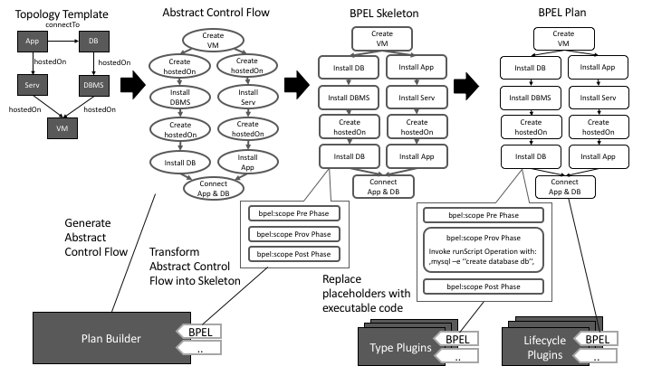
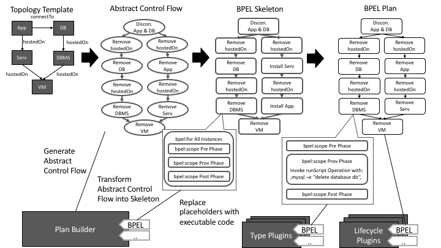

# OpenTOSCA Plan Builder
The OpenTOSCA Container (OpenTOSCA Runtime) enables management of TOSCA Topologies either by executing build plans directly or by generated these based on an application topology.
The main concept of the (de)provisioning is based on generating the logic that executes the scripts or invokes the web services attached to the Node/Relationship Type Implementations packaged within a CSAR.
The OpenTOSCA Plan Builder currently supports the generation of Build Plans, Termination Plans, and Scale-Out Plans in the workflow language BPEL 2.0.
In the following we describe the architecture and concepts to generate these in an abstract manner.

## Overview System Architecture
The generation of a plan is based on a plugin-based architecture (see Plan Builder Overview below) for different abstraction levels and languages.
The Plan Builder component is responsible for generating an abstract high-level control flow of a plan, based on the type of plan to be generated (See Section Build Plans, Termination Plans, and Scale-Out Plans) and the Toplogy Template inside a given CSAR archive (See CSAR in Overview figure).
The abstract control flow is then transformed into a language-dependent Skeleton, such as a BPEL process, which has the same flow of activities but contains placeholders instead.
After the creation of a skeleton, its placeholders are then replaced by executable code from the appropriate plugins, that either can understand a Node Type or Relationship Type and generate the needed code (See Type Plugins in Overview figure) or the types implement the expected Lifecycle operations, such as install, start and stop (See Lifecycle Plugins in Overview figure).
When the creation of code and replacement of placeholder activities is finished, the now executable plan is injected into the original CSAR for further processing and usage.

## Build Plans
A Build Plan is a Plan that is able to install, deploy and provision the modelled Node- and Relationship Templates of a given Topology Template (See Figure Build Plan Generation).
The Plan Builder is able to generate these like described in the following:

##### 1. Build Plan Abstract Control Flow Generation
The abstract control flow of a Build Plan contains for each Node Template and Relationship Template an abstract provisioning activity (See Abstract Control Flow).
The order of these activities is based on the Relationship Template's type between the Node Templates.
For example, the DBMS is installed after the VM is created, as the DBMS is **hostedOn** on the VM in the topology.
Another example is that the App and DB is connected after both are started, because they are connected by a **connectTo** relationship.

##### 2. Build Plan Skeleton Generation
The generated control flow from the previous step is afterwards transformed into code of a particular language, with the constraint that the original control flow is preserved (e.g. by empty `bpel:scope` activities in BPEL).
How such a skeleton is generated and in what form is implementation dependant, hence the lower level plugins are bound to specifics of such a skeleton generator.
For example, the skeleton already can have placeholders for instance variables etc. which plug-ing from the next step can use.

##### 3. Build Plan Completion
In the last step the Type and Lifecycle Plugins are used to generate low level code that is able to fullfill the abstract task of provisioning each Node Template and Relationship Template in an executable manner.
On the hone hand, the Type Plugins understand a single Node- or Relationship Type and can generate code for the target language to provision the understood type.
On the other hand, a lifecycle plugin doesn't understand the Node- or Relationship Types, instead it uses the interfaces defined on those and generates code to invoke the operations in a pre defined manner (e.g. invoke install, configure, start,..).

## Termination Plans
 A Termination Plan is a Plan that is able to deinstall, undeploy and deprovisioning the modelled Node- and Relationship Template of a given Topology Template (See Figure Termination Plan Generation).
 The Plan Builder is able to generate these like described in the following:

##### 1. Termination Plan Abstract Control Flow Generation
The abstract control flow of a Termination Plan contains for each Node- and Relationship Template and abstract termination activity. The order of these activities is based on the Relationship Template's type between the Node Template, but in reverse order of a Build Plan (See Build Plans section). For example, the DBMS is remove before the VM is stopped as the DBMS is **hostedOn** the VM.

##### 2. Termination Plan Skeleton Generation
The generated control flow from the previous step is afterwards transformed into code of a particular language, with the constraint that the original control flow is preserved (e.g. by empty bpel:scope activities in BPEL). How such a skeleton is generated and in what form is implementation dependant, hence the lower level plugins are bound to specifics of such a skeleton generator. For example the Skeleton already can have placeholders for instance variables etc. which plug-ing from the next step can use. This step is similar to the Build Plan Skeletons but with an additional for loop around the placeholders, as for each created instance of a Node- or Relationship Template the termination activity must be executed.

##### 3. Termination Plan Completion
In the last step the Type and Lifecycle Plugins are used to generate low level code that is able to fullfill the abstract task of terminating each Node- and Relationship Template instance in an executable manner. The Type Plugins understand a single Node- or Relationship Type and can generate code for the target language to terminate an instance of the understood type. On the other hand, a lifecycle plugin doesn't understand the Node- or Relationship Types, instead it uses the interfaces defined on those and generates code to invoke the operations in a pre defined manner (e.g. invoke stop, uninstall,..).

## Scale-Out Plans
A Scale-Out Plan is a Plan that is able to provision a single instance of of a set of Node Templates and Relationship Templates of a given Topology Template with such a pre-defined set, which we call region.
E.g., in the Scale-Out Plan figure the goal is to create a new instance of the App Node Template, hence scaling-out the application.
The application is a member of a region and the Nodes that are connected to such a region must be annotated with a so-called Selection Strategy, that specifies with which algorithm an instance selection shall occur.
The Plan Builder is able to generate Scale-Out Plans from Topology Templates with these regions as described in the following:

##### 1. Scale-Out Plan Abstract Control Flow Generation
The Abstract Control Flow of Scale-Out Plan is generated based on the Topology Templates structure and the defined region.
First, for each Node Template that is annotated with a Selection Strategy (DB and Serv in the figure) a Strategic Selection Activity is added to the control flow. In these activities an instance of the annotated Node Templates is selected at runtime. Afterwards, for each outgoing hostedOn relation of these strategically selected nodes a path of activities is added to the abstract control flow graph (Select DB instance, find hostedOn instance, find DBMS instance,..) to fetch possibly needed data for the scale-out of the application. After all these instance selection activities are generated, the nodes and relations inside the region are handled by adding abstract provisioning activities with the same order as in the generation of Build Plans is added.

##### 2. Scale-Out Plan Skeleton Generation
The generated control flow from the previous step is afterwards transformed into code of a particular language, with the constraint that the original control flow is preserved (e.g. by empty bpel:scope activities in BPEL). How such a skeleton is generated and in what form is implementation dependant, hence the lower level plugins are bound to specifics of such a skeleton generator. For example the Skeleton already can have placeholders for instance variables etc. which plug-ing from the next step can use. This step is similar to the Build Plan Skeletons Generation step.

##### 3. Termination Plan Completion
n the last step the Type and Lifecycle Plugins are used to generate low level code that is able to fullfill the abstract task of provisioning each Node- and Relationship Template of the region (Create hostedOn, Install App,..) in an executable manner. The Type Plugins understand a single Node- or Relationship Type and can generate code for the target language to terminate an instance of the understood type. On the other hand, a lifecycle plugin doesn't understand the Node- or Relationship Types, instead it uses the interfaces defined on those and generates code to invoke the operations in a pre defined manner (e.g. invoke stop, uninstall,..).
In addition to the provisioning of the region the selection activities (Select DB, Find DBMS,..) are completed with code in two flavors. The strategically selected nodes (DB and Serv) must be selected according to the annotated Selection Strategy which is understood by so-called Selection Plugin, which understands the Node Type and the Selection Strategy type. These plugins generate code that implement the annotated strategy for the given type. The other flavor of instance selection is a recursive instance selection, where the instance must be selected according to the previously selected instances. E.g. After the DB instance was selected the hostedOn Relationship Template instance must be connected to it, the DBMS instance must be connected to the hostedOn relation, and so on. These selections are generic and are generated by the Plan Builders BPEL skeleton plugin itself.
