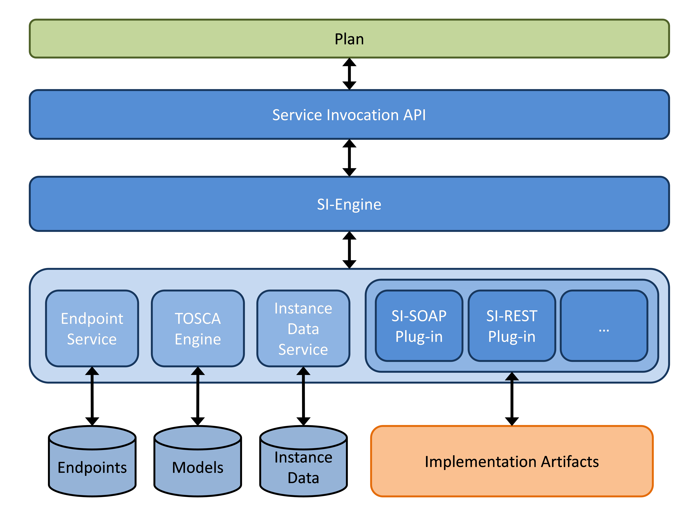
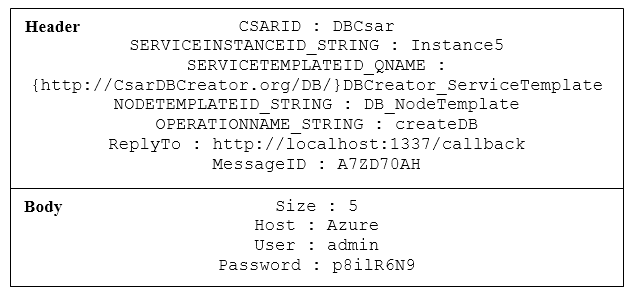
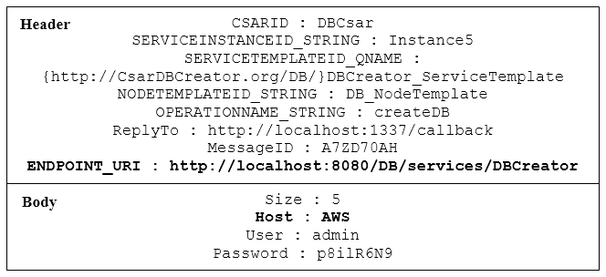
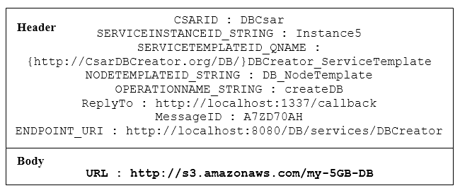
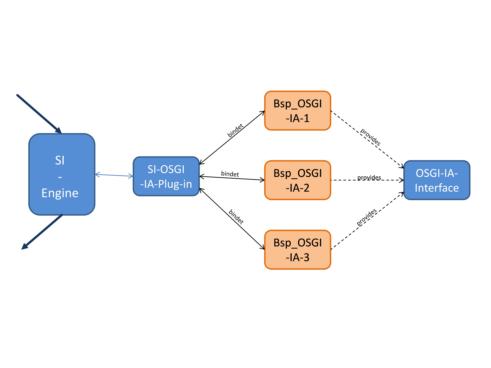
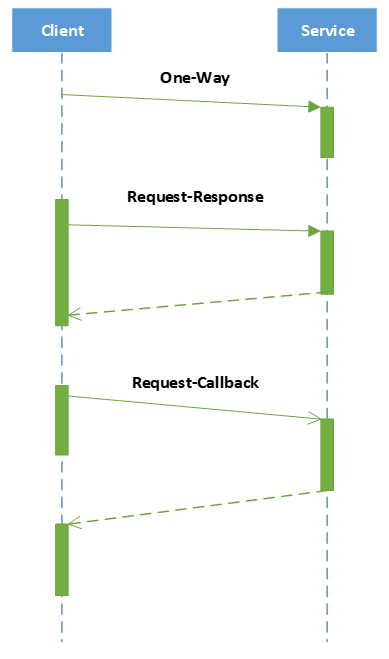

# Service Invoker (AKA Management Bus)

<!-- toc -->

- [Architecture](#architecture)
- [Concept](#concept)
- [Implementation](#implementation)
  * [Service Invocation Enum](#service-invocation-enum)
  * [Service Invocation SOAP API](#service-invocation-soap-api)
  * [Service Invocation Java API](#service-invocation-osgi-event-api)
  * [Service Invocation Engine](#service-invocation-engine)
  * [Service Invocation Plugin Interface](#service-invocation-plugin-interface)
  * [Service Invocation SOAP/HTTP plugin](#service-invocation-soaphttp-plugin)
  * [Service Invocation REST/HTTP plugin](#service-invocation-resthttp-plugin)
- [Assumptions](#assumptions)

<!-- tocstop -->

> The service invoker abstracts from different technologies such as SOAP and REST

## Architecture
Figure 1 shows the architecture of the service invocation interface.
The main component of the service invocation interface is the SI Engine (see [SI Engine](#service-invocation-engine)).
It forms the central unit of the service invocation interface with its connection to the other  important components within the OpenTOSCA container.
Furthermore the Service Invocation APIs (see [SI SOAP API](#service-invocation-soap-api) and [SI OSGi event API](#service-invocation-osgi-event-api)) are an important part of the service invocation interface.


Figure 1: Architecture of the OpenTOSCA container with service invocation interface

The SI engine has among other things the task to determine the implementation artifact that belongs to the invoke request, further required information, as well as the invocation type of the implementation artifact with the TOSCA engine.
Furthermore the SI engine uses the endpoint service to acquire the endpoints of the implementation artifact or plans.
An interface with the instance data service offers the option to invoke and use instance data of previously executed plans.

The invocations of implementation artifacts or plans happen through the so called SI plugins (see [SI Plugin Interface](#service-invocation-plugin-interface)).
These plugins offer support for different protocols and standards (invocation types), like for example sending a message with SOAP via HTTP or the invocation of an OSGi implementation artifacts and can be added and started during the runtime if necessary.
The administrator of the SI plugins is also the SI engine, with an extra designed OSGi based plugin system.

The functionality of the service invocation interface is provided with different service invocation APIs, like for example a SI SOAP API or a SI REST API.
With them other components, applications and implementation artifacts and especially plans can use the service invocation interface.
If for an example a plan wants to invoke a management operation declared in TOSCA, which is implemented with a SOAP/HTTP implementation artifact.
The plan sends a message to the service invocation SOAP API which contains all the necessary information.
The contents of this message are passed to the SI engine.
There further data like the endpoint is acquired and subsequently all information is passed on to a suitable plugin where the invocation is executed.
The exact processing process is explained in more detail in the following chapter.

## Concept

In this chapter the concept of the service invocation interface and the options of the concept are explained.


Figure 2: Conceptual structure of the components

Figure 2 shows that the SI engine constitutes the central component within the service invocation interface.
It enables the communication with existing and required components of the OpenTOSCA container (TOSCA engine, endpoint service, instance data service) and provides the connection between the service invocation API and the different SI plugins, it therefore takes on the routing of messages within the service invocation interface.
Figure 3 illustrates this with a layer diagram.



Figure 3: Service invocation interface as layer diagram

Figure 2 shows the usage of the exchange object.
Within the service invocation interface and the components the exchange object provided by [Camel](http://camel.apache.org/) is used to pass data and messages.
The communication between the SI engine (and therefore the service invocation interface) and the other components of the OpenTOSCA container happens trough passing individual parameters.
This has the advantage that within the service invocation interface the advantages of the exchange objects can be used, the other components of the container however can stay independent of Camel and therefore independent of the service invocation interface which means they do not have to be adapted.

Figure 2 also features an Enum.
This Enum (see [SI Enum](#service-invocation-enum)) is defined and specifies the keys of the headers and the message object.
This ensures that the messages passed from the service invocation API to the SI engine and the messages passed from the SI engine to the SI plugin are uniform in there make up regarding the parameters contained in the headers.
This enables the componentwise identical and reliable read out of all necessary information like CsarID or ServiceTemplateID.
It would also be possible to make an object with fields for the required parameters (CsarID, ServiceTemplateID, OperationName, ...).
The HashMap as object for the headers simulates such an object together with the Enum to pass the required parameters.
But the solution with the enum, which determines the keys for the required parameters in the header HashMap, is more flexible and intended in Camel.

Figure 4 shows the sequence of an exemplary processing sequence inside the service invocation interface beginning with the invocation trough a plan, processing of the query in the SI engine and the invocation of the implementation artifact, and the response back to the plan.


Figure 4: Processing sequence to invoke a service

First the plan invokes the service invocation SOAP API with a SOAP message containing all the data required to invoke the implementation artifact.
The service invocation SOAP API unmarshalles this SOAP message, reads the passed data, writes it into a exchange object and forwards this to the SI engine.
The parameters in the headers to determine the implementation artifacts are in a format comprehensible to the SI engine because of the defined Enum.

The SI engine collects information about the to be invoked implementation artifact, like name and invocation type, with the TOSCA engine and the received data.
Furthermore it determines the message exchange pattern (MEP) of the implementation artifact, from the in the TOSCA definition specified values for the to be invoked operation.

As part of the service invocation interface we differentiate between the two WSDL 2.0 based MEPs, [In-Out](http://en.wikipedia.org/wiki/Request-response) and In-Only.
The In-Out pattern specifies that for an incoming message (Input) an answer has to be given (Output).
Listing 1 shows an example of the In-Out pattern in a TOSCA definition.
In contrast the In-Only pattern specifies that for a query no answer is sent.
An example for this is displayed in Listing 2.

```
01 <Operation name="createDB">
02 	<InputParameters>
03 		<InputParameter name="Size" type="xs:string"/>
04	 	<InputParameter name="Host" type="xs:string"/>
05 		<InputParameter name="User" type="xs:string"/>
06 		<InputParameter name="Password" type="xs:string"/>
07 	</InputParameters>
08 	<OutputParameters>
09 		<OutputParameter name="URL" type="xs:string"/>
10 	</OutputParameters>
11 </Operation>
```
Listing 1: Example In-Out Pattern
```
01 <Operation name="deleteDB">
02 	<InputParameters>
03 		<InputParameter name="URL" type="xs:string"/>
04 		<InputParameter name="User" type="xs:string"/>
05 		<InputParameter name="Password" type="xs:string"/>
06 	</InputParameters>
07 </Operation>
```

Listing 2: Example In-Only Pattern

Subsequently the SI engine determines with the additional information the endpoint of the implementation artifact with the help of the endpoint service (see 4).

Optionally, if during the invocation of the service invocation SOAP API the ID of an CSAR instance is given, the SI engine examines if saved instance data exist for this CSAR instances and if that is the case uses it.
The instance data can have been saved by any previous plan.

Afterwards the SI engine determines with the invocation type of the implementation artifact a suitable SI plugin and sends all collected data to it with an exchange object.

The plugin creates an request message from the received information and sends it to the implementation artifact (see 7).
The invocation can happen synchronous or asynchronous depending on the implementation of the implementation artifact and the responsibility lies with the respective plugin.

The response of the implementation artifact is sent from the SI plugin to the SI engine and from there to the service invocation SOAP API (see 8).
There it is unmarshalled and converted in a SOAP message.
Finally the service invocation API sends this SOAP message back to the plan (see 9), which can now work with the data received from the implementation artifact.

In this example the invocation of a as a SOAP web services implemented implementation artifact happens through a plan.
Naturally other invocation scenarios are possible.
For example the invocation of an implementation artifact implemented as a RESTful web service of an OSGi service.
Furthermore there is the possibility to invoke a plan, initiated with the plan invocation engine or another plan.


Figure 5: Exemplary messages / invocations

Figure 5 shows the described scenario - the invocation of a SOAP web service implementation artifact with a plan - in an example with concrete messages und values.
The messages and invocations are truncated in the figure.
The complete messages and invocations are explained below.

Listing 3 shows the extensive SOAP invocation of the plan to the service invocation SOAP API.
Goal of the invocation is to invoke the implementation artifact, specified in rows 8 to 18 with the operation createDB and the parameters specified in rows 22 to 40.
The specification of ReplyTo in row 19 tells the service invocation interface at which address the callback with the response should be sent.
The MessageID is sent back to the plan from the service invocation interface, because it is required by the workflow engine to be able to assign the query response as well as the correct plan instance.

```xml
 <soapenv:Envelope xmlns:soapenv="http://schemas.xmlsoap.
 									org/soap/envelope/" xmlns:
 									sch="http://siserver.
 									org/schema">
 		<soapenv:Header/>
 		<soapenv:Body>
 			<sch:invokeOperation>
 			<CsarID>DBCsar</CsarID>
 			<!--Optional:-->
 			<ServiceInstanceID>Instance5</ServiceInstanceID>
 			<ServiceTemplateIDNamespaceURI>
 				http://CsarDBCreator.org/DB/
 			</ServiceTemplateIDNamespaceURI>
 			<ServiceTemplateIDLocalPart>
 				DBCreator\_ServiceTemplate
 			</ServiceTemplateIDLocalPart>
 			<NodeTemplateID>DB\_NodeTemplate</NodeTemplateID>
 			<OperationName>createDB</OperationName>
 			<ReplyTo>http://localhost:1337/callback</ReplyTo>
 			<MessageID>A7ZD70AH</MessageID>
 			<!--Optional:-->
 			<Params>
 				<!--1 or more repetitions:-->
 				<Param>
 					<key>Size</key>
 					<value>5</value>
 				</Param>
 				<Param>
 					<key>Host</key>
 					<value>Azure</value>
 				</Param>
 				<Param>
 					<key>User</key>
 					<value>admin</value>
 				</Param>
 				<Param>
 					<key>Password</key>
 					<value>p8ilR6N9</value>
 				</Param>
 			</Params>
 		</sch:invokeOperation>
 	</soapenv:Body>
 </soapenv:Envelope>
```
Listing 3: SOAP message of a plan to the service invocation interface to create a database

The SOAP message is converted by the service invocation SOAP API, illustrated in figure 6, and forwarded to the SI engine.
This is done using the exchange object that is provided by Camel.
The parameters for the implementation artifact (size, host, user, password) are saved in the message body.
The data to determine the implementation artifact and its invocation are in the message header.
Further values like ReplyTo and MessageID are also put in the header.
Those values however are not defined by the SI Enum, because they are not needed by the SOAP API or other SI components.

The SI engine gets the required data from the header, uses it to determine the implementation artifact with the help of the TOSCA engine and acquires the endpoint with the endpoint service.
This is also put into the header of the message object under the key defined by the SI Enum.

Furthermore the SI engine checks per instance data service if instance data for this invocation is saved and if so gets it from there.
This is however optional and only happens for ServiceInstanceIDs specified by the invoker.
Subsequently the input parameters in the message body are replaced with the values from the instance database and updated.
Like this IP addresses of a previously setup virtual machine can be used for example.



Figure 6: Message from the service invocation SOAP API to the SI engine

Finally after the invocation type of the implementation artifact has been determined with the TOSCA engine a fitting plugin is chosen and the exchange message supplied with all necessary information is forwarded to it.


Figure 7: Sequence diagram of the SI engine

Figure 7 displays the communication of the SI engine with the TOSCA engine, endpoint service, instance data services and a SI plugins as a sequence diagram.
It shows how the SI engine determines an invokable implementation artifact with the parameters and the TOSCA engine.
First the NodeType that belongs to the parameters CsarID, ServiceTemplateID and NodeTemplateID is determined (NodeTypes categorize NodeTemplates). Subsequently all NodeTypeImplementations for this NodeType are queried.
The list of NodeTypeImplementations is iterated and all implementations artifacts are determined.
This list of implementation artifacts is also iterated and each implementation artifact is checked if it offers the required operation.
If the name of the operation is unique within a NodeType, only the specification of the name is required.
If however the operation is not only offered by the interface of one NodeType the name of the interface has to be specified as well to uniquely identify it.
If the operation is offered it is also checked if a invocation type was specified in the TOSCA definition and if a plugin is available.
If that is the case the endpoint service check if an endpoint for this implementation artifact is saved and if it was deployed by the container.
If that is also the case a invokable implementation artifact has been found.
The sequence diagram shows furthermore the communication with the instance data service (if a ServiceInstanceID has been provided) as well as the invocation of an SI plugin.

In Figure 8 the message enriched by the SI engine is shown.
The endpoint of the implementation artifact was determined and added as header, a parameter in the body was replaced by a value from the instance database.
In this example the implementation artifact is told to create a database at Amazon Web Services (AWS) instead of at Microsoft Azure.
A previously executed plan could have this saved and after checking that the prices for databases at AWS are better then at Azure.



Figure 8: A message directed to a SI plugin enriched from the SI engine

After the message has been passed to the SI plugin suitable to the invocation type, it reads the information required (OperationName, Endpoint) for the invocation of the implementation artifact from the header and gets the parameters from the body.
What happens afterwards with this data and how the actual invocation of the implementation artifact happens is plugin specific and therefore can differ from plugin to plugin.
In the case of the SOAP/HTTP plugin for example further information is read from the WSDL belonging to the implementation artifact, a SOAP message corresponding to the WSDL is created and this is sent to the implementation artifact.
From the response, in the case of a SOAP message this would be the body, the output parameters are extracted and those are put into the body of the message object which gets returned to the SI engine.

```xml
 <soap:Envelope
 xmlns:soap="http://www.w3.org/2001/12/soap-envelope"
 soap:encodingStyle="http://www.w3.org/2001/12/soap-encoding">
 	<soap:Body xmlns:m="http://www.DBIA.org/DBCreator">
 		<m:CreateDBRequest>
 		<m:Size>5</m:Size>
 		<m:Host>AWS</m:Host>
 		<m:User>admin</m:User>
 		<m:Password>p8ilR6N9</m:Password>
 		</m:CreateDBRequest>
 	</soap:Body>
 </soap:Envelope>
```

Listing 4: SOAP message created with the SOAP/HTTP plugin

Listing 5 shows the answer of the implementation artifact.
In this example on the query to create a database the address of the database is returned as response.

```xml
 <soap:Envelope
 xmlns:soap="http://www.w3.org/2001/12/soap-envelope"
 soap:encodingStyle="http://www.w3.org/2001/12/soap-encoding">
 	<soap:Body>
 		<CreateDBResponse>
 			<URL>http://s3.amazonaws.com/my-5GB-DB</URL>
 		</CreateDBResponse>
 	</soap:Body>
 </soap:Envelope>
```
Listing 5: Response of the implementation artifact

Figure 9 shows the exchange message from the SI engine and forwarded from there to the service invocation SOAP API.
The body contains the information received from the implementation artifact which has been encoded as a HashMap by the SOAP plugin.
To do this in the incoming SOAP message the name of the element is assigned as key and the content of the element as value.
It is assumed that the names of the elements returned by the implementation artifact is identical to the return values specified by the TOSCA definition.



Figure 9: Return of the SI plugin with the received information of the implementation artifact

The service invocation SOAP API (see [SISOAP API](#service-invocation-soap-api)) takes the body of the exchange message and the MessageID from the header for the SOAP message directed at the plan (see Listing 6).
The HashMap with the returned data of the invoked implementation artifact contained in the body is converted as follows: The key-value pairs of the HashMap are pairwise transferred as key and value elements of the SOAP message (see Listing 6).
The plan receives a uniform answer which is consistent with the parameters specified in TOSCA and is independent of the technology of the invoked implementation artifact.
Because the invocation of the service invocation interface is done through the parameters specified in TOSCA, this results in a generic and uniform interface for the invoker to invoke services.
A plan to invoke an implementation artifact only requires the information specified in TOSCA und does not have to know anything about its implementation.

Finally the created SOAP message that was passed in the beginning from the plan to the service invocation interface is sent to the address (ReplyTo) in the header.

```xml
 <soapenv:Envelope xmlns:soapenv="http://schemas.xmlsoap.
 									org/soap/envelope/" xmlns:
 									sch="http://siserver.
 									org/schema">
 	<soapenv:Header/>
 	<soapenv:Body>
 		<sch:invokeResponse>
 			<MessageID>A7ZD70AH</MessageID>
 			<Params>
 				<Key>URL</Key>
 				<Value>http://s3.amazonaws.com/my-5GB-DB</Value>
 			</Params>
		</sch:invokeResponse>
 	</soapenv:Body>
 </soapenv:Envelope>
```
Listing 6: Message from the SOAP API back to the invoker

Until now the concept of the service invocation interface has only been explained with the service invocation SOAP API and SOAP/HTTP SI plugin.
That this concept of the service invocation interface offers much more options is explained in the following paragraph.

Figure 10 shows the option to realise an OSGi plugin.
This plugin enables the invocation of implementation artifacts implemented as OSGi services.
It should be noted that the OpenTOSCA container currently, because a suitable IA plugin is as of yet missing, is not yet able to deploy OSGi implementation artifacts, those are therefore not yet supported by the container.
The service invocation interface was implemented with further implementation of artifact types in mind and has concepts in store to deal with those.



Figure 10: Example for the possibilities of more plugin types

The OSGi plugin uses, equivalent to the SI engine and its plugins, the option of declarative services provided by OSGi.
This means that OSGi implementation artifacts implement a set interface and have to offer it as a service.
This is required for the implementation of declarative services, also enables adding and starting implementation artifacts during the runtime.
Based on the implemented interface and the so specified service the OSGi SI plugin can bind and use the OSGi implementation artifact.
The endpoint of the implementation artifact in this case has to be the ID of the respective OSGi service.
Listing 7 shows the methods set by the interface.

```java
 public void invoke(String operationName, HashMap<String,
 					  String> params);

 public Object invoke(String operationName, HashMap<String,
						String> params);

 public getID();
```
Listing 7: Methods of the OSGi implementation artifact interface

The two invoke methods are necessary to realise the two MEPs request-response and one-way.
The method getID is used during the binding of the OSGi implementation artifact to get its ID and save it.
The SI plugin can then choose and invoke the correct OSGi service based on the endpoint.

As mentioned earlier it is also possible to extend the service invocation interface with further service invocation APIs.
This makes it possible to make the functionality of the service invocation interface available to more technologies.
The addition of further service invocation APIs can, equivalent to the plugins, be done during the runtime.

Figure 11 shows the service invocation interface exemplary running on service invocation SOAP as well as service invocation REST API.
As the names of the APIs suggest, this makes it possible to invoke the service invocation interface and therefore the invocation of implementation artifacts and plans with SOAP and REST at the same time.


Figure 11: Example of a further service invocation API

In the scope of this bachelor thesis implemented components of the service invocation interface will be presented in the following chapter.

## Implementation

In this chapter the implementation of the service invocation interface and its components is explained.
The Enum to specify the headers of the exchange message is presented first.
Followed by the service invocation API for SOAP and OSGi events.
Lastly the SI engine is explained with a closer look at the SI plugins and the interface.

### Service Invocation Enum

This section illustrates the SI Enum.
It is used to pass the parameters required for a implementation artifact or plan in a specified way.

Listing 8 shows the set SI enum and the so defined values.
The values serve as the key for the key/value pairs in the header.
This enables the components of the service invocation interface to read out parameters.
CSARID serves as identifier of the correct CSAR file.
SERVICEINSTANCEID_STRING is required if data is to be retrieved with the instance data service and is used to determine the instance.
If present NODEINSTANCEID_STRING is used to transmit the ID of a specific instance.
This value is not used by the SI engine to recall instance data with the instance data service but is passed as a parameter to a implementation artifact.
The implementation artifact gets the required data itself with the instance data service.
SERVICETEMPLATEID_QNAME serves to determine the service template of a TOSCA definition.
Equivalently NODETEMPLATEID_STRING determines the node template.
OPERATIONNAME_STRING specifies the operation to be invoked of the implementation artifact or plan.
If the operation name is not unique within a node type the name of the interface has to be specified as well.
This is done with the INTERFACENAME_STRING.
PLANID_QNAME is used if a plan is to be invoked and serves to identify the plan.

```java
public enum SIEnum {
CSARID, SERVICEINSTANCEID_STRING, NODEINSTANCEID_STRING, SERVICETEMPLATEID_QNAME, NODETEMPLATEID_STRING,
INTERFACENAME_STRING, OPERATIONNAME_STRING, PLANID_QNAME, ENDPOINT_URI, SPECIFICCONTENT_DOCUMENT
}
```
Listing 8: SI-Enum

All values mentioned so far are already being passed to the SI engine from the respective service invocation API.
Only the values of ENDPOINT_URI and if applicable SPECIFICCONTENT_DOCUMENT are set by the SI engine.
ENDPOINT_URI is determined with the endpoint service and specifies the endpoint of an implementation artifact or plan.
SPECIFICCONTENT_DOCUMENT is determined with the TOSCA engine (if specified in the TOSCA definition) and can contain important information for the plugin, like for example information about the mapping of the parameters (see [Service Invocation REST/HTTP plugin](#service-invocation-resthttp-plugin)).

### Service Invocation SOAP API

In this chapter the service invocation SOAP API to invoke the service invocation interface with SOAP messages is explained.
Also more details on the usage of Camel.

Listing 9 shows conceptually the implemented route and its endpoints of the service invocation SOAP API.
The strings defined in rows one to 16 INVOKE, CALLBACK, ENGINE_AI and ENGINE_PLAN represent the endpoints of the route.
The route itself is defined in rows 17 to 22.

The string INVOKE, rows one to six, serves as endpoint to invoke the service invocation SOAP API.
With it a SOAP web services is started on http://localhost:8081/invoker per CXF component.
The invoker.wsdl serves as WSDL of the web service.
The service and port are defined by the WSDL.

```java
 String INVOKE = "cxf:http://localhost:
                  8081/invoker?wsdlURL=META-INF/invoker.
                  wsdl&serviceName={http://siserver.org/wsdl}
                  SIServerInvokeService&portName={http:
                  //siserver.org/wsdl}
                  SIServerInvokePort";

 String CALLBACK = "cxf:${header[ReplyTo]}?wsdlURL=META-
                  INF/invoker.wsdl&serviceName={http:
                  //siserver.org/wsdl}
                   SIServerCallback&portName={http://siserver.
                  org/wsdl}CallbackPort";

 String ENGINE_IA = "bean:siengineinterface.
                  SIEngineInterface?method=invokeOperation";

 String ENGINE_PLAN = "bean:siengineinterface.
                  SIEngineInterface?method=invokePlan";

 from(INVOKE).unmarshal(requestJaxb).process(requestProcessor)
       .choice().when(this.header(CxfConstants.OPERATION_NAME).
      isEqualTo("invokeOperation")).to(ENGINE_IA).when(this.header(
      CxfConstants.OPERATION_NAME).isEqualTo("invokePlan")).
      to(ENGINE_PLAN).end().process(responseProcessor).
      marshal(responseJaxb).recipientList(this.simple(CALLBACK));
```

Listing 9: Route of the Service Invocation SOAP API

The string CALLBACK defines the endpoint required for asynchronous invocations to send reply messages to the invoker.
This also uses the CXF component as well as the invoker.wsdl.
The respective service and port is also given.
The address where the SOAP message should be sent is determined dynamically.
${header[ReplyTo]} means the value of ReplyTo from the header of the exchange message should be read and used as address for the response message.
This value has to be transmitted by the invoker at the time of invocation of the service invocation SOAP API.
The service invocation SOAP API supports the transfer, as shown in Listing 3 as parameter in the body or as WS addressing header.
Correspondingly the MessageID can be transmitted with both methods.

In rows 12 and 13, as well as 14 and 15 the two methods of the SI engine are set as endpoints.
One endpoint to invoke implementation artifacts (ENGINE_IA) and one endpoint to invoke plans (ENGINE_PLAN).

Rows 16 to 21 show the route that is processed after an invocation.
From(INVOKE) defines the INVOKE endpoint as entry point of the route.
The SOAP message of an invocation is unmarshalled (unmarshal(requestJaxb)) and then processed in requestProcessor.
During processing all parameters defined with the SI enum as well as all headers from the SOAP message are applied as header of the exchange message.
Then the header OPERATION_NAME is read and used to determine if an implementation artifact or plan should be invoked and accordingly the method of the SI engine is invoked (ENGINE_IA or ENGINE_PLAN).
After the SI engine or respectively a suitable plugin has executed the invocation and the exchange message with the reply from the implementation artifact or plan has been returned to the service invocation SOAP API, this is processed again (process(responseProcessor).
The reply is read from the body of the exchange message and, if possible, converted into a marshallable object.
Subsequently the response object is marshalled and sent as SOAP message to the CALLBACK endpoint.

###  Service Invocation OSGi event API

This chapter presents the implementation of the service invocation OSGi event API.
Special focus lies on the general functionality of OSGi events and the collaboration with the plan invocation engine.

The service invocation OSGi event API enables the usage of the service invocation interface with the OSGi event admin service.
With the OSGi event admin services events can be sent and received with the **publish and subscribe** pattern.
This technology enables asynchronous communication between the service invocation interface and for example the plan invocation engine.

Figure 12 shows the service invocation interface with service invocation OSGi event API and plan invocation engine.
Furthermore the function of the publish and subscribe pattern is shown.
The plan invocation engine sends the message enriched with the required information to a list (Request Topic).
The service invocation OSGi event API receives the message, because it is subscribed to this list, and can process it further.
Transmitted information like CSAR ID or plan ID, familiar from the service invocation SOAP API, are set as header and the transmitted payload as body of an exchange message object.
The payload can be for example a HashMap with parameters as key/value pairs, or as is the case with the plan invocation engine be of the type org.w3c.com.Document.
Subsequently the exchange message is passed to the SI engine to be processed further.
After the response from the SI engine returns, the service invocation OSGi event API sends the response message to more lists (Response Topic).
The plan invocation engine is subscribed to this list and can so receive the response messages and process them.


Figure 12: Invocation of a plan initiated with the plan invocation engine

Listing 10 shows based on the service invocation OSGi event API how OSGi event services are used.
First, like in every OSGi XML configuration file (Component Description), the name (row two to four) and the class (row five and six) of the respective component are set.
The EventAdmin service has to be bound so that the components can send events to lists (rows seven to eleven).
bindEventAdmin (row seven) sets the method to bind the service and has to be present in org.opentosca.siengine.api.osgievent.SIEventHandler, the class specified in rows five and six and implemented correspondingly.
Rows twelve to fifteen specify that the class mentioned above offers the service EventHandler.
The class has to implement the interface EventHandler and the corresponding method to receive events handleEvent(Event event).
The names of the lists (event.topics) the component is subscribed to have to be specified.
In this example this is the list org_opentosca_plans/request which is used for example by the plan invocation engine to send query for the invocation of plans.

```xml
 <scr:component xmlns:scr="http://www.osgi.org/xmlns/scr/v1.1.
 							0" immediate="false" name="org.
							opentosca.siengine.api.osgievent.
							SIEventHandler">
 	<implementation class="org.opentosca.siengine.api.
 						 osgievent.SIEventHandler"/>
 	<reference bind="bindEventAdmin" cardinality="1..1"
 					interface="org.osgi.service.event.
 					EventAdmin" name="EventAdmin"
 					policy="static"
 					unbind="unbindEventAdmin"/>
 	<service>
 		<provide interface="org.osgi.service.event.
 							EventHandler"/>
 	</service>
 	<property name="event.topics" type="String"
 					value="org_opentosca_plans/requests"/>
 </scr:component>
```

Listing 10: Usage of the OSGi event service

Equivalently the plan invocation engine is subscribes to the list org_opentosca_plans/responsnes, which is used to send the responses messages with the service invocation OSGi event API.
The sending of an event is done with the method postEvent(Event event) offered by the EventAdmin service.

### Service Invocation Engine

In this section the implementation of the SI engine is presented.
The focus lies on the methods offered by the SI engine and the system to administrate the SI plugins.

The SI engine provides two methods.
First InvokeOperation(Exchange exchange) to invoke implementation artifacts and second invokePlan(Exchange exchange) to invoke plans.
Although implementation artifacts and plans can be viewed as services the queries for their invocation has to be handled differently.
Figure 13 illustrates the processes of both methods.

Identical in both methods is that they have the read the headers relevant for them from the exchange message.
In the case of invokeOperation this would be the values CSARID, SERVICEINSTANCEID_STRING, NODEINSTANCEID_STRING, SERVICETEMPLATEID_QNAME, NODETEMPLATEID_STRING, INTERFACENAME_STRING and OPERATIONNAME_STRING.
In the case of invokePlan CSARID, SERVICEINSTANCEID_STRING, NODETEMPLATEID_STRING and PLANID_QNAME.
Subsequently, if invokeOperation was called, the TOSCA engine is used to determine a suitable implementation artifact, its message exchange pattern and the corresponding properties.
The corresponding sequence diagram (Figure 12) was already presented before.
The query for instance data, if a ServiceInstanceID is available and a HashMap as payload happens in both cases.
If the method was invokeOperation it is also checked if a NodeInstanceID was specified.
If this is the case and the Payload is in form of a HashMap the NodeInstanceID is taken in as parameter of the HashMap.
This enables implementation artifacts to determine current values from the instance data themselves.
Independently of the two methods the respective endpoint of the implementation artifact or plan is determined with the endpoint service.
For the invocation of implantation artifacts the invocation type of a suitable plugin is determined with the properties queried earlier.


Figure 13: Workflow diagram of both SI engine methods invokeOperation and invokePlan

If a plan is invoked the exchange message is directly passed to the SOAP plugin (see [Service Invocation SOAP/HTTP plugin](#service-invocation-soaphttp-plugin)) because the OpenTOSCA container so far only supports BPEL plans.
If more plan types are supported in the future the invocation type and therefore the choice of plugin has to be determined based on the management plan language.

Listing 11 shows how the invocation type of an implementation artifact is specified within the TOSCA definition.
The option to define properties (row three to twelve) provided by the artifact templates is used for this.
The rows eight to ten in this example are relevant for the service invocation interface.
With the InvocationType element the invocation type of the implementation artifact is set.
In this case SOAP/HTTP.
The SI engine would then forward this request for the invocation of this implementation artifact to a plugin that can handle SOAP/HTTP.

```xml
<p:ArtifactTemplate id="EC2VMService" type="toscatypes:
                    WAR">
    <p:Properties>
        <opentosca:WSProperties>
            <opentosca:ServiceEndpoint>
                    /services/EC2VMIAService
            </opentosca:ServiceEndpoint>
            <opentosca:InvocationType>
                    SOAP/HTTP
            </opentosca:InvocationType>
        </opentosca:WSProperties>
    </p:Properties>
    <p:ArtifactReferences>
        <p:ArtifactReference reference=
                "IAs/EC2VMService/EC2-VM-Service.war" />
    </p:ArtifactReferences>
</p:ArtifactTemplate>
```

Listing 11: Example ArtifactTemplate with invocation type specification

Furthermore another property (ServiceEndpoint) is defined in Listing 11.
This is used by the IA engine to determine the correct endpoint of the implementation artifact.
This ensures that the IA engine stores an endpoint with the endpoint service that is usable by the service invocation interface.

An important requirement on the service invocation interface is the option that the spectrum of invocation types can be extended.
This is achieved with a plugin system, which is now explained in more detail.

The plugin system is realized with declarative services.
The SI plugins implement the specified interface SIPluginInterface (see [SI Plugin Interface](#service-invocation-plugin-interface)) and respectively provide the service ISIEnginePluginService.
This is shown in rows four and five in Listing 12.

```xml
 <scr:component ...>
 	<implementation class= .../>
 	<service>
 		<provide interface="org.opentosca.siengine.plugins.
 							service.ISIEnginePluginService"/>
 	</service>
 </scr:component>
```
Listing 12: Providing a service per OSGi XML configuration file
```xml
 <scr:component ...>
 	<implementation class= .../>
 	<reference bind="bindPluginService" cardinality="0..n"
 					interface="org.opentosca.siengine.plugins.
 					service.ISIEnginePluginService"
 					name="SIPluginInterface" policy="dynamic"
 					unbind="unbindPluginService"/>
 </scr:component>
```
Listing 13: Binding a service per OSGi XML configuration file

Because the SI engine binds all these services (see Listing 13, rows three to seven), during the start of an SI plugin the SI engine automatically calls a method to bind this plugin.
In this example the method is called bindPluginService (see row 3 in Listing 13).

Furthermore the SI plugins have a method getType(), specified with the interface, which returns the invocation type as string.
This method is called by the SI engine when a plugin is bound and the return value (the invocation typ) together with the respective plugin is stored in a map (see Listing 14, rows three to six).
Row one and two show the map to administrate the SI plugins.
The key is the invocation type and the value is the plugin.
During the stopping of a plugin the unbind method is executed and the plugin is removed from the map (row 8 to eleven).
Because of this system the SI engine always has a current list of available SI plugins and can choose a suitable plugin based on the invocation type of the implementation artifact.

```java
 Map<String, ISIEnginePluginService> pluginServicesMap = Collections.
 synchronizedMap(new HashMap<String, ISIEnginePluginService >());

// . . .

 public void bindPluginService(ISIEnginePluginService plugin) {

 		pluginServicesMap.put(plugin.getType(), plugin);
 }

 public void unbindPluginService(ISIEnginePluginService plugin) {

 		pluginServicesMap.remove(plugin.getType());
 }
```

Listing 14: Implementation of the plugin system

## Service Invocation Plugin Interface

This chapter presents the interface for the SI plugins.
As mentioned earlier all plugins usable by the service invocation interface have to implement this interface and provide the service ISIEnginePluginService.

```java
 public interface ISIEnginePluginService {

    Exchange invoke(Exchange exchange);

    String getType();
}
```
Listing 15: Interface of the SI plugins

Listing 15 shows the interface specified for the SI plugins.
The interface defines two methods.
The method getType() explained earlier, that retrieves the supported invocation type of a plugin, and the method invoke(Exchange exchange) to transmit the exchange message to the SI plugins.
The invoke method returns the exchange message, with which it was called, together with the response message of the invoked implementation artifact or plan as return value in the body.

### Service Invocation SOAP/HTTP plugin

This chapter presents an implementation of the SI plugin interface.
Specifically it presents a SOAP/HTTP plugin, meaning a SI plugin that can invoke implementation artifacts and plans with a SOAP message via HTTP.

After the invocation of the invoke method and the transmission of the exchange message through the SI engine, the SOAP/HTTP plugin reads the endpoint of the implementation artifact or plan from the header.
Endpoints can differ depending on the required plugin.
In the case of the SOAP/HTTP plugin the endpoint has to either point directly to the WSDL definition of the implementation artifact or plan, or has to achieve this by attaching "?wsdl".
If for example the WSDL definition of an to be invoked implementation artifact is available under the address http://localhost:8080/EC2IA/services/EC2Service?wsdl either this address or this one http://localhost:8080/EC2IA/services/EC2Service has to be provided as endpoint.
This is necessary because the WSDL definition describes the interface to invoke the webservice and the information contained to create and send the invocation message and therefore the plugin has to read it.
The MEP is detzermined like this for example, or if a HashMap is transmitted with the input parameters as body of the exchange message, the WSDL definition is used to generate a correct SOAP message from it.

The SOAP/HTTP plugin supports in the current implementation three exchange types of messages.
Those will be explained in the following paragraph and Figure 14.

**One-Way (In-Only)**: The service is called with a SOAP message, does not send a response message.
Listing 16 shows an exemplary One-Way operation in a WSDL definition.

```
01 	<wsdl:operation name="one-wayOperation">
02 		<wsdl:input message="tns:inputMessage">
03 		</wsdl:input>
04 	</wsdl:operation>
```

Listing 16: One-Way Operation

**Request-Response (In-Out)**:  The client (the plugin) sends a SOAP message to the service and waits for the response message.
An example of a request response operation is in shown in Listing 17.

```xml
<wsdl:operation name="request-responseOperation">
    <wsdl:input message="tns:requestMessage">
    </wsdl:input>
    <wsdl:output message="tns:responseMessage">
    </wsdl:output>
</wsdl:operation>
```

Listing 17: Request-Response operation

**Request-Callback (asynchronous Request-Response)**: The client sends a SOAP message to the service, does not require a immediate response.
Instead it is informed when the response from the service arrives.
The service has to be given an address for the callback and a MessageID.
The MessageID has to be contained in the response message of the service, so that a correlation between the invocation message and the response message is possible.

The SOAP/HTTP plugin enables the transmission of callback addresses and MessageIDs as parameters in the SOAP body of the message and with WS addressing header.
The request callback however is realized from the WSDLs point of view as two one way operations and is not specified by the WDSL definition alone.
To finally determine the information gotten from the WSDL additional MEPs from the TOSCA definition have to be used.
Accordingly an In-Only operation (from the TOSCA definition) and an In-Only operation (from the WSDL definition) make a One-Way SOAP message (without response message) to the service.
In contrast an In-Out operation (from the TOSCA definition) and an In-Only operation (from the WSDL definition) make a message exchange through request callbacks.



Figure 14: Presentation of the three MEPs supported by the SOAP/HTTP plugin

### Service Invocation REST/HTTP plugin

This section explains the implementation of the REST/HTTP plugin.
Special focus lies on how mapping information of the passed parameters can be specified in the TOSCA definition.

HTTP allows the passing of parameters inside the URL (query string) as well as in the message body.
To enable the plugin to create the message according to the implementation of the implementation artifact, information about the mapping of the parameters can be given in the TOSCA definition.
This information is determined in the SI engine with the TOSCA engine and passed to the plugin.
Listing 18 shows the schema to describe mapping information, which have to be defined inside the implementation artifact (as artifact specific content).

```xml
<DataAssign>
    <Operations>
        <Operation name="String" ?
                    interfaceName="String" ?
                    endpoint="no | yes" ?
                    params="queryString | payload" ?
                    contentType="urlencoded | xml" ?
                    method="POST | GET" ? >
        </Operation> +
    </Operations>
</DataAssign>
```

Listing 18: Schema to describe the parameter mapping

Implementation artifacts implement the interfaces and operations offered by a NodeType.
Because an implementation artifact can implement a single operation of an interface, all operations of an interface, or all interfaces with their operations the attributes name and interfaceName are required.
They specify for which operations the respective mapping information is valid.
If the implementation artifact only implements a single operation name and interfaceName are not required.
Similarly the interfaceName is only required if the implementation artifact implements multiple interfaces.
The endpoint attribute specifies that the name of the operation and the interface are to be attached (with / as separator) to the endpoint received from the endpoint service.
The params attribute specifies if the parameter should be transmitted as part of the URL (queryString) or in the body (payload).
If it is part of the body the content type can be specified.
Currently the two content types application/x-www-form-urlencoded (urlencoded) as well as application/xml (xml) are supported.
The required HTTP method (GET or POST) can be specified with method-Attribute.

Additionally to the mapping information the plugin has its own assumptions or rather requirements on the structure of a message.
For example if the parameter is passed as a query string the key value pairs are separated with & and the key value values are separated with =.
The first key value pair is appended a ? to separate tge endpoint from the parameters.
Listing 19 shows an example of the specification for such a mapping definition and the resulting query.
Identical (with & and = as separators) the parameters are encoded in the body if they are passed urlencoded.
For the passing with XML the parameters are converted as follows: The names of the parameters become elements with the value of the respective parameter as content.
The name of the operation is used as root element.
Listing 20 shows an example for this.

```
<DataAssign>
	<Operations>
		<Operation name="createDB"
					endpoint="yes"
					params="queryString"
					method="GET" >
		</Operation>
	</Operations>
</DataAssign>

GET /DB/services/DBCreator/createDB?Size=5&Host=AWS&User=
		admin&Password=p8ilR6N9 HTTP/1.1
Host: localhost:8080

...
```
Listing 19: Example for the parameter passing with query string

```
<DataAssign>
	<Operations>
		<Operation name="createDB"
				params="payload"
				contentType="xml" >
		</Operation>
	</Operations>
</DataAssign>

POST /DB/services/DBCreator HTTP/1.1
Host: localhost:8080

...

<createDB>
	<Size>5</Size >
	<Host>AWS</Host >
	<User>admin</User >
	<Password>p8ilR6N9</Password >
</createDB>
```

Listing 20: Example for the parameter passing as content type xml

In the future it could be possible to use web application description language (WADL), equivalent to WSDL in the SOAP plugin, to acquire required information.
But because it is rarely used and is much more complex this prototype implementation of the plugin has its own, specifically created schema to specify information.

# Assumptions

Some assumptions have to be made and requirements put on the creators of TOSCA definitions and plugin developers (of the service invocation interface) so that the concept and the implementation based on it can work correctly.
These are explained in this chapter.

**Accuracy of the passed parameters**
The parameters passed to the service invocation interface can be put in two groups.
On one hand the data required to determine the implementation artifact or plan and on the other hand the data required to invoke the implementation artifact or plan.

The parameters passed to the service invocation interface to determine a fitting implementation artifact or plan, have to be correct and known within the OpenTSCA container.
Known within the OpenTOSCA container means, that this data, like for example the CSARID or ServiceTemplateID has to be invokable with the TOSCA engine and therefore exist as Java objects.
If this is not the case required information like the name of the implementation artifact and so the its endpoint cannot be determined and the invocation cannot be made.

The input parameters required for the invocation of the implementation artifact plan have to correspond to the parameters specified by the implementation artifact or plan.
This means that the names and the number (after additional parameters like instance data has been added) of passed parameters have to be identical.
The operations to be executed also have to match with the implementation artifacts or plans as well as their input parameters.
If an operation is present in different interfaces of one NodeType the name of the interface has be specified as well.
If this is not specified it is assumed that the operation is unique within the NodeType and the implementation artifact is determined only with that.

**Existence of an endpoint**

Without information under which name or which address a specific implementation artifact is reachable it cannot be invoked.
Therefore implementation artifacts deployed with the IA engine or rather its plugins, or similarly deployed plans, have to have a correct endpoint, stored with the endpoint service.

These endpoints can differ based on the type of implementation artifact.
The endpoint of a SOAP web service implementation artifact would be saved as a URL which specifies the address to the WSDL file of the SOAP web service.
The endpoint of an OSGi service implementation artifact would be represented with the ID of this OSGi service.
The different plugins of the service invocation interface know how to interpret the different endpoints.

The deployed implementation artifacts and plans (for invocations) have to be available from the OpenTOSCA container environment.

**Usage of specified interfaces**
New, to be developed SI plugins, have to implement the interface specified by the existing plugin.
This is necessary to ensure correct functionality of the plugin system based on OSGi.

Furthermore the invocation types, which are used to identify plugins, have to differ from each other.

For the concept of the OSGi plugin the implementation artifacts have to implement this interface as well.

**Required information within the TOSCA definition**

Required information, like for example the invocation type of an implementation artifact, has to be specified in the TOSCA definition.
This information is used by the service invocation interface among other things to determine a suitable SI plugin.
Without this data no suitable plugin can be found and the invocation of the implementation artifact fails.

The optional input and output values of the NodeType operations to determine the message exchange pattern (MEP) have to be specified as well.
If they are not specified request-response is assumed.

**Usage of the Enum**

The SI enum explained in 4.4.1 is required for the exchange of the required information.
It defines the header of the exchange message and so ensures a standardised format.

New service invocation APIs have to use this enum, equivalently to the existing service invocation SOAP API.
Otherwise the SI engine cannot read the information and the invocation of the implementation artifact of plan can not be executed.
