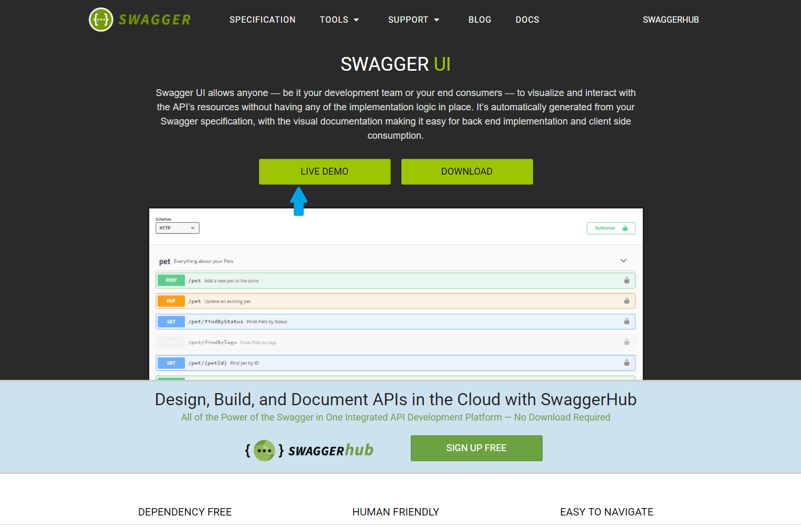
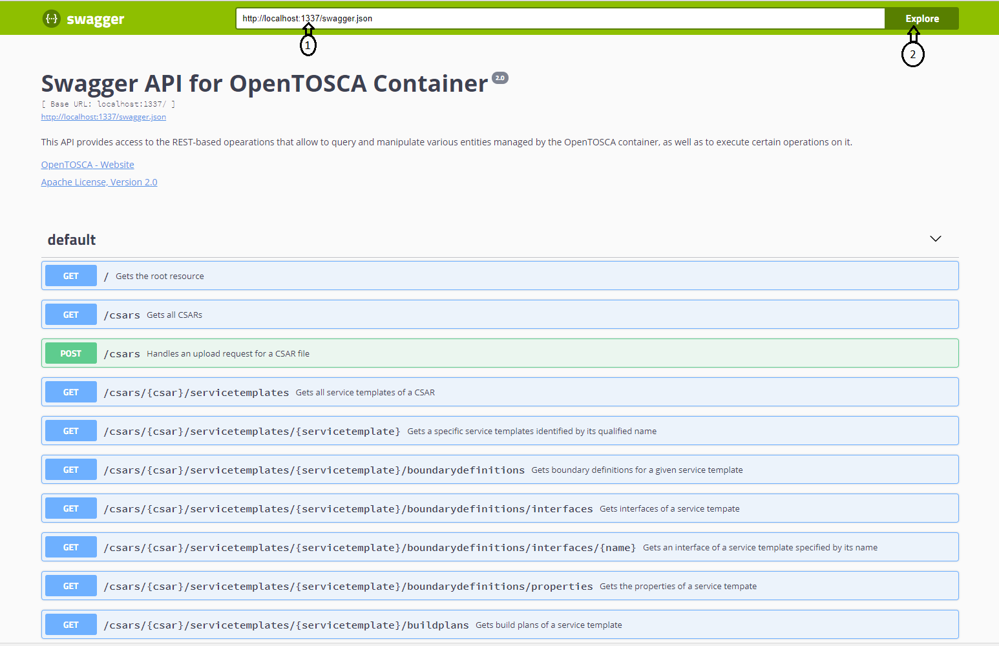

# OpenTOSCA Container REST API
REST API for the OpenTOSCA container that gives access to various modeling- and instance-based resources. The classes in this project are annotated such that a REST API, as well as an accompanying Swagger 2 specification are generated.

## REST API
The root of the API can be found at http://localhost:1337/.
A visual representation of the API is shown below (we thank [Florian Haupt](http://www.iaas.uni-stuttgart.de/institut/mitarbeiter/haupt/index.php) for the help in producing this representation):

## Swagger Specification
When the container is running, the generated swagger file can be found in the following path:
http://localhost:1337/swagger.json
A visual representation can be produced then using Swagger UI by: 
- Navigate to [Swagger UI](https://swagger.io/swagger-ui/)
- Start the live demo: 
- Link to the swagger json file: 